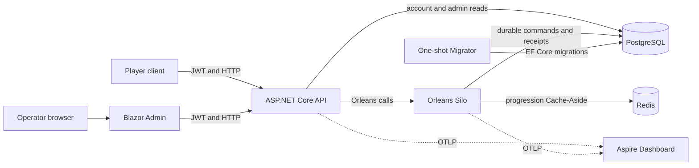
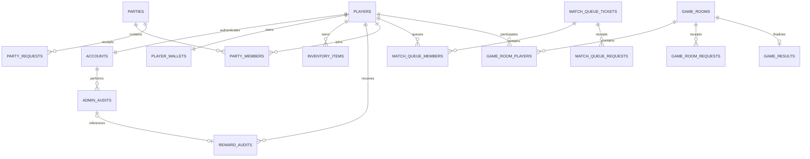
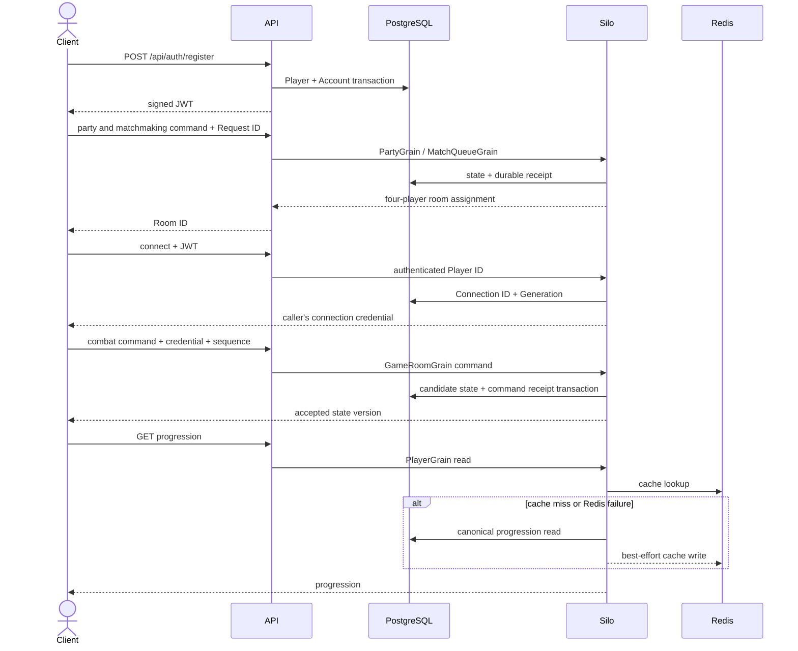

# System overview

Updated: 2026-09-29 (Asia/Seoul)

## Runtime structure

- **API:** JWT(JSON Web Token, 서명된 로그인 토큰) 인증, 본인·관리자 인가, HTTP 입력 검증과 응답 변환을 맡습니다. 요청 본문의 Player ID를 호출자 신원으로 신뢰하지 않습니다.
- **Silo:** Party, MatchQueue, GameRoom, Player Grain을 실행하고 엔티티별 명령 순서를 조정합니다. Grain 직렬 실행만 믿지 않고 모든 영속 쓰기의 최종 제약은 PostgreSQL에 둡니다.
- **PostgreSQL:** 계정, 게임 상태, 명령 영수증, 보상과 감사 기록의 내구성 있는 원본입니다.
- **Redis:** Player 진행도 읽기의 Cache-Aside 보조 저장소입니다. 장애 시 PostgreSQL로 폴백하며 보상 Exactly-once(최종 효과가 한 번만 반영되는 성질)의 증거로 사용하지 않습니다.
- **Migrator:** Compose 시작 때 스키마를 적용하는 유일한 프로세스입니다. 실패하면 Silo 시작이 차단됩니다.
- **Admin:** API만 호출하며 데이터베이스나 Grain에 직접 접근하지 않습니다.

## Persistence ERD

아래 ERD(Entity Relationship Diagram, 개체 관계도)는 현재 `GameDbContext`의 업무 관계를 요약합니다. 요청 테이블은 같은 Request ID의 재시도 결과와 충돌을 저장하는 내구성 영수증입니다.

주요 제약은 다음과 같습니다.

- 계정 Login ID와 플레이어 닉네임은 고유합니다.
- 지갑·인벤토리·보상 감사는 한 보상 트랜잭션에서 함께 확정됩니다.
- 파티·매칭·게임 방 요청 영수증은 같은 Request ID의 재생과 다른 내용의 충돌을 구분합니다.
- 게임 방 연결은 서버가 발급한 Connection ID와 Generation(연결 세대)을 함께 검증합니다.
- 완료 보상은 게임 결과 전달 상태와 Player 보상 영수증을 사용해 재시작 후에도 중복 효과를 막습니다.

## Representative request sequence

## Deployment boundary

The tracked Compose package is a single-machine portfolio environment. It uses one Silo and static container DNS discovery, loopback-only published ports, environment-provided secrets, and one Aspire Dashboard. Production TLS termination, an external secret manager, rolling migrations, multi-Silo membership, distributed recovery leases, backups, and an orchestrator remain outside the demonstrated scope.
