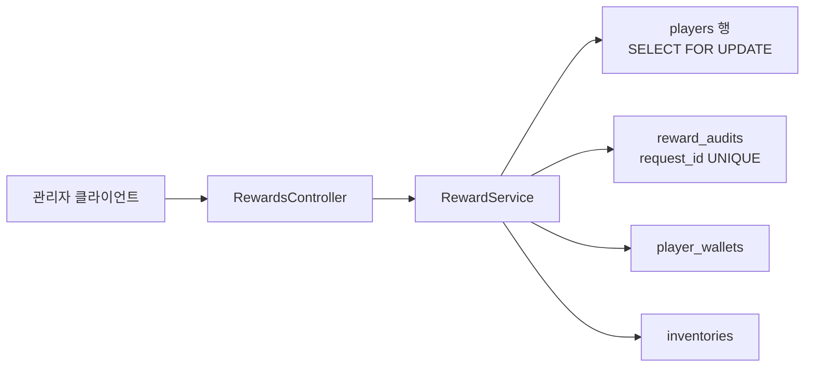
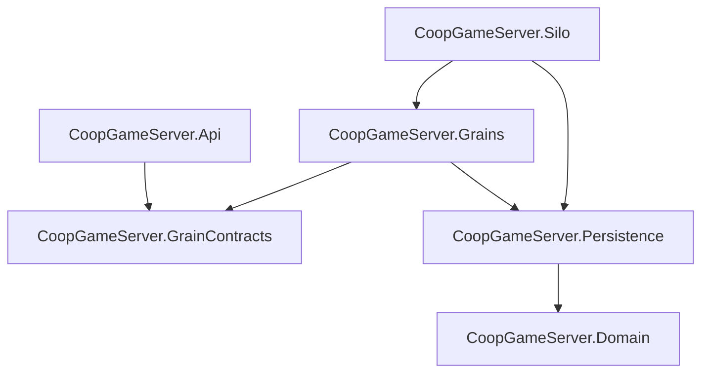
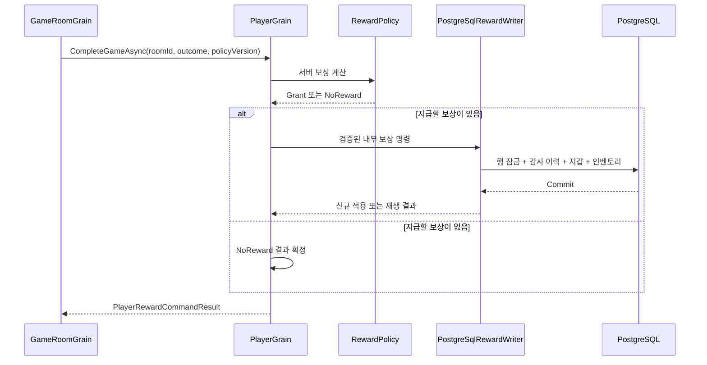

# 4주차 세부 설계 01 — PlayerGrain과 보상 영속 책임 경계

- 문서 상태: 승인 및 구현됨(Approved / Implemented)
- 최초 작성일: 2026-08-21
- 대상 주차: 4주차 — 게임 룸·전투 결과·재접속
- 구현 상태: PlayerGrain·PostgreSQL Writer·게임 결과 보상 정책·Pending 기록·GameRoom 자동 전달·Silo 자동 복구 구현
- 상위 문서: [4주차 전체 설계 — 게임 룸·전투·재접속](week-04-game-room-reconnect-overview.md)
- 관련 결정: [ADR 0001 — Orleans 사용](../adr/0001-use-orleans-for-game-entity-coordination.md), [ADR 0003 — 멱등성 키](../adr/0003-use-idempotency-keys-for-state-changing-requests.md)

## 1. 문서 목적

4주차에는 `PlayerGrain`을 추가하고 `GameRoomGrain`의 게임 완료 결과를 플레이어 보상으로 연결한다.
이때 `PlayerGrain`과 기존 `RewardService`가 모두 재화·인벤토리를 직접 소유하면 다음 문제가 발생할 수 있다.

- Grain 메모리의 골드와 PostgreSQL의 골드가 서로 달라질 수 있다.
- 관리자 보상 API와 게임 종료 보상이 서로 다른 경로로 DB를 수정할 수 있다.
- 어느 코드가 최종 규칙을 책임지는지 불명확해진다.
- Silo 재시작 뒤 Grain 메모리 복원 기준을 정하기 어렵다.
- 같은 요청의 재시도와 서로 다른 정상 요청의 동시 실행을 한곳에서 검증하기 어렵다.

이 문서는 각 구성 요소의 책임과 데이터 소유권을 먼저 고정하여 이중 소유를 방지한다.

## 2. 현재 구조

현재 보상 지급 흐름은 다음과 같다.



현재 `RewardService`는 다음 안전장치를 이미 제공한다.

- 같은 `requestId`와 같은 본문의 재시도에는 최초 결과를 반환한다.
- 같은 `requestId`로 다른 보상 본문을 보내면 충돌로 거부한다.
- 보상 감사 이력, 지갑, 인벤토리를 하나의 PostgreSQL Transaction으로 처리한다.
- Player 행을 `SELECT FOR UPDATE`로 잠가 서로 다른 정상 보상 요청의 유실 갱신을 막는다.
- PostgreSQL `UNIQUE` 제약으로 최종 중복 저장을 차단한다.

이 안전장치는 검증된 자산이므로 `PlayerGrain` 도입 뒤에도 제거하지 않는다.

## 3. 목표

1. 플레이어가 소유하는 진행도·보상 변경 명령은 `PlayerGrain`을 통해 순서대로 처리한다.
2. 재화·인벤토리의 최종 원본은 PostgreSQL 하나로 유지한다.
3. `RewardService`의 기존 멱등성·트랜잭션·행 잠금 규칙을 재사용한다.
4. 게임 완료 보상은 클라이언트가 지정한 수량이 아니라 서버 정책으로 계산한다.
5. GameRoom 완료와 Player 보상 사이에 실패가 발생해도 같은 요청의 재시도로 수렴하게 한다.
6. 기존 관리자 보상 API도 최종적으로 `PlayerGrain`을 통과하게 하여 우회 변경 경로를 없앤다.

## 4. 비목표

이번 책임 경계 단계에서는 다음 기능을 구현하지 않는다.

- 실시간 공격·피격·물리 동기화
- 복잡한 아이템 드롭 테이블
- Redis 캐시
- 다중 지역 또는 다중 데이터베이스 분산 트랜잭션
- 최종 운영용 Outbox 메시지 브로커
- Player 프로필과 인증 정보 전체를 Grain 메모리로 이전

`Outbox`는 Transactional Outbox(트랜잭셔널 아웃박스, DB 변경과 전달할 메시지를 같은 트랜잭션에 저장한 뒤 나중에 안전하게 전송하는 패턴)를 뜻한다. 4주차에서는 같은 목적을 가진 최소한의 게임 결과 전달 기록부터 구현한다.

## 5. 선택한 책임 경계

| 구성 요소 | 담당 | 담당하지 않음 |
|---|---|---|
| `RewardsController` | JWT 권한 확인, HTTP 요청·응답 변환 | DB 직접 변경, 보상 중복 판단 |
| `GameRoomGrain` | 방 상태와 서버 판정 결과 확정, PlayerGrain 호출 | 지갑·인벤토리 직접 변경 |
| `PlayerGrain` | Player ID별 진행도·보상 명령 직렬화, 내부 명령 검증, IRewardWriter 호출 | Room 안의 전투 명령 순번 관리, 골드·아이템의 별도 메모리 원본 유지 |
| `RewardPolicy` | 게임 결과를 서버 정의 보상으로 변환 | DB 저장, HTTP 입력 처리 |
| `PostgreSqlRewardWriter` | PostgreSQL 행 잠금, 멱등성, 감사 이력, 지갑·인벤토리 Transaction | 인증·인가, 게임 승패 판정, 보상 수량 결정 |
| PostgreSQL | 재화·인벤토리·감사 이력의 최종 원본 | HTTP 권한 판단 |

### 5.1 PlayerGrain의 소유 범위

`PlayerGrain`의 Grain Key는 `playerId`다. 같은 Player ID의 명령은 한 Grain에 전달되어 순서대로 처리된다.

초기 `PlayerGrain`은 다음을 소유한다.

- 플레이어별 진행도·보상 변경 명령의 순서
- 게임 완료 보상 명령의 검증과 전달
- 동일 Player에 대한 내부 작업의 조정
- 이후 추가할 현재 접속 세션·현재 Room ID 같은 짧은 수명 상태

초기 `PlayerGrain`이 소유하지 않는 것은 다음과 같다.

- 골드 총액의 별도 메모리 복사본
- 전체 인벤토리의 별도 메모리 복사본
- 비밀번호 해시와 JWT 발급 정보
- 관리자 권한 판정

Grain에 골드·인벤토리를 다시 보관하지 않는 이유는 PostgreSQL과 두 개의 원본이 생기는 것을 막기 위해서다.

Room 안에서 발생하는 공격·스킬의 `commandSequence`는 `GameRoomGrain`이 소유한다. 전투 상태는 Room 전체 참가자가 함께 변경하는 상태이므로 `PlayerGrain`을 한 번 더 거치지 않는다. 즉, 두 Grain의 순서 책임은 다음처럼 분리한다.

- `PlayerGrain`: 같은 Player의 보상·진행도 변경 순서
- `GameRoomGrain`: 같은 Room의 전투 명령과 Player별 전투 명령 순번

### 5.2 PostgreSqlRewardWriter의 소유 범위

현재 `RewardService`가 가진 검증된 DB 책임은 유지하되, 구현을 옮길 때 역할이 드러나는 `PostgreSqlRewardWriter`로 이름을 바꾼다. 이 객체는 상태를 장기간 보관하지 않는 PostgreSQL 작업 서비스다.

구현 시 현재 API 프로젝트에 있는 서비스를 Silo에서도 사용할 수 있는 Persistence 프로젝트로 옮긴다. Grain 구현이 구체 클래스와 API DTO에 직접 결합되지 않도록 공개된 최소 계약을 함께 둔다.

```text
src/CoopGameServer.Persistence/Rewards/IRewardWriter.cs
src/CoopGameServer.Persistence/Rewards/RewardWriteCommand.cs
src/CoopGameServer.Persistence/Rewards/RewardWriteResult.cs
src/CoopGameServer.Persistence/Rewards/PostgreSqlRewardWriter.cs
```

- `IRewardWriter`: PlayerGrain이 의존하는 공개 인터페이스다.
- `RewardWriteCommand`: HTTP DTO가 아닌 Persistence 전용 공개 입력 계약이다.
- `RewardWriteResult`: 신규 적용·기존 결과 재생을 표현하는 공개 출력 계약이다.
- `PostgreSqlRewardWriter`: `IRewardWriter`의 PostgreSQL 구현이다.

이 타입들은 `public`으로 선언한다. `CoopGameServer.Grains`와 `CoopGameServer.Persistence`는 서로 다른 Assembly(어셈블리, 컴파일 결과물)이므로 `internal` 타입은 별도 설정 없이 서로 사용할 수 없기 때문이다.

서비스는 요청마다 `IDbContextFactory<GameDbContext>`로 새 `GameDbContext`를 만든다. `GameDbContext`는 요청·트랜잭션 단위로만 사용하며 Grain 또는 서비스 필드에 장기간 저장하지 않는다. Silo에서는 Factory만 보관하는 `PostgreSqlRewardWriter`를 Singleton(싱글턴, 프로세스에 한 인스턴스)으로 등록해도 안전하지만, 생성한 `GameDbContext`는 호출마다 만들고 즉시 폐기한다.

`PostgreSqlRewardWriter`는 다음 규칙을 계속 책임진다.

- `reward_audits.request_id` 중복 확인
- 같은 키의 다른 본문 충돌 확인
- Player 행 `SELECT FOR UPDATE`
- 지갑·인벤토리 누적
- 보상 감사 이력 저장
- 전체 Transaction Commit 또는 Rollback

`PostgreSqlRewardWriter`가 반환하는 예상 업무 오류와 예외의 경계는 다음과 같다.

- 존재하지 않는 Player, 같은 키의 다른 본문: 명시적인 결과 코드로 반환한다.
- DB 연결 끊김, Command Timeout, 예상하지 못한 DB 오류: 예외로 전달한다.
- PlayerGrain은 예상 업무 오류를 Orleans 결과 계약으로 변환한다.
- 일시적인 기반시설 예외는 GameRoom이 `PendingRetry`로 남겨 나중에 다시 시도한다.

### 5.3 PostgreSQL을 최종 원본으로 유지하는 이유

Orleans Grain의 Activation(활성화, Grain이 Silo 메모리에서 실행되는 인스턴스)은 비활성화되거나 Silo 재시작으로 사라질 수 있다.
반면 재화·인벤토리·지급 이력은 유실되면 안 되는 영속 데이터다.

따라서 다음 원칙을 적용한다.

> PlayerGrain은 변경 명령의 순서를 소유하고, PostgreSQL은 변경 결과의 최종 값을 소유한다.

## 6. 프로젝트 의존 방향

첫 구현에서는 새 프로젝트를 추가하지 않고 현재 프로젝트 경계를 사용한다.



- 외부 HTTP 계약은 `CoopGameServer.Contracts`에 둔다.
- Orleans 호출 계약은 `CoopGameServer.GrainContracts/Players`에 둔다.
- `PlayerGrain` 구현은 `CoopGameServer.Grains/Players`에 둔다.
- DB Transaction 구현은 `CoopGameServer.Persistence/Rewards`에 둔다.
- 재화·인벤토리·감사 이력 도메인 객체는 `CoopGameServer.Domain`에 유지한다.
- Silo는 `IRewardWriter`와 `PostgreSqlRewardWriter`, `IDbContextFactory<GameDbContext>`의 DI(Dependency Injection, 의존성 주입) 등록을 담당한다.

기능이 늘어나 여러 Grain이 같은 Use Case(유스케이스, 사용 목적별 작업 흐름)를 공유하게 되면 `CoopGameServer.Application` 프로젝트 분리를 다시 검토한다. 현재는 실제 필요가 생기기 전에 프로젝트를 추가하지 않는다.

## 7. 계약 초안

이 절의 이름은 구현 중 소폭 조정할 수 있지만, 직렬화와 오류 표현 원칙은 확정한다. Orleans 경계를 통과하는 record에는 `[GenerateSerializer]`를 붙이고 각 필드에는 변경하지 않을 `[Id(n)]` 번호를 부여한다. 이 표시가 없으면 API 프로세스와 Silo 프로세스 사이에서 데이터를 안전하게 직렬화하지 못할 수 있다.

### 7.1 IPlayerGrain

```csharp
public interface IPlayerGrain : IGrainWithGuidKey
{
    Task<PlayerRewardCommandResult> GrantAdminRewardAsync(
        GrantPlayerRewardCommand command);

    Task<PlayerRewardCommandResult> CompleteGameAsync(
        CompletePlayerGameCommand command);

    Task<PlayerProgressionPageResult> GetProgressionPageAsync(
        GetPlayerProgressionPageQuery query);
}
```

- `GrantAdminRewardAsync`: 관리자 전용 API가 보내는 명시적 보상이다.
- `CompleteGameAsync`: GameRoom이 확정한 서버 결과에 따른 보상이다.
- `GetProgressionPageAsync`: PostgreSQL에서 골드와 인벤토리 한 페이지를 읽어 반환한다.

인벤토리는 처음에는 작더라도 전체 배열을 한 번에 반환하지 않는다. `PageSize`는 1~100으로 제한하고, 다음 페이지가 있으면 서버가 만든 `ContinuationToken`을 돌려준다. Continuation Token(연속 토큰)은 다음 조회 위치를 나타내는 문자열이며, 클라이언트가 DB 내부 정렬 규칙을 직접 알지 못하게 한다.

### 7.2 관리자 보상 명령

```csharp
[GenerateSerializer]
public sealed record GrantPlayerRewardCommand(
    [property: Id(0)] Guid RequestId,
    [property: Id(1)] long GoldAmount,
    [property: Id(2)] int? ItemId,
    [property: Id(3)] int? ItemQuantity,
    [property: Id(4)] string Reason);
```

관리자 보상은 신뢰된 관리자 API에서만 생성한다. PlayerGrain은 HTTP JWT 자체를 해석하지 않는다. 권한 검사는 API 경계에서 끝내고 Grain에는 검증된 내부 명령을 전달한다.

### 7.3 게임 완료 명령

```csharp
[GenerateSerializer]
public sealed record CompletePlayerGameCommand(
    [property: Id(0)] Guid RequestId,
    [property: Id(1)] Guid RoomId,
    [property: Id(2)] string QueueKey,
    [property: Id(3)] GameOutcome Outcome,
    [property: Id(4)] int RewardPolicyVersion);
```

게임 완료 명령에는 클라이언트가 선택한 `GoldAmount`나 `ItemQuantity`를 넣지 않는다. `RewardPolicy`가 `QueueKey`, 결과, 정책 버전을 보고 실제 보상을 결정한다.

### 7.4 보상 명령 결과와 오류

Grain은 HTTP 상태 코드나 Persistence 전용 예외를 직접 반환하지 않는다. 예상 가능한 업무 결과를 Orleans 계약으로 반환한다.

```csharp
[GenerateSerializer]
public enum PlayerRewardCommandStatus
{
    Applied = 0,
    NoReward = 1,
    Rejected = 2,
}

[GenerateSerializer]
public enum PlayerRewardCommandError
{
    None = 0,
    InvalidRequest = 1,
    PlayerNotFound = 2,
    UnsupportedRewardPolicy = 3,
    IdempotencyConflict = 4,
}

[GenerateSerializer]
public sealed record PlayerRewardCommandResult(
    [property: Id(0)] bool IsReplay,
    [property: Id(1)] PlayerRewardCommandStatus Status,
    [property: Id(2)] PlayerRewardCommandError Error,
    [property: Id(3)] PlayerRewardReceipt? Receipt);

[GenerateSerializer]
public sealed record PlayerRewardReceipt(
    [property: Id(0)] Guid RewardAuditId,
    [property: Id(1)] Guid RequestId,
    [property: Id(2)] Guid PlayerId,
    [property: Id(3)] long GoldAmount,
    [property: Id(4)] int? ItemId,
    [property: Id(5)] int? ItemQuantity,
    [property: Id(6)] string Reason,
    [property: Id(7)] DateTimeOffset CreatedAt);
```

- `Applied`: 실제 보상이 신규 적용됐거나 기존 적용 결과가 재생됐다.
- `NoReward`: 서버 정책상 지급할 재화가 없어 정상적으로 지급 단계를 생략했다.
- `Rejected`: `Error != None`인 재시도로 해결되지 않는 예상 업무 오류다.
- DB 연결 끊김과 시간 초과 같은 일시적 장애는 이 결과로 성공처럼 감싸지 않고 예외로 전달한다. GameRoom은 이를 받아 전달 상태를 `PendingRetry`로 유지한다.

결과 불변 조건은 `Applied`일 때만 `Receipt`가 존재하고, `NoReward`와 `Rejected`에서는 `Receipt`가 null인 것이다. `Applied`와 `NoReward`의 `Error`는 반드시 `None`이며, `Rejected`는 반드시 구체적인 오류를 가진다.

### 7.5 페이지 조회 계약

```csharp
[GenerateSerializer]
public sealed record GetPlayerProgressionPageQuery(
    [property: Id(0)] int PageSize,
    [property: Id(1)] string? ContinuationToken);

[GenerateSerializer]
public enum PlayerProgressionQueryError
{
    None = 0,
    InvalidPageSize = 1,
    InvalidContinuationToken = 2,
    PlayerNotFound = 3,
}

[GenerateSerializer]
public sealed record PlayerProgressionPageResult(
    [property: Id(0)] PlayerProgressionQueryError Error,
    [property: Id(1)] long Gold,
    [property: Id(2)] PlayerInventoryItemSnapshot[] Items,
    [property: Id(3)] string? NextContinuationToken);

[GenerateSerializer]
public sealed record PlayerInventoryItemSnapshot(
    [property: Id(0)] int ItemId,
    [property: Id(1)] int Quantity,
    [property: Id(2)] DateTimeOffset UpdatedAt);
```

조회 계약도 Grain 경계를 통과하므로 직렬화 표시를 사용한다. API가 `PageSize`를 1차 검사하고 PlayerGrain이 같은 범위와 토큰 형식을 다시 검사한다. 잘못된 값과 없는 Player는 예외가 아니라 `PlayerProgressionQueryError`로 반환한다.

## 8. 서버 정의 보상 정책

게임 완료 보상은 다음 흐름으로 계산한다.



초기 정책은 코드에 명시된 작은 고정 정책으로 시작한다.

예시:

| QueueKey | 결과 | 골드 | 아이템 |
|---|---:|---:|---|
| `coop-dungeon-normal-v1` | 승리 | 500 | 아이템 ID `1001` 1개 |
| `coop-dungeon-normal-v1` | 패배 | 0 | 없음 |
| `coop-dungeon-normal-v1` | 취소 | 0 | 없음 |

위 수치는 첫 번째 구현 정책으로 확정했으며, 같은 정책 버전 `1`의 내용은 이후 변경하지 않는다. 보상 수치를 바꾸려면 버전 `2`를 추가해야 한다. 중요한 점은 클라이언트가 보상 수량을 결정하지 않는다는 것이다.

패배·취소 정책처럼 골드가 0이고 아이템도 없는 경우에는 `IRewardWriter`를 호출하거나 `reward_audits` 행을 만들지 않는다. 현재 도메인과 DB는 실제 지급이 하나 이상인 감사 이력만 허용하기 때문이다. 대신 PlayerGrain은 `NoReward`를 반환하고 GameRoom은 해당 Player의 `game_results` 상태를 `NoReward`로 확정한다. 따라서 무보상도 실패가 아니라 한 번 확정된 정상 결과다.

### 8.1 보상 정책 버전 고정

`RewardPolicyVersion`은 게임 완료 시점의 최신 버전을 즉석에서 선택하지 않는다. Room을 생성할 때 QueueKey에 맞는 버전을 하나 선택해 `game_rooms.reward_policy_version`에 저장하고, 게임이 끝날 때까지 바꾸지 않는다.

- `reward_policy_version`은 1 이상의 정수이며 Room 생성 뒤 불변이다.
- 이미 배포한 같은 버전 번호의 QueueKey·Outcome별 보상 내용도 바꾸지 않는다. 보상 내용이 바뀌면 반드시 새 버전 번호를 만든다.
- `game_results`에도 적용한 정책 버전과 결정적 보상 `requestId`를 저장한다.
- PlayerGrain은 전달받은 버전을 지원하지 않으면 `UnsupportedRewardPolicy`를 반환한다.
- `Pending` 또는 `PendingRetry` 결과가 남아 있는 동안 해당 과거 정책 구현을 제거하지 않는다.
- 배포로 기본 정책 버전이 바뀌어도 기존 Room은 저장된 이전 버전을 계속 사용한다.

이 규칙이 없으면 Silo 재시작이나 새 버전 배포 뒤 같은 게임을 다시 처리할 때 다른 결정적 ID가 만들어져 보상이 중복될 수 있다.

### 8.2 Grain 계약과 DB 명령의 변환

`CompletePlayerGameCommand`는 Orleans 호출 계약이고, `IRewardWriter`가 받는 DB 명령은 별도의 Persistence 공개 형식으로 둔다.

```csharp
public interface IRewardWriter
{
    Task<RewardWriteResult> WriteAsync(RewardWriteCommand command);
}

public sealed record RewardWriteCommand(
    Guid RequestId,
    Guid PlayerId,
    long GoldAmount,
    int? ItemId,
    int? ItemQuantity,
    string Reason);

public enum RewardWriteError
{
    None = 0,
    PlayerNotFound = 1,
    IdempotencyConflict = 2,
}

public sealed record RewardWriteResult(
    bool IsReplay,
    RewardWriteError Error,
    RewardWriteReceipt? Receipt);

public sealed record RewardWriteReceipt(
    Guid RewardAuditId,
    Guid RequestId,
    Guid PlayerId,
    long GoldAmount,
    int? ItemId,
    int? ItemQuantity,
    string Reason,
    DateTimeOffset CreatedAt);
```

PlayerGrain은 RewardPolicy의 `Grant` 결과를 `RewardWriteCommand`로 변환한다. `NoReward` 결과에는 이 명령을 만들지 않는다. `RewardWriteError`는 예상 가능한 DB 업무 결과만 표현하며, 연결 오류와 Timeout은 예외로 유지한다. 따라서 Persistence 프로젝트가 HTTP DTO나 Orleans 계약을 직접 참조하지 않아도 된다.

이 Persistence 계약은 같은 Silo 프로세스 안에서 일반 C# 메서드 호출로만 사용하므로 Orleans `[GenerateSerializer]`는 필요하지 않다. 반대로 7장의 PlayerGrain 명령·결과는 프로세스 경계를 통과하므로 직렬화 표시가 반드시 필요하다.

## 9. 멱등성 키 범위

### 9.1 관리자 보상

현재와 같이 관리자가 생성한 전역 UUID `requestId`를 사용한다.

- 같은 키 + 같은 보상: 최초 결과 재생
- 같은 키 + 다른 보상: 충돌

### 9.2 게임 완료 보상

플레이어별 게임 완료 보상 ID는 다음 입력으로 결정적으로 만든다.

```text
game-room-reward-v1 + roomId + playerId + rewardPolicyVersion
```

결정적 ID(Deterministic ID, 같은 입력에서 항상 같은 값이 나오는 식별자)를 사용하는 이유는 다음과 같다.

- GameRoom 완료 요청의 HTTP `requestId`가 바뀌어도 같은 방·같은 플레이어 보상은 하나다.
- Silo가 중간에 재시작되어도 같은 식별자를 다시 계산할 수 있다.
- 네트워크 응답이 유실되어 다시 호출해도 `reward_audits`의 같은 결과로 수렴한다.

`rewardPolicyVersion`은 Room 생성 시 DB에 고정한 값을 사용한다. `PostgreSqlRewardWriter`가 사용하는 PostgreSQL `UNIQUE` 제약이 실제 지급의 최종 중복 방지선이다. `NoReward`는 `reward_audits`를 만들지 않으며 `(room_id, player_id)`가 고유한 `game_results` 행으로 한 번만 확정한다.

## 10. 정상 요청 흐름

### 10.1 관리자 보상

1. `RewardsController`가 JWT 역할을 검사한다.
2. Controller는 경로의 `playerId`로 `IPlayerGrain` Proxy를 얻는다.
3. PlayerGrain에 관리자 보상 명령을 전달한다.
4. PlayerGrain은 명령 형식과 자신의 Grain Key를 확인한다.
5. PostgreSqlRewardWriter가 PostgreSQL Transaction을 수행한다.
6. API는 신규 적용이면 `201 Created`, 재생이면 `200 OK`를 반환한다.

예상 오류는 기존 HTTP 의미를 유지한다.

- `InvalidRequest` → `400 Bad Request`
- `PlayerNotFound` → `404 Not Found`
- `IdempotencyConflict` → `409 Conflict`
- DB 연결·시간 제한 같은 일시 장애 → `503 Service Unavailable`

### 10.2 게임 완료 보상

1. GameRoomGrain이 전투 결과를 확정한다.
2. 방 상태와 네 Player의 `game_results = Pending`을 같은 Transaction으로 먼저 저장한다. 각 행에는 Room 생성 때 고정한 `reward_policy_version`과 결정적 `reward_request_id`가 들어간다.
3. `Pending` Player ID의 PlayerGrain을 호출한다.
4. PlayerGrain은 저장된 정책 버전과 결과로 보상을 계산한다.
5. 실제 지급이 있으면 IRewardWriter에 결정적 `requestId`를 전달하고, 지급이 없으면 `NoReward`를 반환한다.
6. GameRoom은 성공한 Player를 `Applied` 또는 `NoReward`로, 일시 오류는 `PendingRetry`로, 영구 오류는 `TerminalFailure`로 기록한다.
7. 네 명 모두 `Applied` 또는 `NoReward`이면 정상 전달 완료로 본다. `TerminalFailure`가 있으면 게임 결과 자체는 유지하되 운영 확인이 필요한 완료로 본다.

## 11. 실패와 재시도 설계

| 실패 지점 | 저장 상태 | 재시도 처리 |
|---|---|---|
| GameRoom 완료 저장 전 실패 | 방이 아직 InGame | 완료 요청을 다시 실행한다. |
| GameRoom 완료 저장 후 Player 호출 전 실패 | 방 Completed, 보상 Pending | 즉시 전달 또는 복구 Worker가 다시 호출한다. |
| PostgreSqlRewardWriter Commit 전 일시 실패 | 보상 미적용, PendingRetry | 같은 결정적 ID로 다시 시도한다. |
| PostgreSqlRewardWriter Commit 후 응답 유실 | 보상 적용됨, GameRoom은 PendingRetry일 수 있음 | 같은 ID의 기존 지급 결과를 재생하고 Applied로 바꾼다. |
| 일부 Player만 보상 성공 | 성공자는 Applied, 나머지는 PendingRetry | 재시도 시 미완료 Player만 호출한다. |
| 정책상 지급할 보상 없음 | NoReward | IRewardWriter를 호출하지 않으며 재시도하지 않는다. |
| 같은 키에 다른 보상 내용 | TerminalFailure | 충돌 내용을 남기고 자동으로 덮어쓰지 않는다. |
| 존재하지 않는 Player·지원하지 않는 정책 버전 | TerminalFailure | 자동 재시도를 멈추고 운영 확인 대상으로 남긴다. |

GameRoom 완료 자체를 보상 실패 때문에 InGame으로 되돌리지 않는다. 게임 결과는 이미 확정됐고 일부 플레이어에게 보상이 지급됐을 수 있기 때문이다. 대신 플레이어별 전달 상태를 남기고 재시도한다.

### 11.1 game_results 전달 상태

| 상태 | 뜻 | 자동 재시도 |
|---|---|---|
| `Pending` | 아직 첫 전달을 시작하지 않음 | 예 |
| `PendingRetry` | 일시적인 DB·네트워크 오류로 다음 시도를 기다림 | 예 |
| `Applied` | 실제 보상이 적용되었거나 기존 적용 결과를 확인함 | 아니요 |
| `NoReward` | 정책상 지급할 보상이 없음을 정상 확정함 | 아니요 |
| `TerminalFailure` | 재시도로 해결되지 않는 계약·데이터 오류 | 아니요, 운영 확인 필요 |

각 결과 행에는 최소한 `room_id`, `player_id`, `reward_policy_version`, `reward_request_id`, `delivery_status`, `attempt_count`, `next_attempt_at`, `last_error_code`, `updated_at`을 저장한다. 기본 키는 `(room_id, player_id)`로 두어 한 게임의 한 Player 결과가 두 행으로 갈라지지 않게 한다.

### 11.2 재시도를 실제로 시작하는 주체

DB에 상태만 남기고 호출자의 재전송만 기다리면 `Pending`이 영원히 남을 수 있다. 따라서 단일 Silo인 4주차에는 다음 세 경로를 함께 사용한다.

1. GameRoom 완료 직후 `Pending`을 즉시 전달한다.
2. 같은 완료 요청 재생 시 아직 끝나지 않은 결과를 다시 확인한다.
3. Silo의 공통 `GameRoomRecoveryService`가 일정 주기로 DB의 재시도 시각이 지난 Room ID를 조회하고, 해당 GameRoomGrain의 `FinalizeCompletedRoomAsync`를 호출한다.

```csharp
Task FinalizeCompletedRoomAsync();
```

이 메서드는 HTTP API로 공개하지 않는다. Silo 내부 복구 서비스와 같은 완료 요청의 재생 경로만 호출한다. 메서드는 Party 복귀, Ticket 완료, Player별 `Pending`·`PendingRetry` 결과를 DB에서 다시 읽고 끝나지 않은 단계만 조정하므로 Worker가 과거 상태를 매개변수로 전달하지 않는다. 보상 재시도는 이 메서드 내부 단계이며 별도의 공개 `RetryPendingRewardsAsync` 계약을 만들지 않는다.

현재 구현은 완료 직후와 같은 완료 요청 재생 시 `FinalizeCompletedRoomAsync`를 호출하여 Player별 보상을 전달한다. Player 응답은 한 행씩 즉시 저장하므로 일부 Player만 성공해도 성공 상태가 보존된다. Silo의 `GameRoomRecoveryService`는 시작 직후와 이후 5초 간격으로 최대 100개의 Room ID를 조회하고, 같은 메서드를 호출해 재시작 뒤 남은 `Pending`·기한이 지난 `PendingRetry`도 자동 처리한다.

Recovery Service(복구 서비스)는 보상을 직접 지급하지 않는다. DB에서 Room ID를 찾아 Grain을 깨우는 역할만 담당하며, 실제 상태 확인과 PlayerGrain 호출은 항상 GameRoomGrain이 수행한다. 이 Worker는 재접속 기한 복구 설계에서도 공통으로 사용하고, 조회 조건만 만료 기한과 보상 재시도 시각으로 나눈다. 이렇게 하면 Silo 재시작 뒤에도 Worker가 Pending 행을 다시 찾아 처리를 이어갈 수 있다.

- 첫 재시도 간격은 5초로 시작하고 최대 1분까지 늘리는 제한된 지수 Backoff(백오프, 실패할수록 재시도 간격을 늘리는 방식)를 사용한다.
- Recovery Service의 기본 조회 주기는 5초이고 한 번에 처리하는 서로 다른 방은 최대 100개다.
- 한 방의 호출 실패는 같은 Batch(배치, 한 번에 묶어 처리하는 작업 단위)의 다른 방 처리를 중단시키지 않는다.
- 일시 오류는 횟수만으로 `TerminalFailure`로 바꾸지 않는다.
- 다중 Silo에서 Worker 중복 실행을 막는 Lease(임대 잠금)는 운영 확장 항목이다. 4주차 단일 Silo에서는 결정적 ID와 DB 제약으로 중복 지급을 막는다.

## 12. 동시성 설계

Orleans는 같은 PlayerGrain Key에 들어온 호출을 순차 처리한다. 그러나 이것만으로 PostgreSQL 보호를 제거하지 않는다.

다음 방어 계층을 함께 유지한다.

1. PlayerGrain: 플레이어별 보상·진행도 변경 명령 순서를 정리한다.
2. PostgreSQL Player 행 잠금: Grain을 우회한 관리·이전 코드 또는 경쟁 Transaction도 보호한다.
3. `reward_audits.request_id UNIQUE`: 같은 멱등성 키의 최종 중복 적용을 막는다.
4. Transaction: 감사 이력·지갑·인벤토리가 일부만 저장되는 것을 막는다.

이를 Defense in Depth(다층 방어, 한 보호 장치가 실패해도 다른 장치가 막는 설계)로 본다.

## 13. 조회 정책

`GetProgressionPageAsync`는 초기 단계에서 PostgreSQL을 직접 조회한다.

- PlayerGrain은 골드·인벤토리를 장기 메모리 캐시하지 않는다.
- 조회 결과는 골드와 최대 100개의 인벤토리 항목, 다음 `ContinuationToken`이 담긴 DTO(Data Transfer Object, 계층 사이에 전달하는 데이터 객체)로 반환한다.
- 인벤토리 정렬 기준은 `(item_id ASC)`로 고정하고 토큰은 마지막 `item_id`를 서버 형식으로 인코딩한다.
- 5주차 Redis 도입 시 측정 결과를 근거로 읽기 캐시를 별도 추가한다.
- 캐시를 추가해도 PostgreSQL은 최종 원본으로 유지한다.

## 14. 취소와 시간 제한 정책

HTTP 클라이언트 연결이 끊겼다는 이유만으로 이미 Grain에 전달된 상태 변경 명령을 중간 취소하지 않는다.

- Orleans Grain 계약에는 HTTP 요청의 `CancellationToken`을 넣지 않는다.
- API는 Grain Task를 먼저 만든 뒤 `await grainTask.WaitAsync(HttpContext.RequestAborted)` 형태로 응답 대기만 중단한다. `WaitAsync`가 취소되어도 이미 시작한 Grain 호출 자체는 계속 처리된다.
- PlayerGrain과 PostgreSqlRewardWriter는 HTTP 요청 토큰을 받지 않고 DB 작업용 독립 Timeout을 사용한다.
- PlayerGrain에 전달된 보상 명령은 DB의 성공, 예상 업무 오류, 일시적 기반시설 실패 중 하나가 확정될 때까지 처리한다.
- 호출자가 결과를 받지 못하면 같은 `requestId`로 재시도해 저장된 결과를 확인한다.
- DB 명령에는 별도의 Command Timeout(명령 시간 제한)을 두어 무한 대기를 막고, 시간 초과는 `PendingRetry` 대상인 일시 오류로 분류한다.
- Silo 정상 종료 시에는 호스트 종료 토큰을 사용해 새 작업 수락을 멈추고 진행 중 작업을 정리한다.

이 정책은 “클라이언트가 사라졌으므로 보상 지급을 취소한다”는 불확실한 상태를 만들지 않기 위해 필요하다.

## 15. 검토한 대안

### 15.1 PlayerGrain이 골드·인벤토리를 메모리에 모두 보관

- 장점: 조회가 빠르고 Player 단위 규칙을 한눈에 보기 쉽다.
- 단점: PostgreSQL과 이중 원본이 생기며 활성화·비활성화·저장 실패 복구가 복잡하다.
- 결정: 현재 단계에서는 선택하지 않는다.

### 15.2 기존처럼 API가 RewardService를 직접 호출

- 장점: 변경량이 적고 기존 테스트를 그대로 사용하기 쉽다.
- 단점: 게임 완료는 PlayerGrain, 관리자 보상은 API라는 두 변경 경로가 생긴다.
- 결정: 전환 과정에서만 허용하고 최종적으로 Controller도 PlayerGrain을 호출한다. 이 선택은 변경 경계를 통일하는 대신 Silo가 중단되면 관리자 보상도 처리할 수 없다는 가용성 비용이 있다. 4주차는 일관된 Orleans 경계를 학습하는 목적을 우선한다.

### 15.3 IRewardWriter를 없애고 모든 DB 코드를 PlayerGrain에 작성

- 장점: 호출 경로가 짧다.
- 단점: Grain이 게임 규칙·멱등성·SQL·Transaction을 모두 가져 거대한 클래스가 된다.
- 결정: 선택하지 않는다. PostgreSqlRewardWriter를 별도 협력 객체로 유지한다.

### 15.4 여러 Grain과 DB를 하나의 분산 트랜잭션으로 묶기

- 장점: 겉보기에는 한 번에 Commit할 수 있다.
- 단점: 구현·운영 복잡성이 크고 현재 프로젝트 범위를 넘어선다.
- 결정: 결정적 requestId, 상태 기록, 재시도로 수렴하는 방식을 사용한다.

## 16. 테스트 계획

### 16.1 단위 테스트

- 빈 `requestId`, `roomId`, 잘못된 결과 거부
- RewardPolicy의 QueueKey·결과별 보상 계산
- 패배 무보상은 `NoReward`이며 RewardWriteCommand를 만들지 않음
- 같은 입력에서 같은 게임 보상 requestId 생성
- 다른 Player·Room·정책 버전에서 다른 requestId 생성
- 배포 기본 버전이 바뀌어도 기존 Room의 저장된 정책 버전 유지
- 클라이언트가 게임 완료 보상 수량을 직접 지정할 계약이 없음을 확인

### 16.2 PostgreSqlRewardWriter PostgreSQL 통합 테스트

기존 테스트를 유지하고 새 위치·새 계약으로 옮긴다.

- 같은 `requestId` 100개 동시 요청에서 한 번만 적용
- 서로 다른 `requestId` 동시 누적에서 유실 없음
- 첫 지갑·인벤토리 행 생성 경쟁
- 같은 키의 다른 본문 충돌
- 지갑 Overflow 시 감사 이력 Rollback
- `NoReward`에는 reward_audits 행이 생기지 않음

### 16.3 PlayerGrain 통합 테스트

- 관리자 보상 신규 적용과 재생
- 같은 Player의 서로 다른 보상 명령 순차 처리
- Silo 재시작 뒤 같은 보상 요청 결과 재생
- 존재하지 않는 Player 보상 거부
- 지원하지 않는 정책 버전을 예상 업무 오류로 반환
- DB 시간 초과는 업무 성공 결과로 바꾸지 않고 일시 예외로 전달
- PostgreSQL 값과 Grain 응답 일치

### 16.4 GameRoom 전체 흐름 테스트

- 3인 파티 + 솔로 매칭과 방 생성
- GameRoom 시작·완료
- 네 명의 결과가 `Applied` 또는 `NoReward`로 정확히 한 번 확정
- 완료 요청 재전송에도 추가 지급 없음
- 한 Player의 일시적 전달 실패 뒤 `PendingRetry`만 재시도
- 영구 오류는 `TerminalFailure`로 분류하고 자동 재시도 중단
- Silo 재시작 뒤 Recovery Service가 Pending 보상 전달 재개
- 정책 배포 변경 뒤에도 기존 Room 보상 requestId 유지
- 파티 복귀·티켓 Completed·재매칭 기존 동작 유지

## 17. 구현 순서와 커밋 경계

각 단계는 이전 단계 테스트를 통과한 뒤 별도 커밋한다.

1. **PlayerGrain 계약과 테스트 골격 작성**
   - `IPlayerGrain`, 직렬화된 명령·결과·페이지 조회 계약
   - 컴파일과 계약 단위 테스트
2. **RewardService를 PostgreSqlRewardWriter로 옮겨 Silo에서 재사용**
   - API 전용 의존 제거
   - 공개 `IRewardWriter`, `RewardWriteCommand`, `RewardWriteResult` 작성
   - `IDbContextFactory<GameDbContext>` 사용
   - 기존 PostgreSQL 통합 테스트 보존
3. **PlayerGrain 보상 명령 구현**
   - 관리자 보상부터 연결
   - PlayerGrain 통합 테스트
4. **RewardsController를 PlayerGrain 호출로 전환**
   - JWT 관리자 정책과 HTTP 상태 코드 유지
   - 기존 Controller 테스트 회귀 확인
5. **게임 결과·Pending 전달 기록 추가**
   - Migration 작성
   - Room의 불변 `reward_policy_version` 저장
   - 정규화된 `game_results`와 전달 상태 저장
6. **GameRoom → PlayerGrain 보상 연결**
   - 결정적 requestId
   - `Applied`와 `NoReward`, 일시·영구 오류 분리
7. **Pending 복구 Worker 연결**
   - 공통 `GameRoomRecoveryService`에 보상 재시도 조회 추가
   - Backoff, 부분 실패·재시작 테스트
8. **문서·Notion·README 최신화**
   - 실제 구현과 설계 차이 기록
   - CI 결과와 테스트 수 반영

## 18. 코드 작성 전 확인할 결정

1차 심층 검토에서 다음 구조 결정은 확정했다.

- 패배·취소 보상은 0이며 `NoReward`로 기록하고 IRewardWriter를 호출하지 않는다.
- 관리자 보상 API도 같은 주차에 PlayerGrain으로 전환한다.
- Player별 전달 상태는 정규화된 `game_results` 테이블로 저장한다.
- 인벤토리 조회는 최대 100개의 페이지 단위 계약을 사용한다.
- Room 생성 시 보상 정책 버전을 저장하고 이후 바꾸지 않는다.
- Silo의 DB 기반 Recovery Service가 Pending 전달을 자동 재개한다.
- 예상 영구 오류는 `TerminalFailure`, DB·네트워크 일시 오류는 `PendingRetry`로 구분한다.

Recovery Service의 조회 주기는 5초, 한 번의 최대 조회량은 100개 방, GameRoom 내부 재시도 Backoff는 최초 5초·최대 60초로 확정했다. DB Command Timeout(데이터베이스 명령 시간 제한)의 명시적 초기값은 실제 부하 측정 전까지 Npgsql 기본값을 사용하며, 운영 확장 단계에서 부하 테스트 결과로 결정한다.

초기 게임 완료 보상은 `coop-dungeon-normal-v1`·정책 버전 `1`의 승리에 골드 500과 아이템 ID `1001` 1개를 지급하는 것으로 확정했다. 패배·취소는 보상 Writer를 호출하지 않는 정상 `NoReward`이다.

## 19. 완료 기준

이 설계 단계는 다음 조건을 만족하면 승인 완료로 본다.

- 각 구성 요소의 데이터 소유권을 한 문장으로 설명할 수 있다.
- PlayerGrain이 PostgreSQL 재화의 별도 원본을 만들지 않는 이유가 명확하다.
- GameRoom 완료 후 중간 실패와 재시도 흐름이 정의되어 있다.
- 무보상, 일시 오류, 영구 오류가 서로 다른 최종 상태로 정의되어 있다.
- 정책 버전이 Room 생성 시 고정되어 배포 뒤 재시도에도 같은 보상 ID를 만든다.
- Orleans 계약과 Persistence 공개 계약이 프로젝트 경계를 넘어 컴파일 가능한 형태다.
- 게임 완료 보상 수량을 클라이언트가 결정하지 않는다는 계약이 명확하다.
- 단위·통합·재시작 테스트 항목이 구현 순서와 연결되어 있다.
