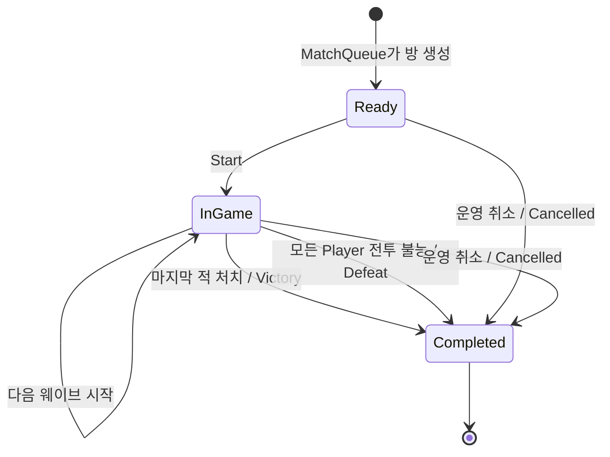

# 4주차 세부 설계 02 — GameRoom 전투·웨이브 상태 머신

- 문서 상태: 제안됨(Proposed)
- 최초 작성일: 2026-08-21
- 구현 상태: 1차 심층 검토 반영, 코드 미구현
- 상위 문서: [4주차 전체 설계 — 게임 룸·전투·재접속](week-04-game-room-reconnect-overview.md)
- 선행 문서: [PlayerGrain과 보상 영속 책임 경계](week-04-01-player-grain-reward-boundary.md)

## 1. 문서 목적

현재 `GameRoomGrain`은 `Ready → InGame → Completed`만 관리한다. 4주차에는 이 안에 최소 협동 전투와 웨이브 진행 규칙을 추가한다.

이 문서는 다음 질문에 답한다.

- 방 생명주기와 전투 결과를 어떻게 분리할 것인가?
- 어떤 상태에서 어떤 명령을 허용할 것인가?
- 웨이브는 언제 시작하고 끝나는가?
- 게임 승리·실패는 누가 판정하는가?
- Silo 재시작 뒤 어떤 상태를 복원해야 하는가?

공격 요청 형식, 쿨다운, 서버 시간, 명령 순번의 세부 규칙은 [세부 설계 03](week-04-03-server-time-and-command-validation.md)에서 다룬다.

## 2. 전투 모델 선택

4주차 전투는 **4인 협동·3개 웨이브·명령 기반 PvE**로 제한한다.

- PvE(Player versus Environment, 플레이어 대 환경 전투): 사용자가 서버가 제어하는 적과 싸우는 방식
- 실시간 위치나 물리 계산은 없다.
- 클라이언트는 일반 공격 또는 스킬 사용 의도만 보낸다.
- 서버는 현재 상태·쿨다운·Player 소속을 검사하고 피해량을 계산한다.
- 각 웨이브에는 서버가 소유하는 적 한 개가 존재한다.
- 마지막 웨이브의 적을 처치하면 승리한다.
- 모든 플레이어가 전투 불능이면 실패한다.

이 모델은 HTTP API와 자동 테스트만으로도 서버 권위·상태 전이·중복 요청·재접속을 검증할 수 있다.

## 3. 생명주기와 결과 분리

방 생명주기는 기존 세 상태를 유지한다.

```csharp
public enum GameRoomLifecycle
{
    Ready = 0,
    InGame = 1,
    Completed = 2,
}
```

게임의 승리·실패·운영 취소는 별도의 결과 값으로 표현한다.

```csharp
public enum GameOutcome
{
    None = 0,
    Victory = 1,
    Defeat = 2,
    Cancelled = 3,
}
```

취소 원인은 결과와 별도로 보관한다.

```csharp
public enum GameCancellationReason
{
    None = 0,
    OperatorRequested = 1,
    InitialConnectionTimeout = 2,
    LegacyMigration = 3,
}
```

선택 이유:

- `Completed`는 더 이상 게임 명령을 받지 않는 최종 생명주기다.
- `Victory`와 `Defeat`은 완료된 이유 또는 결과다.
- 생명주기에 `Failed`, `Cancelled`를 계속 추가하면 모든 상태 전이 코드가 복잡해진다.
- `Lifecycle = Completed`와 `Outcome != None`이라는 불변 조건으로 종료 상태를 명확하게 검사할 수 있다.

### 3.1 기존 Complete 명령의 전환 원칙

3주차의 `CompleteAsync(Guid requestId)`는 전투 판정 없이 `InGame` 방을 완료한다. 이 동작을 그대로 남기면
`Completed + Outcome` 불변 조건을 깨므로 4주차 계약에서는 다음과 같이 전환한다.

- `Victory`와 `Defeat`는 마지막 전투 명령을 처리하는 `GameRoomGrain`만 확정한다.
- 관리자용 기존 `/complete` 경로는 제거하고 명시적인 `CancelAsync`로 바꾼다.
- `CancelAsync`는 운영자만 호출할 수 있고 결과를 `Cancelled`로 저장한다.
- `Ready → Completed + Cancelled`에서는 `StartedAt`이 null일 수 있다.
- `InGame → Completed + Victory/Defeat/Cancelled`에서는 `StartedAt`이 반드시 존재한다.
- 기존 생명주기 테스트의 일반 완료 호출은 승리·패배 전투 또는 관리자 취소 테스트로 분리한다.

즉, 4주차 이후에는 결과가 없는 일반 `Complete` 명령을 새로 저장하지 않는다.

```csharp
public sealed record CancelGameRoomCommand(
    Guid RequestId,
    GameCancellationReason Reason);
```

외부 관리자 API는 `OperatorRequested`만 만들 수 있다. 최초 연결 제한 만료는 서버가
`InitialConnectionTimeout`과 결정적 requestId를 사용해 내부에서 호출한다. `LegacyMigration`은 기존 행 Backfill에만 사용한다.

## 4. 전체 상태 전이



허용하지 않는 전이:

- Ready에서 공격 또는 스킬 사용
- Ready에서 Victory 또는 Defeat 확정
- InGame에서 다시 Start
- Completed에서 공격·스킬·웨이브 변경
- Completed에서 결과 덮어쓰기
- Completed에서 다시 Ready 또는 InGame 복귀

## 5. 방 전투 상태

`GameRoomSnapshot`은 다음 정보를 추가로 제공한다.

```csharp
public sealed record GameRoomCombatSnapshot(
    Guid RoomId,
    string QueueKey,
    GameRoomLifecycle Lifecycle,
    GameOutcome Outcome,
    GameCancellationReason CancellationReason,
    int CurrentWave,
    int MaxWaves,
    int EnemyMaxHealth,
    int EnemyCurrentHealth,
    long StateVersion,
    long EnemyAttackSequence,
    int CombatRuleVersion,
    PlayerCombatSnapshot[] Players,
    DateTimeOffset CreatedAt,
    DateTimeOffset? StartedAt,
    DateTimeOffset? CompletedAt);
```

### 5.1 필드 의미

| 필드 | 의미 |
|---|---|
| `CurrentWave` | 현재 진행 중인 웨이브 번호, 시작 전에는 0 |
| `CancellationReason` | Outcome이 Cancelled일 때만 None이 아닌 취소 원인 |
| `MaxWaves` | 전체 웨이브 수, 초기 구현은 3 |
| `EnemyMaxHealth` | 현재 웨이브 적의 최대 체력 |
| `EnemyCurrentHealth` | 현재 웨이브 적의 남은 체력 |
| `StateVersion` | 방 상태가 성공적으로 변경될 때마다 증가하는 버전 |
| `EnemyAttackSequence` | 실제 적 반격이 발생할 때마다 1씩 증가하는 결정적 대상 선택 순번 |
| `CombatRuleVersion` | 방이 시작할 때 고정한 전투 규칙 버전 |
| `Players` | 네 명의 전투·접속 상태 스냅샷 |

`StateVersion`은 클라이언트가 받은 스냅샷이 오래됐는지 판단하는 보조 정보다. 명령의 멱등성 키나 Player별 명령 순번을 대신하지 않는다.

- 방 생성 커밋 뒤 최초 값은 1이다.
- 상태를 바꾸는 명령 한 건이 Commit되면 발생 이벤트 수와 관계없이 정확히 1 증가한다.
- 연결 상태 변경과 Timer 판정도 상태를 바꾸고 Commit되면 1 증가한다.
- 거부된 명령, 저장 결과 재생, 단순 조회는 증가시키지 않는다.
- `long.MaxValue`에서는 새 상태 변경을 거부하고 운영 오류로 기록한다.

적 대상 선택은 접속 Heartbeat 등 다른 상태 변경의 영향을 받지 않도록 `StateVersion`이 아니라
별도의 `EnemyAttackSequence`를 사용한다.

## 6. 플레이어 전투 상태

```csharp
public sealed record PlayerCombatSnapshot(
    Guid PlayerId,
    int MaxHealth,
    int CurrentHealth,
    PlayerCombatStatus CombatStatus,
    PlayerConnectionStatus ConnectionStatus,
    long LastAcceptedCommandSequence,
    DateTimeOffset? BasicAttackReadyAt,
    DateTimeOffset? SkillReadyAt);
```

```csharp
public enum PlayerCombatStatus
{
    Active = 0,
    Incapacitated = 1,
}
```

- 초기 최대 체력은 모든 Player가 같은 값으로 시작한다.
- 체력이 0이 되면 `Incapacitated`가 된다.
- 전투 불능 Player는 공격·스킬을 사용할 수 없다.
- 4주차에는 부활 기능을 구현하지 않는다.
- 연결이 끊겨도 체력과 전투 불능 상태는 그대로 유지한다.
- `connectionId`, `connectionGeneration`, `LeaseExpiresAt`은 내부 영속 상태에는 존재하지만 공용 Player 스냅샷에는 넣지 않는다.
- 인증된 조회자 자신의 `connectionGeneration`만 별도 응답 필드로 투영한다. 다른 Player의 연결 자격 정보는 반환하지 않는다.

접속 상태 세부 규칙은 세부 설계 04에서 정의한다.

## 7. 웨이브 규칙

초기 전투 설정은 코드에 명시된 서버 정책으로 둔다.

```csharp
public sealed record WaveDefinition(
    int WaveNumber,
    int EnemyMaxHealth,
    int EnemyAttackPower);
```

권장 초기값:

| 웨이브 | 적 최대 체력 | 적 공격력 |
|---:|---:|---:|
| 1 | 100 | 5 |
| 2 | 180 | 10 |
| 3 | 300 | 15 |

수치는 기능 검증을 위한 초기값이며 게임 밸런스 결과가 아니다.

### 7.1 웨이브 시작

- 방 Create 시 네 Player 행을 먼저 만들고 체력 100·쿨다운 null·명령 순번 0·`AwaitingConnection`으로 초기화한다.
- 방 Start 시 네 Player가 모두 현재 연결로 `Connected`인지 검사하고 `CurrentWave = 1`로 초기화한다.
- 서버 정책에서 1웨이브 적 체력과 공격력을 읽는다.
- Start는 Create 이후 축적된 연결 ID·연결 세대·명령 순번을 초기화하지 않는다.
- `EnemyAttackSequence = 0`과 방 생성 때 고정한 `CombatRuleVersion`을 사용한다.
- Party 상태 전환과 방 상태 저장이 성공한 뒤 전투 명령을 허용한다.

### 7.2 웨이브 진행

1. 유효한 Player 명령이 적에게 피해를 준다.
2. 적 체력이 0보다 크면 서버가 적 반격을 계산한다.
3. 적 체력이 0 이하가 되면 현재 웨이브를 완료한다.
4. 마지막 웨이브가 아니면 다음 웨이브를 즉시 초기화한다.
5. 마지막 웨이브라면 `Outcome = Victory`로 방을 완료한다.

### 7.3 실패 판정

- 적 반격 처리 뒤 네 Player가 모두 `Incapacitated`라면 `Outcome = Defeat`로 완료한다.
- 연결 이탈만으로 즉시 패배 처리하지 않는다.
- 세부 설계 04에 따라 유예 시간 만료 Player는 `Abandoned + Incapacitated`로 확정한다.

## 8. 적 반격 선택 규칙

초기 구현은 무작위 대상 선택을 사용하지 않는다. 재현 가능한 테스트를 위해 다음 결정적 규칙을 사용한다.

1. `player_order` 순서를 유지한 채 `CombatStatus = Active`인 Player만 고른다. 연결이 끊겼지만 유예 시간 안인 Player도 포함한다.
2. `EnemyAttackSequence % 현재 Active Player 수`로 대상 인덱스를 고른다.
3. 선택된 Active Player에게 현재 웨이브의 적 공격력을 적용한다.
4. 실제 반격을 적용한 뒤 `EnemyAttackSequence`를 정확히 1 증가시킨다.
5. 체력이 0 이하가 되면 0으로 고정하고 `Incapacitated`로 전환한다.

이 규칙은 암호학적 난수나 실제 게임 AI가 아니다. 같은 입력에서 같은 결과를 만들어 상태 복원·테스트를 쉽게 하는 학습용 정책이다.

## 9. 명령과 상태 전이 표

| 명령 | Ready | InGame | Completed |
|---|---|---|---|
| Create | 최초 1회만 | 거부 | 거부 |
| GetSnapshot | 허용 | 허용 | 허용 |
| Start | 네 명의 Lease와 호출자 연결이 유효하면 허용 | 이미 시작 오류 | 완료 오류 |
| BasicAttack | 게임 중 아님 오류 | 조건 충족 시 허용 | 완료 오류 |
| UseSkill | 게임 중 아님 오류 | 조건 충족 시 허용 | 완료 오류 |
| Disconnect | 참가자라면 기록 | 참가자라면 기록 | 새 요청 거부, 같은 requestId의 과거 결과만 재생 |
| Reconnect | 참가자라면 복구 | 유예 시간 안 허용 | `RoomCompleted` 거부, 인증된 GET 조회만 허용 |
| Cancel | 운영자만 허용 | 운영자만 허용 | 결과 변경 금지 |

## 10. 전투 명령 결과

모든 전투 명령은 예외 문자열 대신 구조화된 결과를 반환한다.

```csharp
public sealed record GameRoomActionResult(
    bool IsReplay,
    GameRoomActionError Error,
    long StateVersion,
    long LastAcceptedCommandSequence,
    DateTimeOffset? RetryAt,
    GameRoomCombatSnapshot? Room,
    CombatEvent[] Events);
```

이 계약을 전투 명령 결과의 정본으로 사용한다. `RetryAt`은 쿨다운처럼 시간이 지나면 재시도 가능한 오류에만 설정한다. 세부 검증 규칙은 03 문서에서 같은 계약을 재사용한다.

`CombatEvent`는 이번 명령으로 발생한 변화를 설명한다.

예:

- Player가 적에게 20 피해
- 적이 Player에게 5 피해
- 1웨이브 완료
- 2웨이브 시작
- Player 전투 불능
- 게임 승리

스냅샷은 최종 현재 상태를, 이벤트는 이번 명령에서 왜 상태가 바뀌었는지를 설명한다.

## 11. 예상 오류 코드

```csharp
public enum GameRoomActionError
{
    None = 0,
    InvalidRequestId,
    InvalidPlayerId,
    InvalidCommandSequence,
    InvalidKnownStateVersion,
    InvalidConnectionId,
    InvalidConnectionGeneration,
    RequestIdConflict,
    RoomNotCreated,
    RoomNotInGame,
    RoomCompleted,
    PlayerNotInRoom,
    PlayerDisconnected,
    StaleConnection,
    PlayerIncapacitated,
    CommandSequenceAlreadyPassed,
    CommandSequenceGap,
    CommandSequenceExhausted,
    StaleState,
    CooldownActive,
    UnsupportedAction,
}
```

오류 코드와 HTTP 상태 코드 매핑은 API 계층에서 수행한다.

## 12. 상태 불변 조건

Invariant(불변 조건)는 명령 처리 전후에 항상 참이어야 하는 규칙이다.

### 12.1 방 불변 조건

- Player는 항상 정확히 네 명이고 중복되지 않는다.
- `Ready`에서는 `CurrentWave = 0`, `Outcome = None`, `StartedAt = null`, `CompletedAt = null`이다.
- `InGame`에서는 `1 <= CurrentWave <= MaxWaves`, `Outcome = None`, `StartedAt != null`, `CompletedAt = null`이다.
- `Completed`에서는 `Outcome != None`, `CompletedAt != null`이다.
- `Victory` 또는 `Defeat`이면 `StartedAt != null`이고, `Cancelled`는 시작 전 취소일 때 `StartedAt = null`일 수 있다.
- `Outcome = Cancelled`일 때만 `CancellationReason != None`이고, 그 밖의 결과에서는 `CancellationReason = None`이다.
- `Victory`이면 `CurrentWave = MaxWaves`, `EnemyCurrentHealth = 0`이다.
- 시작 전 `Cancelled`이면 `CurrentWave = 0`, `EnemyMaxHealth = 0`, `EnemyCurrentHealth = 0`이다.
- `StateVersion`과 `EnemyAttackSequence`는 감소하지 않는다.
- 현재 적 체력은 0 이상 최대 체력 이하다.

### 12.2 Player 불변 조건

- Player ID는 방 참가자 배열에 포함된다.
- Player 최대 체력은 0보다 크다.
- 현재 체력은 0 이상 최대 체력 이하다.
- 현재 체력이 0이면 `Incapacitated`다.
- `LastAcceptedCommandSequence`는 감소하지 않는다.

DB Check Constraint(검사 제약 조건)로 표현할 수 있는 규칙은 PostgreSQL에도 중복 적용한다.

## 13. 영속 데이터 설계

초기 권장안은 현재 `game_rooms`와 `game_room_requests`를 확장하고 Player 상태만 별도 테이블로 분리하는 방식이다.

### 13.1 game_rooms 확장

추가 후보 열:

```text
outcome
cancellation_reason
current_wave
max_waves
enemy_max_health
enemy_current_health
state_version
enemy_attack_sequence
combat_rule_version
reward_policy_version
party_release_status
ticket_release_status
```

방 전체에 하나만 존재하는 값은 `game_rooms`에 둔다.

`reward_policy_version`은 Room 생성 시 QueueKey에 맞춰 1 이상의 값으로 선택하고 이후 변경하지 않는다. 완료 후 재시도는 현재 서버 기본 버전이 아니라 이 저장값만 사용한다.

DB Check Constraint(검사 제약 조건)는 다음 관계를 중복 검증한다.

```text
Ready:
  outcome = None
  current_wave = 0
  started_at IS NULL
  completed_at IS NULL

InGame:
  outcome = None
  1 <= current_wave <= max_waves
  started_at IS NOT NULL
  completed_at IS NULL

Completed + Victory/Defeat:
  outcome IN (Victory, Defeat)
  cancellation_reason = None
  started_at IS NOT NULL
  completed_at IS NOT NULL

Completed + Cancelled:
  outcome = Cancelled
  cancellation_reason != None
  completed_at IS NOT NULL
  started_at은 시작 전 취소라면 NULL 허용
```

### 13.2 game_room_players 생성

```text
room_id                  PK 일부
player_id                PK 일부
player_order             방 안에서 UNIQUE
max_health
current_health
combat_status
connection_status
connection_id
connection_generation
last_command_sequence
basic_attack_ready_at
skill_ready_at
disconnected_at
reconnect_deadline
```

Player별로 달라지는 상태는 별도 행으로 저장한다.

- 방 Create Transaction에서 정확히 네 행을 함께 만든다.
- 기본 키는 `(room_id, player_id)`다.
- `(room_id, player_order)`에는 UNIQUE 제약을 둔다.
- `room_id`는 `game_rooms`를 참조하고 방 삭제 시 함께 삭제한다.
- 체력 범위, 상태 열거형 범위, 0 이상의 명령 순번·연결 세대는 Check Constraint로 검증한다.
- 4주차부터 참가자 구성의 정본(Source of Truth, 최종 기준)은 `game_room_players`다.
- 기존 `game_rooms.player_ids` 배열은 API·기존 테스트 호환을 위한 과도기 읽기 캐시로만 유지한다.
- 두 표현은 같은 Transaction에서 동기화하고 Grain 활성화 시 정확히 같은 네 명인지 검사한다.
- 후속 호환성 정리가 끝나면 중복 `player_ids` 배열을 제거한다.

### 13.3 game_room_requests 확장

기존 Create·Start·Complete 멱등성 기록에 전투 명령을 추가한다.

```text
player_id                nullable
accepted_command_sequence nullable
command_kind             BasicAttack / UseSkill 추가
request_payload_json
result_payload_json
created_at
```

기본 키 `(room_id, request_id)`는 유지한다.

요청 본문에는 성공·거부와 관계없이 클라이언트가 보낸 `commandSequence`를 기록한다.
반면 `accepted_command_sequence`는 성공적으로 적용된 전투 명령만 채우고 거부 결과에는 null을 저장한다.

Player별 승인 순번에는 다음 Partial UNIQUE Index(부분 고유 인덱스, 조건에 맞는 행만 고유성을 검사하는 인덱스)를 추가한다.

```sql
CREATE UNIQUE INDEX ...
ON game_room_requests(room_id, player_id, accepted_command_sequence)
WHERE accepted_command_sequence IS NOT NULL;
```

이 구조라면 쿨다운 거부 결과를 requestId로 재생하면서도, 시간이 지난 뒤 새 requestId와 같은 commandSequence로 다시 시도할 수 있다.
이미 성공한 같은 순번에 다른 명령이 들어오면 충돌로 처리한다.

### 13.4 game_results 생성

모든 `Victory`, `Defeat`, `Cancelled` 완료에는 네 참가자의 결과 행을 한 개씩 만든다.

```text
room_id                  PK 일부
player_id                PK 일부
reward_policy_version
reward_request_id
delivery_status          Pending / PendingRetry / Applied / NoReward / TerminalFailure
attempt_count
next_attempt_at
last_error_code
updated_at
```

- 기본 키 `(room_id, player_id)`로 같은 게임의 Player 결과가 두 행으로 갈라지는 것을 막는다.
- `reward_request_id`는 Room·Player·저장된 정책 버전으로 결정적으로 생성한다.
- 승리 정책의 실제 지급은 `Applied`, 패배·취소 정책의 무지급은 `NoReward`로 확정한다.
- `NoReward`에는 `reward_audits` 행을 만들지 않는다.

현재 `CK_game_room_requests_payload_shape`는 Create·Start·Complete만 허용하므로 같은 Migration에서 다음 정본 표로 교체한다. 기존 `Start`·`Complete` 요청 행은 감사 이력으로 보존하고 새 코드에서는 더 이상 생성하지 않는다.

| `command_kind` | 새 기록 여부 | payload | `accepted_command_sequence` |
|---|---|---|---|
| `Start`, `Complete` | 기존 Legacy 행만 허용 | null | null |
| `Create` | 기록 | 필수 | null |
| `StartCombat` | 기록 | 호출자 connectionId·generation 필수 | null |
| `BasicAttack`, `UseSkill` | 성공·도메인 거부 기록 | 필수 | 성공일 때만 값 |
| `Cancel` | 기록 | `GameCancellationReason` 필수 | null |
| `Connect`, `Reconnect`, `Disconnect` | 기록 | 연결 명령 payload 필수 | null |
| `Heartbeat` | 기록하지 않음 | 해당 없음 | 해당 없음 |

허용 목록 밖의 `command_kind`는 DB CHECK로 거부한다. 이 표를 요청 종류와 payload 제약의 최종 기준으로 사용한다.

requestId 충돌 비교에는 외부에서 받은 원시 JSON 문자열을 사용하지 않는다. API가 만든 타입 안전 내부 명령을
고정된 속성 순서와 열거형 표현으로 직렬화한 Canonical Payload(정규화 본문)를 저장하고 같은 방식으로 비교한다.

### 13.5 기존 3주차 데이터 Migration과 Backfill

Backfill(백필, 새 열에 기존 행의 값을 채우는 작업) 없이 `Outcome NOT NULL` 또는 새 Player 행 제약을 바로 적용하면
현재 로컬 DB의 기존 GameRoom 행을 변환할 수 없다. Migration은 다음 순서를 사용한다.

1. 새 열을 임시 nullable 또는 안전한 기본값으로 추가한다.
2. Migration 시작 시각을 UTC 값 하나로 계산해 `legacyCompletedAt`으로 고정한다. 역사적 완료 시각을 알 수 없는 행에만 이 값을 사용한다.
3. 모든 기존 Room에 호환용 `reward_policy_version = 1`, 현재 `CombatRuleVersion`, `initial_connect_deadline = created_at + 기본 최초 접속 제한 시간`을 채운다. Initial deadline은 감사용으로 보존하되 Ready에서만 평가한다.
4. 모든 기존 Room의 `player_ids` 순서를 사용해 정확히 네 개의 `game_room_players` 행을 만든다.
   - 기존 Ready: 체력 기본값, `Active`, `AwaitingConnection`, generation 0, 성공 명령 순번 0
   - 아래에서 LegacyMigration으로 완료할 InGame·Completed: 체력·순번 호환 기본값, 활성 연결이 없는 `Left`
5. 기존 `Ready` 방은 `Outcome = None`, `CurrentWave = 0`으로 유지한다.
6. 전투 상태를 복원할 자료가 없는 기존 `InGame` 방은 승패를 임의로 만들지 않고 `Completed + Cancelled + LegacyMigration`으로 전환하고, 기존 `started_at`은 보존하며 `completed_at = legacyCompletedAt`을 채운다.
7. 기존 `Completed` 방 역시 과거에 검증된 승패가 없으므로 `Completed + Cancelled + LegacyMigration`으로 표시하고 기존 `started_at`·`completed_at`은 보존한다.
8. 6·7번 방의 네 Player에 대해 저장된 정책 버전으로 결정적 `reward_request_id`를 만들고 `game_results = Pending` 행을 Backfill한다.
9. 6·7번 방은 Party 복귀·Ticket 완료 후처리를 `Pending`으로 두어 Silo 활성화 뒤 `FinalizeCompletedRoomAsync`가 `NoReward`까지 멱등적으로 정리한다.
10. `StateVersion = 1`, `EnemyAttackSequence = 0`을 채운다.
11. 기존 `Start`·`Complete` 요청 행을 삭제하지 않고 Legacy null-payload 허용 분기로 보존한다.
12. 정확히 네 Player 행, Ready의 initial deadline, terminal의 completed_at, 결과 행을 검증한 뒤 NOT NULL·CHECK·UNIQUE 제약을 적용한다.

학습용 개발 DB라고 해도 Migration에서 기존 행을 암묵적으로 삭제하지 않는다. 삭제가 필요하다면 별도의 명시적 개발 환경 초기화 절차로 수행한다.

## 14. DB 저장과 메모리 반영 순서

현재 `GameRoomState.Clone()` 후보 상태 방식은 유지한다.

1. 현재 메모리 상태를 복제한다.
2. 복제본에 순수 상태 전이를 적용하고 이번 명령의 Persistence Delta(영속 변경분)를 만든다.
3. 후보 방·변경된 Player 행을 Update하고 새 요청 결과 한 행만 Append-only Insert(추가 전용 삽입)한다.
4. 필요한 `game_results` Pending 행도 같은 DB Transaction으로 저장한다.
5. Commit 성공 후에만 `_state`를 후보 상태로 교체한다.
6. 저장 실패 시 기존 메모리 상태를 유지하고 호출자가 재시도하게 한다.

이 순서는 DB 저장에 실패했는데 메모리에서만 적 체력이 줄어드는 문제를 막는다.

3주차 구현처럼 매 명령마다 현재 방의 모든 `game_room_requests`를 삭제하고 다시 삽입하지 않는다.
전투 명령이 누적될수록 전체 삭제·재삽입은 쓰기량이 제곱으로 증가하고 요청 이력을 불필요하게 잠그기 때문이다.

## 15. 게임 완료 후 외부 처리 순서

Victory·Defeat·Cancelled 판정 시 다음 순서를 사용한다.

1. GameRoom 전투 결과와 Party·Ticket 후처리 상태 `Pending`을 저장한다.
2. Victory·Defeat·Cancelled 모두 Player별 `game_results` 전달 상태를 `Pending`으로 같은 Transaction에 저장한다.
3. Commit 뒤 `FinalizeCompletedRoomAsync`를 호출한다.
4. 사전 구성 Party를 Active로 복귀시키고 성공 상태를 저장한다.
5. MatchQueue Ticket을 Completed로 바꾸고 성공 상태를 저장한다.
6. 모든 Player에게 저장된 결과·정책 버전을 PlayerGrain으로 전달한다.
7. 승리의 실제 지급은 `Applied`, 패배·취소의 무지급은 `NoReward`로 바꾼다. 일시 오류는 `PendingRetry`, 영구 오류는 `TerminalFailure`로 남긴다.

외부 Grain 호출은 하나의 PostgreSQL Transaction으로 묶이지 않는다. 결정적 requestId와 Pending 재시도로 최종 상태에 수렴시킨다.

`FinalizeCompletedRoomAsync`는 다음 모든 경로에서 호출한다.

- 최종 전투 또는 Cancel 명령 Commit 직후
- 같은 terminal requestId의 결과 재생 시
- Grain 활성화 때 Completed 방에 Pending 단계가 남아 있을 때
- 운영 Reconciliation(조정, 저장 상태를 다시 비교해 맞추는 작업) 실행 시

Party·Queue 호출에는 `roomId + 대상 ID + 작업 종류`로 만든 결정적 하위 requestId를 사용한다.
이미 목표 상태라면 성공으로 보고, 다른 방에 속한 상태라면 자동 덮어쓰기하지 않고 운영 오류로 남긴다.

최종 전투 명령의 성공 여부와 외부 후처리 완료 여부는 분리한다. 전투 결과가 DB에 Commit된 뒤 외부 호출이 실패해도
그 공격을 실패로 되돌리지 않으며 방은 Completed로 유지한다. API는 저장된 전투 성공 결과를 반환하고,
스냅샷의 후처리 상태와 구조화 로그로 Pending을 관찰한다.

## 16. 스냅샷 호환성

3주차 `GameRoomSnapshot`을 바로 삭제하면 기존 API와 테스트가 크게 깨진다.

권장 전환:

1. 전투 필드를 추가한 새 스냅샷 계약을 만든다.
2. 기존 생명주기 테스트를 새 계약에 맞게 갱신한다.
3. HTTP 응답 DTO는 필요한 필드만 명시적으로 매핑한다.
4. Orleans `[Id(n)]` 번호는 기존 필드 번호를 재사용하지 않고 뒤에 추가한다.
5. `GameCompletionOutcome`처럼 같은 뜻의 별도 이름을 만들지 않고 Grain·Player 보상 계약 모두 `GameOutcome`을 사용한다.

Orleans Serializer(직렬화기, 객체를 전송 가능한 데이터로 바꾸는 기능)의 필드 ID를 바꾸면 호환성이 깨질 수 있으므로 기존 번호는 유지한다.

## 17. 테스트 계획

### 17.1 순수 상태 단위 테스트

- Create 뒤 Ready 초기값
- Start 뒤 1웨이브 초기화
- Ready에서 BasicAttack 거부
- InGame에서 유효한 BasicAttack 적용
- 적 체력이 0이면 다음 웨이브 시작
- 마지막 적 처치 시 Victory
- 모든 Player 체력 0이면 Defeat
- Completed 뒤 모든 전투 명령 거부
- 같은 requestId 같은 본문 재생
- 같은 requestId 다른 본문 충돌
- 같은 Player 명령 순번 중복·역행 거부
- 쿨다운 거부 뒤 새 requestId·같은 순번 성공
- 상태 변경 명령 한 건당 StateVersion 정확히 1 증가
- 적 반격 때만 EnemyAttackSequence 증가

### 17.2 PostgreSQL 통합 테스트

- 방·Player·요청 결과가 한 Transaction으로 저장
- DB 실패 시 후보 상태 미반영
- Silo 재시작 뒤 현재 웨이브·체력·쿨다운·명령 번호 복원
- `(room_id, request_id)` 중복 제약
- 승인 명령만 적용되는 `(room_id, player_id, accepted_command_sequence)` 부분 고유 인덱스
- BasicAttack·UseSkill payload CHECK와 허용하지 않은 command_kind 거부
- 기존 Ready·InGame·Completed 각각에 정확히 네 Player 행 생성
- 기존 Ready의 initial deadline과 기존 InGame 변환 행의 completed_at Backfill
- LegacyMigration terminal Room의 정책 버전·결정적 reward_request_id·네 Pending 결과 생성
- 요청 한 건 처리 시 기존 요청 행을 삭제하지 않고 한 행만 추가

### 17.3 전체 흐름 테스트

- 3인 파티 + 솔로 매칭
- 게임 시작
- 네 Player 공격·스킬
- 3웨이브 승리
- 파티 Active 복귀
- Ticket Completed
- Player별 결과가 `Applied` 또는 `NoReward`로 정확히 한 번 확정
- 같은 참가자 재매칭

## 18. 검토한 대안

### 18.1 승리·실패를 별도 Lifecycle로 추가

- 장점: 상태 이름만으로 결과를 알 수 있다.
- 단점: 종료라는 동일 규칙이 여러 생명주기에 중복된다.
- 결정: `Completed + Outcome` 조합을 권장한다.

### 18.2 전체 전투 상태를 JSON 한 열에 저장

- 장점: 초기 구현이 빠르고 스냅샷 구조와 유사하다.
- 단점: Player별 제약·조회·인덱스·부분 검증이 어렵다.
- 결정: 방 공통 상태는 game_rooms, Player 상태는 game_room_players로 분리한다.

### 18.3 무작위 적 공격 대상

- 장점: 게임처럼 보이는 다양성이 생긴다.
- 단점: 테스트 재현과 장애 복원이 어려워지고 난수 상태까지 저장해야 한다.
- 결정: 초기에는 결정적 대상 선택을 사용한다.

### 18.4 연결 이탈 즉시 패배

- 장점: 상태가 단순하다.
- 단점: 일시적 네트워크 장애로 파티 전체 경험이 망가진다.
- 결정: 재접속 유예 시간을 제공한다.

## 19. 구현 순서

1. 전투 계약·통합 `GameOutcome`·오류 열거형 추가
2. 순수 `GameRoomState` 전이와 단위 테스트
3. Room Create 시 `game_room_players` 네 행 생성
4. EF Core 모델·CHECK·부분 고유 인덱스·Backfill Migration 작성
5. 전체 요청 재작성 방식을 증분 Persistence Delta 방식으로 교체
6. GameRoomGrain 명령과 TimeProvider 연결
7. API 요청·응답과 connectionId·generation 검증 연결
8. Silo 재시작·가짜 시간·Migration 통합 테스트
9. 완료 후처리 상태와 `FinalizeCompletedRoomAsync` 연결
10. PlayerGrain 결과 보상 연결

## 20. 설계 확정안

1. 웨이브 수는 3으로 고정한다.
2. 초기 Player 최대 체력은 100으로 둔다.
3. 적 체력·공격력은 이 문서의 예시 수치로 시작한다.
4. 적 반격은 `EnemyAttackSequence`와 고정된 player_order로 결정한다.
5. 종료 모델은 `Completed + GameOutcome`으로 통일한다.
6. 방 공통 상태와 Player 상태를 정규화된 테이블로 나누고 `game_room_players`를 참가자 정본으로 사용한다.
7. 거부 요청은 requestId 재생을 위해 저장하되 승인 순번 부분 고유 인덱스와 분리한다.
8. 기존 결과 없는 Complete 명령은 관리자 Cancel로 전환한다.
9. 완료 후 외부 처리는 Pending 상태와 `FinalizeCompletedRoomAsync`로 재개한다.

게임 밸런스 개선과 다중 전투 모드는 현재 범위에서 제외한다.

## 21. 완료 기준

- 모든 방 상태와 명령의 허용 여부가 표로 정의되어 있다.
- Victory·Defeat가 동일한 최종 생명주기에서 표현된다.
- 웨이브 시작·진행·완료 규칙이 모호하지 않다.
- 방과 Player의 영속 데이터 경계가 명확하다.
- DB 저장 성공 전 메모리 후보 상태를 확정하지 않는다.
- 기존 3주차 행의 Backfill과 제약 변경 순서가 정의되어 있다.
- 완료 Commit 뒤 장애가 발생해도 Party·Ticket·보상 후처리를 재개할 수 있다.
- 쿨다운 거부 결과와 승인 명령 순번의 DB 고유성이 충돌하지 않는다.
- 전체 흐름 테스트가 3주차 기존 동작까지 포함한다.
