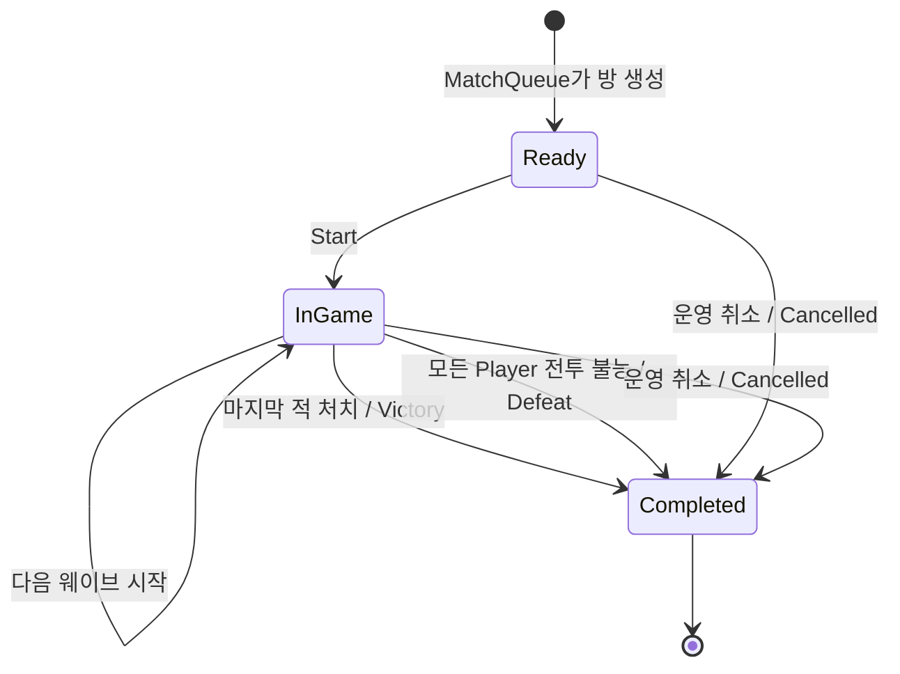

# 4주차 세부 설계 02 — GameRoom 전투·웨이브 상태 머신

- 문서 상태: 제안됨(Proposed)
- 최초 작성일: 2026-08-21
- 최근 검토일: 2026-09-10
- 구현 상태: 결과·보상 전달, 요청 증분 저장, 참가자 상태, 웨이브 저장·첫 웨이브 초기화·상태 버전 구현. 공격·자동 웨이브 진행·연결 처리는 미구현
- 상위 문서: [4주차 전체 설계 — 게임 룸·전투·재접속](week-04-game-room-reconnect-overview.md)
- 선행 문서: [PlayerGrain과 보상 영속 책임 경계](week-04-01-player-grain-reward-boundary.md)

## 1. 문서 목적

현재 `GameRoomGrain`은 `Ready → InGame → Completed`, 실제 저장된 `GameOutcome`, 보상 정책 버전과 플레이어별 결과 전달을 관리한다. 다음 단계에서 이 안에 최소 협동 전투와 웨이브 진행 규칙을 추가한다. 아래 전투 자료형·테이블 확장은 구현 예정 설계이며, 이미 존재하는 필드는 재생성하지 않는다.

이 문서는 다음 질문에 답한다.

- 방 생명주기와 전투 결과를 어떻게 분리할 것인가?
- 어떤 상태에서 어떤 명령을 허용할 것인가?
- 웨이브는 언제 시작하고 끝나는가?
- 게임 승리·실패는 누가 판정하는가?
- Silo 재시작 뒤 어떤 상태를 복원해야 하는가?

공격 요청 형식, 쿨다운, 서버 시간, 명령 순번의 세부 규칙은 [세부 설계 03](week-04-03-server-time-and-command-validation.md)에서 다룬다.

## 2. 전투 모델 선택

4주차 전투는 **4인 협동·3개 웨이브·명령 기반 PvE**로 제한한다.

- PvE(Player versus Environment, 플레이어 대 환경 전투): 사용자가 서버가 제어하는 적과 싸우는 방식
- 실시간 위치나 물리 계산은 없다.
- 클라이언트는 일반 공격 또는 스킬 사용 의도만 보낸다.
- 서버는 현재 상태·쿨다운·Player 소속을 검사하고 피해량을 계산한다.
- 각 웨이브에는 서버가 소유하는 적 한 개가 존재한다.
- 마지막 웨이브의 적을 처치하면 승리한다.
- 모든 플레이어가 전투 불능이면 실패한다.

이 모델은 HTTP API와 자동 테스트만으로도 서버 권위·상태 전이·중복 요청·재접속을 검증할 수 있다.

## 3. 생명주기와 결과 분리

방 생명주기는 기존 세 상태를 유지한다.

```csharp
public enum GameRoomLifecycle
{
    Ready = 0,
    InGame = 1,
    Completed = 2,
}
```

게임의 승리·실패·운영 취소는 별도의 결과 값으로 표현한다.

```csharp
public enum GameOutcome
{
    None = 0,
    Victory = 1,
    Defeat = 2,
    Cancelled = 3,
}
```

취소 원인은 결과와 별도로 보관한다.

```csharp
public enum GameCancellationReason
{
    None = 0,
    OperatorRequested = 1,
    InitialConnectionTimeout = 2,
    LegacyMigration = 3,
}
```

선택 이유:

- `Completed`는 더 이상 게임 명령을 받지 않는 최종 생명주기다.
- `Victory`와 `Defeat`은 완료된 이유 또는 결과다.
- 생명주기에 `Failed`, `Cancelled`를 계속 추가하면 모든 상태 전이 코드가 복잡해진다.
- `Lifecycle = Completed`와 `Outcome != None`이라는 불변 조건으로 종료 상태를 명확하게 검사할 수 있다.

### 3.1 기존 Complete 명령의 전환 원칙

3주차의 `CompleteAsync(Guid requestId)`는 전투 판정 없이 `InGame` 방을 완료한다. 이 동작을 그대로 남기면
`Completed + Outcome` 불변 조건을 깨므로 4주차 계약에서는 다음과 같이 전환한다.

- `Victory`와 `Defeat`는 마지막 전투 명령을 처리하는 `GameRoomGrain`만 확정한다.
- 관리자용 기존 `/complete` 경로는 제거하고 명시적인 `CancelAsync`로 바꾼다.
- `CancelAsync`는 운영자만 호출할 수 있고 결과를 `Cancelled`로 저장한다.
- `Ready → Completed + Cancelled`에서는 `StartedAt`이 null일 수 있다.
- `InGame → Completed + Victory/Defeat/Cancelled`에서는 `StartedAt`이 반드시 존재한다.
- 기존 생명주기 테스트의 일반 완료 호출은 승리·패배 전투 또는 관리자 취소 테스트로 분리한다.

즉, 4주차 이후에는 결과가 없는 일반 `Complete` 명령을 새로 저장하지 않는다.

```csharp
public sealed record CancelGameRoomCommand(
    Guid RequestId,
    GameCancellationReason Reason);
```

외부 관리자 API는 `OperatorRequested`만 만들 수 있다. 최초 연결 제한 만료는 서버가
`InitialConnectionTimeout`과 결정적 requestId를 사용해 내부에서 호출한다. `LegacyMigration`은 실제 원인이 확인된 과거 취소의 호환 표현으로만 예약한다. 기존 완료 방을 이 값으로 일괄 취소하지 않는다.

## 4. 전체 상태 전이



허용하지 않는 전이:

- Ready에서 공격 또는 스킬 사용
- Ready에서 Victory 또는 Defeat 확정
- InGame에서 다시 Start
- Completed에서 공격·스킬·웨이브 변경
- Completed에서 결과 덮어쓰기
- Completed에서 다시 Ready 또는 InGame 복귀

## 5. 방 전투 상태

`GameRoomSnapshot`은 다음 정보를 추가로 제공한다.

```csharp
public sealed record GameRoomCombatSnapshot(
    Guid RoomId,
    string QueueKey,
    GameRoomLifecycle Lifecycle,
    GameOutcome Outcome,
    GameCancellationReason CancellationReason,
    int CurrentWave,
    int MaxWaves,
    int EnemyMaxHealth,
    int EnemyCurrentHealth,
    long StateVersion,
    long EnemyAttackSequence,
    int CombatRuleVersion,
    PlayerCombatSnapshot[] Players,
    DateTimeOffset CreatedAt,
    DateTimeOffset? StartedAt,
    DateTimeOffset? CompletedAt);
```

### 5.1 필드 의미

| 필드 | 의미 |
|---|---|
| `CurrentWave` | 현재 진행 중인 웨이브 번호, 시작 전에는 0 |
| `CancellationReason` | Outcome이 Cancelled일 때만 None이 아닌 취소 원인 |
| `MaxWaves` | 전체 웨이브 수, 초기 구현은 3 |
| `EnemyMaxHealth` | 현재 웨이브 적의 최대 체력 |
| `EnemyCurrentHealth` | 현재 웨이브 적의 남은 체력 |
| `StateVersion` | 방 상태가 성공적으로 변경될 때마다 증가하는 버전 |
| `EnemyAttackSequence` | 실제 적 반격이 발생할 때마다 1씩 증가하는 결정적 대상 선택 순번 |
| `CombatRuleVersion` | 새 방 생성 때 고정하는 전투 규칙 버전, 0은 전투 상세 없는 과거 완료 기록 전용 |
| `Players` | 네 명의 전투·접속 상태 스냅샷 |

`StateVersion`은 클라이언트가 받은 스냅샷이 오래됐는지 판단하는 보조 정보다. 명령의 멱등성 키나 Player별 명령 순번을 대신하지 않는다.

- 방 생성 커밋 뒤 최초 값은 1이다.
- 상태를 바꾸는 명령 한 건이 Commit되면 발생 이벤트 수와 관계없이 정확히 1 증가한다.
- 연결 상태 변경과 Timer 판정도 상태를 바꾸고 Commit되면 1 증가한다.
- 거부된 명령, 저장 결과 재생, 단순 조회는 증가시키지 않는다.
- `long.MaxValue`에서는 새 상태 변경을 거부하고 운영 오류로 기록한다.

적 대상 선택은 접속 Heartbeat 등 다른 상태 변경의 영향을 받지 않도록 `StateVersion`이 아니라
별도의 `EnemyAttackSequence`를 사용한다.

## 6. 플레이어 전투 상태

```csharp
public sealed record PlayerCombatSnapshot(
    Guid PlayerId,
    int MaxHealth,
    int CurrentHealth,
    PlayerCombatStatus CombatStatus,
    PlayerConnectionStatus ConnectionStatus,
    long LastAcceptedCommandSequence,
    DateTimeOffset? BasicAttackReadyAt,
    DateTimeOffset? SkillReadyAt);
```

```csharp
public enum PlayerCombatStatus
{
    Active = 0,
    Incapacitated = 1,
}
```

- 초기 최대 체력은 모든 Player가 같은 값으로 시작한다.
- 체력이 0이 되면 `Incapacitated`가 된다.
- 전투 불능 Player는 공격·스킬을 사용할 수 없다.
- 4주차에는 부활 기능을 구현하지 않는다.
- 연결이 끊겨도 체력과 전투 불능 상태는 그대로 유지한다.
- `connectionId`, `connectionGeneration`, `LeaseExpiresAt`은 내부 영속 상태에는 존재하지만 공용 Player 스냅샷에는 넣지 않는다.
- 인증된 조회자 자신의 `connectionGeneration`만 별도 응답 필드로 투영한다. 다른 Player의 연결 자격 정보는 반환하지 않는다.

접속 상태 세부 규칙은 세부 설계 04에서 정의한다.

## 7. 웨이브 규칙

초기 전투 설정은 코드에 명시된 서버 정책으로 둔다.

```csharp
public sealed record WaveDefinition(
    int WaveNumber,
    int EnemyMaxHealth,
    int EnemyAttackPower);
```

권장 초기값:

| 웨이브 | 적 최대 체력 | 적 공격력 |
|---:|---:|---:|
| 1 | 100 | 5 |
| 2 | 180 | 10 |
| 3 | 300 | 15 |

수치는 기능 검증을 위한 초기값이며 게임 밸런스 결과가 아니다.

### 7.1 웨이브 시작

- 방 Create 시 네 Player 행을 먼저 만들고 체력 100·쿨다운 null·명령 순번 0·`AwaitingConnection`으로 초기화한다.
- 방 Start 시 네 Player가 모두 현재 연결로 `Connected`인지 검사하고 `CurrentWave = 1`로 초기화한다.
- 서버 정책에서 1웨이브 적 체력과 공격력을 읽는다.
- Start는 Create 이후 축적된 연결 ID·연결 세대·명령 순번을 초기화하지 않는다.
- `EnemyAttackSequence = 0`과 방 생성 때 고정한 `CombatRuleVersion`을 사용한다.
- Party 상태 전환과 방 상태 저장이 성공한 뒤 전투 명령을 허용한다.

### 7.2 웨이브 진행

1. 유효한 Player 명령이 적에게 피해를 준다.
2. 적 체력이 0보다 크면 서버가 적 반격을 계산한다.
3. 적 체력이 0 이하가 되면 현재 웨이브를 완료한다.
4. 마지막 웨이브가 아니면 다음 웨이브를 즉시 초기화한다.
5. 마지막 웨이브라면 `Outcome = Victory`로 방을 완료한다.

### 7.3 실패 판정

- 적 반격 처리 뒤 네 Player가 모두 `Incapacitated`라면 `Outcome = Defeat`로 완료한다.
- 연결 이탈만으로 즉시 패배 처리하지 않는다.
- 세부 설계 04에 따라 유예 시간 만료 Player는 `Abandoned + Incapacitated`로 확정한다.

## 8. 적 반격 선택 규칙

초기 구현은 무작위 대상 선택을 사용하지 않는다. 재현 가능한 테스트를 위해 다음 결정적 규칙을 사용한다.

1. `player_order` 순서를 유지한 채 `CombatStatus = Active`인 Player만 고른다. 연결이 끊겼지만 유예 시간 안인 Player도 포함한다.
2. `EnemyAttackSequence % 현재 Active Player 수`로 대상 인덱스를 고른다.
3. 선택된 Active Player에게 현재 웨이브의 적 공격력을 적용한다.
4. 실제 반격을 적용한 뒤 `EnemyAttackSequence`를 정확히 1 증가시킨다.
5. 체력이 0 이하가 되면 0으로 고정하고 `Incapacitated`로 전환한다.

이 규칙은 암호학적 난수나 실제 게임 AI가 아니다. 같은 입력에서 같은 결과를 만들어 상태 복원·테스트를 쉽게 하는 학습용 정책이다.

## 9. 명령과 상태 전이 표

| 명령 | Ready | InGame | Completed |
|---|---|---|---|
| Create | 최초 1회만 | 거부 | 거부 |
| GetSnapshot | 허용 | 허용 | 허용 |
| Start | 네 명의 Lease와 호출자 연결이 유효하면 허용 | 이미 시작 오류 | 완료 오류 |
| BasicAttack | 게임 중 아님 오류 | 조건 충족 시 허용 | 완료 오류 |
| UseSkill | 게임 중 아님 오류 | 조건 충족 시 허용 | 완료 오류 |
| Disconnect | 참가자라면 기록 | 참가자라면 기록 | 새 요청 거부, 같은 requestId의 과거 결과만 재생 |
| Reconnect | 참가자라면 복구 | 유예 시간 안 허용 | `RoomCompleted` 거부, 인증된 GET 조회만 허용 |
| Cancel | 운영자만 허용 | 운영자만 허용 | 결과 변경 금지 |

## 10. 전투 명령 결과

모든 전투 명령은 예외 문자열 대신 구조화된 결과를 반환한다.

```csharp
public sealed record GameRoomActionResult(
    bool IsReplay,
    GameRoomActionError Error,
    long StateVersion,
    long LastAcceptedCommandSequence,
    DateTimeOffset? RetryAt,
    GameRoomCombatSnapshot? Room,
    CombatEvent[] Events);
```

이 계약을 전투 명령 결과의 정본으로 사용한다. `RetryAt`은 쿨다운처럼 시간이 지나면 재시도 가능한 오류에만 설정한다. 세부 검증 규칙은 03 문서에서 같은 계약을 재사용한다.

`CombatEvent`는 이번 명령으로 발생한 변화를 설명한다.

예:

- Player가 적에게 20 피해
- 적이 Player에게 5 피해
- 1웨이브 완료
- 2웨이브 시작
- Player 전투 불능
- 게임 승리

스냅샷은 최종 현재 상태를, 이벤트는 이번 명령에서 왜 상태가 바뀌었는지를 설명한다.

## 11. 예상 오류 코드

```csharp
public enum GameRoomActionError
{
    None = 0,
    InvalidRequestId,
    InvalidPlayerId,
    InvalidCommandSequence,
    InvalidKnownStateVersion,
    InvalidConnectionId,
    InvalidConnectionGeneration,
    RequestIdConflict,
    RoomNotCreated,
    RoomNotInGame,
    RoomCompleted,
    PlayerNotInRoom,
    PlayerDisconnected,
    StaleConnection,
    PlayerIncapacitated,
    CommandSequenceAlreadyPassed,
    CommandSequenceGap,
    CommandSequenceExhausted,
    StaleState,
    CooldownActive,
    UnsupportedAction,
}
```

오류 코드와 HTTP 상태 코드 매핑은 API 계층에서 수행한다.

## 12. 상태 불변 조건

Invariant(불변 조건)는 명령 처리 전후에 항상 참이어야 하는 규칙이다.

### 12.1 방 불변 조건

아래는 공격·종료 판정까지 연결한 최종 목표 불변 조건이다. 현재 단계의 구조·체력·버전 검사는 13.7절에 정리한다. 웨이브 상세 유무는 `MaxWaves`로 구분한다. `MaxWaves = 0`인 과거 완료 기록에는 없는 전투 과정을 만들어 채우지 않으며, 저장된 승패·시각·보상 이력을 보존한다. 참가자 상태를 먼저 구현한 중간 단계의 완료 방은 CombatRuleVersion이 1이어도 웨이브 상세가 없을 수 있다.

- Player는 항상 정확히 네 명이고 중복되지 않는다.
- `Ready`에서는 `CurrentWave = 0`, `Outcome = None`, `StartedAt = null`, `CompletedAt = null`이다.
- `InGame`에서는 `1 <= CurrentWave <= MaxWaves`, `Outcome = None`, `StartedAt != null`, `CompletedAt = null`이다.
- `Completed`에서는 `Outcome != None`, `CompletedAt != null`이다.
- `Victory` 또는 `Defeat`이면 `StartedAt != null`이고, `Cancelled`는 시작 전 취소일 때 `StartedAt = null`일 수 있다.
- `Outcome = Cancelled`일 때만 `CancellationReason != None`이고, 그 밖의 결과에서는 `CancellationReason = None`이다.
- `Victory`이면 `CurrentWave = MaxWaves`, `EnemyCurrentHealth = 0`이다.
- 시작 전 `Cancelled`이면 `CurrentWave = 0`, `EnemyMaxHealth = 0`, `EnemyCurrentHealth = 0`이다.
- `StateVersion`과 `EnemyAttackSequence`는 감소하지 않는다.
- 현재 적 체력은 0 이상 최대 체력 이하다.

### 12.2 Player 불변 조건

- Player ID는 방 참가자 배열에 포함된다.
- Player 최대 체력은 0보다 크다.
- 현재 체력은 0 이상 최대 체력 이하다.
- 현재 체력이 0이면 `Incapacitated`다.
- `LastAcceptedCommandSequence`는 감소하지 않는다.

DB Check Constraint(검사 제약 조건)로 표현할 수 있는 규칙은 PostgreSQL에도 중복 적용한다.

## 13. 영속 데이터 설계

초기 권장안은 현재 `game_rooms`와 `game_room_requests`를 확장하고 Player 상태만 별도 테이블로 분리하는 방식이다.

### 13.1 game_rooms 확장

최종 모델의 열 목록은 다음과 같다. `outcome`과 `reward_policy_version`은 이미 있으므로 향후 Migration에서 다시 추가하거나 기본값으로 덮어쓰지 않는다.

```text
outcome
cancellation_reason
current_wave
max_waves
enemy_max_health
enemy_current_health
state_version
enemy_attack_sequence
combat_rule_version
reward_policy_version
party_release_status
ticket_release_status
```

방 전체에 하나만 존재하는 값은 `game_rooms`에 둔다.

`reward_policy_version`은 Room 생성 시 QueueKey에 맞춰 1 이상의 값으로 선택하고 이후 변경하지 않는다. 완료 후 재시도는 현재 서버 기본 버전이 아니라 이 저장값만 사용한다.

DB Check Constraint(검사 제약 조건)는 다음 관계를 중복 검증한다.

```text
Ready:
  outcome = None
  current_wave = 0
  started_at IS NULL
  completed_at IS NULL

InGame:
  outcome = None
  1 <= current_wave <= max_waves
  started_at IS NOT NULL
  completed_at IS NULL

Completed + Victory/Defeat:
  outcome IN (Victory, Defeat)
  cancellation_reason = None
  started_at IS NOT NULL
  completed_at IS NOT NULL

Completed + Cancelled:
  outcome = Cancelled
  cancellation_reason != None
  completed_at IS NOT NULL
  started_at은 시작 전 취소라면 NULL 허용
```

### 13.2 game_room_players 생성

```text
room_id                  PK 일부
player_id                PK 일부
player_order             방 안에서 UNIQUE
max_health
current_health
combat_status
connection_status
connection_id
connection_generation
last_command_sequence
basic_attack_ready_at
skill_ready_at
disconnected_at
reconnect_deadline
```

Player별로 달라지는 상태는 별도 행으로 저장한다.

- 방 Create Transaction에서 정확히 네 행을 함께 만든다.
- 기본 키는 `(room_id, player_id)`다.
- `(room_id, player_order)`에는 UNIQUE 제약을 둔다.
- `room_id`는 `game_rooms`를 참조하고 방 삭제 시 함께 삭제한다.
- 체력 범위, 상태 열거형 범위, 0 이상의 명령 순번·연결 세대는 Check Constraint로 검증한다.
- 4주차부터 참가자 구성의 정본(Source of Truth, 최종 기준)은 `game_room_players`다.
- 기존 `game_rooms.player_ids` 배열은 API·기존 테스트 호환을 위한 과도기 읽기 캐시로만 유지한다.
- 두 표현은 같은 Transaction에서 동기화하고 Grain 활성화 시 정확히 같은 네 명인지 검사한다.
- 후속 호환성 정리가 끝나면 중복 `player_ids` 배열을 제거한다.

### 13.3 game_room_requests 확장

기존 Create·Start·Complete 멱등성 기록에 전투 명령을 추가한다.

```text
player_id                nullable
accepted_command_sequence nullable
command_kind             BasicAttack / UseSkill 추가
request_payload_json
result_payload_json
created_at
```

기본 키 `(room_id, request_id)`는 유지한다.

요청 본문에는 성공·거부와 관계없이 클라이언트가 보낸 `commandSequence`를 기록한다.
반면 `accepted_command_sequence`는 성공적으로 적용된 전투 명령만 채우고 거부 결과에는 null을 저장한다.

Player별 승인 순번에는 다음 Partial UNIQUE Index(부분 고유 인덱스, 조건에 맞는 행만 고유성을 검사하는 인덱스)를 추가한다.

```sql
CREATE UNIQUE INDEX ...
ON game_room_requests(room_id, player_id, accepted_command_sequence)
WHERE accepted_command_sequence IS NOT NULL;
```

이 구조라면 쿨다운 거부 결과를 requestId로 재생하면서도, 시간이 지난 뒤 새 requestId와 같은 commandSequence로 다시 시도할 수 있다.
이미 성공한 같은 순번에 다른 명령이 들어오면 충돌로 처리한다.

### 13.4 game_results 유지

이 테이블과 결과 전달은 이미 구현되어 있다. 전투 확장 시 기존 행을 삭제하거나 전달 상태를 Pending으로 초기화하지 않는다.

모든 `Victory`, `Defeat`, `Cancelled` 완료에는 네 참가자의 결과 행을 한 개씩 만든다.

```text
room_id                  PK 일부
player_id                PK 일부
reward_policy_version
reward_request_id
delivery_status          Pending / PendingRetry / Applied / NoReward / TerminalFailure
attempt_count
next_attempt_at
last_error_code
updated_at
```

- 기본 키 `(room_id, player_id)`로 같은 게임의 Player 결과가 두 행으로 갈라지는 것을 막는다.
- `reward_request_id`는 Room·Player·저장된 정책 버전으로 결정적으로 생성한다.
- 승리 정책의 실제 지급은 `Applied`, 패배·취소 정책의 무지급은 `NoReward`로 확정한다.
- `NoReward`에는 `reward_audits` 행을 만들지 않는다.

현재 `CK_game_room_requests_payload_shape`는 Create·Start·Complete만 허용한다. 향후 전투·연결 명령을 도입하는 Migration에서 다음 표로 확장한다. 현재 코드는 계속 Start·Complete를 생성하며, 전투 명령으로 전환한 뒤에만 새 기록 생성을 중단한다. 기존 행은 감사 이력으로 보존한다.

| `command_kind` | 새 기록 여부 | payload | `accepted_command_sequence` |
|---|---|---|---|
| `Start` | 전환 후 기존 이력만 허용 | null | null |
| `Complete` | 전환 후 기존 이력만 허용 | 저장된 Outcome JSON 필수 | null |
| `Create` | 기록 | 필수 | null |
| `StartCombat` | 기록 | 호출자 connectionId·generation 필수 | null |
| `BasicAttack`, `UseSkill` | 성공·도메인 거부 기록 | 필수 | 성공일 때만 값 |
| `Cancel` | 기록 | `GameCancellationReason` 필수 | null |
| `Connect`, `Reconnect`, `Disconnect` | 기록 | 연결 명령 payload 필수 | null |
| `Heartbeat` | 기록하지 않음 | 해당 없음 | 해당 없음 |

허용 목록 밖의 `command_kind`는 DB CHECK로 거부한다. 이 표를 요청 종류와 payload 제약의 최종 기준으로 사용한다.

requestId 충돌 비교에는 외부에서 받은 원시 JSON 문자열을 사용하지 않는다. API가 만든 타입 안전 내부 명령을
고정된 속성 순서와 열거형 표현으로 직렬화한 Canonical Payload(정규화 본문)를 저장하고 같은 방식으로 비교한다.

### 13.5 기존 데이터 Migration과 Backfill

Migration(마이그레이션, DB 구조 변경)과 Backfill(백필, 새 필드에 기존 데이터의 호환 값을 채우는 작업)은 다음 원칙으로 설계한다. 2026-09-08에는 보존 원칙만 정리했고, 2026-09-10에는 참가자 상태에 해당하는 부분을 구현했다. 적용 범위와 아직 남은 부분은 13.6절에서 구분한다.

기준선은 현재 `AddGameResultDeliveryTracking`까지 적용된 DB다. 여기에는 이미 승패·보상 정책·지급 결과가 있다. 과거 3주차의 “승패가 전혀 없는 데이터”를 현재 모든 완료 행에 적용해서는 안 된다.

1. 스키마 이력과 기존 행의 불변 조건을 먼저 검사한다. 승패·정책·참가자·결과 행이 불일치하면 자동 보정하지 않고 중단해 원인을 확인한다.
2. 전투 상세 없는 기존 `InGame` 방이 남아 있으면 전환을 중단한다. 기존 서버에서 정상 완료하거나 명시적으로 취소하는 절차를 먼저 수행한다. Migration이 임의로 취소·보상·파티 복귀를 실행하지 않는다.
3. 기존 `Ready` 방은 참가자 순서를 보존하고 새 Player 상태·전투 규칙 버전 1을 초기화한다. 기존 Outcome·보상 정책 버전·생성 시각은 유지한다. 최초 접속 제한 시간은 전환 시점의 UTC를 기준으로 새 유예를 부여해, 오래된 생성 시각 때문에 즉시 만료되지 않도록 한다.
4. 기존 `Completed` 방은 승리·패배·취소 결과와 started_at·completed_at을 그대로 유지한다. 참가자 상태 도입 이전 방은 `combat_rule_version = 0`으로 구분한다. 이미 참가자 단계의 버전 1로 저장된 방은 해당 버전을 바꾸지 않는다. 웨이브 상세가 없으면 별도로 `max_waves = 0`으로 표현한다. 호환 초기값을 실제 전투 이력으로 설명하거나 과거 승리를 맞추기 위해 마지막 웨이브를 완료한 것으로 꾸미지 않는다.
5. Player 행은 기존 `player_ids`의 네 명과 순서를 보존해 생성한다. Ready는 `Active + AwaitingConnection`, 과거 완료 방은 활성 연결이 없는 `Left`다. 버전 0 허용은 과거 완료 방에만 제한하고 전투 관련 CHECK는 버전 1 이상에 적용한다.
6. 기존 `game_results`의 reward_request_id·정책 버전·전달 상태·시도 횟수·다음 시도 시각·오류·갱신 시각은 그대로 보존한다. Applied·NoReward·TerminalFailure를 Pending으로 되돌리지 않는다. 필요한 결과 행이 누락됐다면 이 Migration이 새 지급 대상을 추측하지 않고 사전 검사를 실패시킨다.
7. `game_room_requests`의 키·본문·최초 응답·시각을 원형대로 보존한다. 특히 현재 Complete는 Outcome JSON을 저장한다. 이를 null로 바꾸거나 최초 응답을 새 전투 스냅샷으로 다시 쓰지 않는다. 읽기 호환은 복원 코드에서 처리한다.
8. 추가 필드의 NULL·CHECK·UNIQUE 제약과 복원 코드를 함께 검증한 뒤 전환한다. 복구 서비스는 보존된 실제 결과와 정책을 사용해 아직 미전달인 보상만 처리한다. Party·Ticket의 과거 성공 여부를 추정해 일괄 Pending 작업을 새로 만들지 않는다.

버전 0의 참가자 읽기 계약·기본값·CHECK는 13.6절에서 구현했고, 웨이브·연결 관련 SQL은 후속 단계에 남아 있다. 현재 개발 DB가 비어 있어도 보존 원칙은 생략하지 않는다. 학습용 DB 초기화·삭제는 별도의 사용자 승인 작업이며 Migration의 기본 동작이 아니다.

### 13.6 참가자 상태 저장 기반 구현 — 2026-09-10

이번 단계는 공격 기능 자체가 아니라 **경기별 참가자 네 명의 상태를 보관할 공간과 복원 경로**다. 현재 시작·완료 명령은 기존 동작을 유지한다. 아직 체력이 공격에 의해 줄어들거나 웨이브로 승패를 판정하지 않는다.

구현된 파일과 책임:

| 파일·함수 | 역할과 필요한 이유 |
|---|---|
| `PlayerCombatSnapshot` | PlayerId·PlayerOrder·최대/현재 체력·전투 상태·마지막 승인 순번·공격/스킬 재사용 시각을 전송하는 읽기 계약 |
| `GameRoomSnapshot`의 `CombatRuleVersion`, `Players` | 기존 Orleans 필드 번호 0~9를 보존하고 10~11에 추가. 과거 요청 JSON에 필드가 없으면 버전 0·Players null로 두어 최초 응답을 다시 쓰지 않음 |
| `GameRoomPlayerRecord` 생성자·`Update` | roomId·playerId·playerOrder는 고정하고 체력·상태·순번·쿨다운만 EF Core로 매핑. Update는 공격 판정이 아니라 저장 후보 값 반영 |
| `GameRoomState.Create` | 새 방의 규칙 버전 1, 네 명의 체력 100, 순번 0, 쿨다운 null을 초기화 |
| `GameRoomState.CloneSnapshot` | Players 배열을 복제하여 응답 수정이 내부 상태를 바꾸지 못하게 함 |
| `GameRoomGrain.SynchronizeParticipantsAsync(context, snapshot, isNewRoom)` | 새 방이면 네 행 삽입, 기존 방이면 구성 검증 후 전투 값 갱신. 방·요청 기록과 같은 트랜잭션에 참여 |
| `GameRoomGrain.ValidateParticipants(snapshot)` | 참가자 수·중복·배정 순서·호환 배열·지원 버전을 검증. 누락된 행을 초기 체력으로 자동 복구하지 않음 |
| `OnActivateAsync`·`RestoreSnapshot(record, participants)` | DB에서 배정 순서대로 상태를 읽어 Grain의 메모리를 복원 |

현재 추가한 DB 구조:

- `game_rooms.combat_rule_version`: 새 방 및 이전 Ready는 1, 과거 Completed는 0. 버전은 이후 Update로 변경하지 않는다.
- `game_room_players`: `(room_id, player_id)` 복합 기본 키와 `(room_id, player_order)` 고유 인덱스, 방 외래 키를 사용한다.
- CHECK(검사 제약): 순서 0~3, 양수 최대 체력, 현재 체력 범위, 체력과 전투 불능 상태의 일치, 0 이상 명령 순번을 검증한다.
- 과거 완료 방의 체력 100은 행 형식을 맞추는 자리표시값이다. 버전 0이므로 실제 최종 체력이라고 해석해서는 안 된다.

`AddGameRoomPlayerState` Migration은 구형 InGame 존재, 잘못된 참가자 배열, 누락되거나 참가자·정책이 맞지 않는 보상 결과를 구조 변경 전에 거부한다. Ready/Completed의 참가자 순서를 보존하여 네 행을 만든다. 기존 승패·보상 정책·시각·요청 JSON·결과 전달 행은 원형 보존한다. 테스트 검증 후 2026-09-10 개발 DB에도 적용했다. Down(역방향 적용)은 참가자 상세를 삭제하므로 일반적인 오류 해결 수단으로 실행하지 않는다.

검증: 참가자 생성·응답 보호·체력/쿨다운 재시작 복원·DB 제약·생성 실패 원복·누락 행 복원 차단 9개, 기존 DB 보존·위험 데이터 전환 차단 4개를 추가했다. 이전 136개를 포함하여 총 149개가 통과했다.

이 단계 직후 남겼던 확장 중 웨이브·적 체력·방 상태 버전은 13.7절에서 추가했다. 공격·스킬 판정, 연결 상태·자격 정보·최초 접속 제한 시간은 여전히 미구현이다. HTTP 응답의 전투 필드 공개도 후속 API 단계이며, 현재 새 필드는 내부 Grain 계약에 추가했다.

### 13.7 웨이브·적 체력·상태 버전 구현 — 2026-09-10

이번 단계는 **첫 웨이브의 초기화와 진행 값 저장**이다. 공격·스킬 요청이나 적 반격을 아직 실행하지 않는다.

| 코드 | 추가·수정한 내용과 이유 |
|---|---|
| `Domain/GameRooms/GameRoomCombatRules.GetWave(ruleVersion, waveNumber)` | DB나 Orleans 없이 버전 1의 웨이브 설정을 선택. 지원하지 않는 버전·번호를 거부 |
| `WaveDefinition(WaveNumber, EnemyMaxHealth, EnemyAttackPower)` | 1~3웨이브의 적 최대 체력 100/180/300, 공격력 5/10/15를 불변 설정으로 표현 |
| `GameRoomSnapshot` | 기존 Id 0~11을 유지하고 12~17에 CurrentWave·MaxWaves·EnemyMaxHealth·EnemyCurrentHealth·StateVersion·EnemyAttackSequence 추가 |
| `GameRoomState.Create` | StateVersion=1, MaxWaves=3, 나머지 진행 값 0으로 생성 |
| `GameRoomState.Start` | 저장된 규칙 버전으로 1웨이브 적 체력 100을 초기화하고 버전을 정확히 1 증가. 참가자 상태는 보존 |
| `GameRoomState.Complete` | 기존 관리자 결과 지정 동작을 유지하며 버전만 1 증가. 승패에 맞춰 웨이브·체력을 임의로 변경하지 않음 |
| `GameRoomCommandError.StateVersionExhausted` | long.MaxValue에서 시작·완료를 거부해 오버플로로 음수가 되는 것을 방지. 기존 API는 409로 매핑 |
| `GameRoomRecord.UpdateCombatProgress(...)` | 여섯 진행 값을 저장 후보에 반영. 방·참가자·요청 결과와 같은 DB 트랜잭션에 저장 |
| `GameRoomGrain.RestoreSnapshot` | 현재 DB 진행 값을 복원. 과거 요청 결과의 JSON은 현재 값으로 덮어쓰지 않음 |

`StateVersion`은 requestId나 참가자 명령 순번과 다른 값이다. 예를 들어 생성 1 → 시작 2 → 완료 3이 되지만, 중간의 조회·거부·같은 요청 재전송은 값을 올리지 않는다. 저장 실패하면 메모리와 DB 모두 이전 버전에 머문다. `EnemyAttackSequence`는 실제 반격 전까지 0을 유지한다.

`AddGameRoomWaveState` Migration:

- 중간 참가자 단계에서 생긴 InGame 방도 전환 전에 차단한다. 진행 중인 게임을 1웨이브로 임의 초기화하지 않는다.
- 참가자 네 행과 호환 배열의 순서가 일치하는지도 먼저 검사한다.
- 기존 Ready에는 MaxWaves=3, 기존 Completed에는 MaxWaves=0을 부여한다. 과거 완료 방의 웨이브 0·적 체력 0은 상세가 없다는 표식이다.
- 기존 행의 StateVersion=1은 전환 시점의 출발점이며 과거 명령 횟수를 추정한 값이 아니다. 과거 응답 JSON에 없는 StateVersion은 읽을 때 0이며 이를 현재 DB 버전으로 다시 쓰지 않는다.
- 규칙 버전·보상·결과·시각·참가자 상태·요청 이력은 바꾸지 않는다. 새 열의 임시 DB 기본값은 Backfill 뒤 제거한다.
- CHECK로 생명주기와 웨이브 형태, 체력 범위, 양수 상태 버전, 0 이상 반격 순번을 제한한다.

중요한 단계 경계: 현재 Complete는 관리자 전용 진단 경로이므로 첫 웨이브 도중 Victory를 지정하는 기존 테스트가 가능하다. 이것은 자동 전투 승리 판정을 구현했다는 뜻이 아니다. `Victory이면 마지막 웨이브의 적 체력 0`이라는 최종 규칙은 공격·완료 경로를 전환할 때 적용한다. 현재 완료 결과에 맞춰 가짜 전투 기록을 생성하지 않는다. 연결 유효성 검사도 아직 연결 단계에 남아 있다.

구현 후 다음 단계는 공격·스킬과 서버 시각 기반 쿨다운·명령 순번 검증, 실제 피해·반격·다음 웨이브 전환이다. 개발 DB 적용과 구현 커밋은 아래 기록대로 완료했으며, 원격 푸시는 별도 진행한다.

검증 결과: 규칙 단위 테스트 9개와 웨이브·버전·DB 제약·Migration 통합 테스트 13개를 추가했다. 총 단위 64개 + 통합 107개 = 171개 통과. 기존 저장 실패 테스트에도 버전·웨이브·적 체력 원복 검증을 덧붙였다. EF Core 모델과 Migration 스냅샷의 일치도 확인했다. 이 결과는 자동 전투 판정이나 재접속 기능의 완료를 뜻하지 않는다.

### 13.8 개발 DB 적용 및 커밋 기록 — 2026-09-10

- 구현 커밋: `c63c054` — 게임 방 요청 이력 증분 저장과 참가자 웨이브 상태 영속화 구현
- 대상: 로컬 PostgreSQL `localhost:15432/coopgame`. 적용 전 API·Silo 프로세스가 실행되지 않았고, 게임 방 및 InGame 방은 0건이었다.
- 적용 전 `pg_dump -Fc`로 Custom Format(복원용 전용 형식) 백업을 생성하고 `pg_restore --list`로 목록을 확인했다. 실제 복원 시험을 수행한 것은 아니다.
- 백업은 Git 저장소 밖의 `%LOCALAPPDATA%/CoopGameServer/Backups`에 보관했다. 파일명은 `before-player-wave-20260910-084650.dump`이며 개발 데이터가 포함되므로 Git에 추가하지 않는다.
- `dotnet ef database update`로 `20260909183928_AddGameRoomPlayerState`, `20260909192829_AddGameRoomWaveState`를 순서대로 적용했다. 이 명령은 아직 적용하지 않은 DB 구조 변경을 실행하고 이력 테이블에 기록한다.
- 적용 뒤 마이그레이션 이력, `game_room_players`의 키·제약, 방의 새 열 7개를 확인했다. 방 데이터는 여전히 0건이다. 실제 과거 방 데이터 변환의 보존 검증은 앞서 수행한 통합 테스트 결과를 근거로 한다.
- 이번 정리는 API·Silo를 재기동하거나 새 게임 방을 생성하는 수동 기능 검증까지 포함하지 않는다. 다음 기능 작업에서 기동 후 확인한다.

## 14. DB 저장과 메모리 반영 순서

현재 `GameRoomState.Clone()` 후보 상태 방식은 유지한다.

1. 현재 메모리 상태를 복제한다.
2. 복제본에 순수 상태 전이를 적용하고 이번 명령의 Persistence Delta(영속 변경분)를 만든다.
3. 후보 방·변경된 Player 행을 Update하고 새 요청 결과 한 행만 Append-only Insert(추가 전용 삽입)한다.
4. 필요한 `game_results` Pending 행도 같은 DB Transaction으로 저장한다.
5. Commit 성공 후에만 `_state`를 후보 상태로 교체한다.
6. 저장 실패 시 기존 메모리 상태를 유지하고 호출자가 재시도하게 한다.

이 순서는 DB 저장에 실패했는데 메모리에서만 적 체력이 줄어드는 문제를 막는다.

요청 증분 저장은 이번 선행 작업에서 반영했다. `PersistCandidateStateAsync(candidateState, requestId)`는 현재 상태에 없고 후보에 새로 추가된 요청만 저장한다. 도메인 거부 결과도 최초 한 건은 저장하지만 키 충돌·재전송은 기존 행을 수정하지 않는다.

전체 삭제·재삽입을 제거해 N개 명령에 대한 요청 행 누적 쓰기를 대략 N건으로 줄인다. 다만 `GameRoomState.Clone()`의 전체 메모리 복사와 활성화 시 전체 이력 조회는 유지하므로 전체 처리 비용이 상수 시간이 됐다는 뜻은 아니다. 이력 보관 기간·대용량 메모리 최적화는 별도 개선 대상이다.

### 14.1 증분 저장 선행 작업 검증 — 2026-09-08

[GameRoomRequestPersistenceTests](../../tests/CoopGameServer.IntegrationTests/Grains/GameRooms/GameRoomRequestPersistenceTests.cs)에 다음 다섯 통합 테스트를 추가했다.

1. Create·Start·Complete마다 한 행만 추가되고 과거 행이 유지된다. JSON 값뿐 아니라 PostgreSQL의 `xmin`(행 버전을 만든 트랜잭션 번호)도 비교해 같은 내용의 삭제·재삽입을 검출한다.
2. 같은 요청 재생과 다른 내용의 키 충돌이 최초 기록을 바꾸지 않는다.
3. 방 생성 전 거부 결과가 방 생성 및 Silo 재시작 후에도 최초 실패로 재생된다.
4. 빈 키·null 배정처럼 저장하지 않는 입력은 요청 행을 만들지 않는다.
5. 테스트 전용 DB 키 충돌로 저장을 실패시키면 방 DB·메모리는 기존 상태를 유지하고, 장애 제거 후 같은 키로 다시 성공한다.

검증 결과: Release 빌드 경고·오류 0개, 단위 테스트 55개와 통합 테스트 81개(총 136개) 통과, 변경 C# 파일의 서식 검사 통과. 개발 DB의 Migration·데이터는 변경하지 않았다.

장애 주입 중 기존 한계도 확인했다. `PostgresException`을 포함한 DB 예외를 Orleans가 클라이언트로 직렬화하지 못해 `CodecNotFoundException`으로 전달한다. 위 테스트는 특정 예외 타입이 아니라 실패·원복·재시도 결과를 검증한다. 서버 내부 DB 오류를 안정적인 외부 오류 계약으로 변환하는 처리는 이번 저장 최적화와 분리된 후속 개선 항목이다.

## 15. 게임 완료 후 외부 처리 순서

아래는 향후 전투 완료 후처리의 목표 설계다. 현재는 보상 전달의 Pending/재시도와 자동 복구까지 구현됐고, Party·Ticket 후처리를 DB 상태로 저장해 이 메서드에서 통합 재개하는 부분은 아직 미구현이다.

Victory·Defeat·Cancelled 판정 시 다음 순서를 사용한다.

1. GameRoom 전투 결과와 Party·Ticket 후처리 상태 `Pending`을 저장한다.
2. Victory·Defeat·Cancelled 모두 Player별 `game_results` 전달 상태를 `Pending`으로 같은 Transaction에 저장한다.
3. Commit 뒤 `FinalizeCompletedRoomAsync`를 호출한다.
4. 사전 구성 Party를 Active로 복귀시키고 성공 상태를 저장한다.
5. MatchQueue Ticket을 Completed로 바꾸고 성공 상태를 저장한다.
6. 모든 Player에게 저장된 결과·정책 버전을 PlayerGrain으로 전달한다.
7. 승리의 실제 지급은 `Applied`, 패배·취소의 무지급은 `NoReward`로 바꾼다. 일시 오류는 `PendingRetry`, 영구 오류는 `TerminalFailure`로 남긴다.

외부 Grain 호출은 하나의 PostgreSQL Transaction으로 묶이지 않는다. 결정적 requestId와 Pending 재시도로 최종 상태에 수렴시킨다.

`FinalizeCompletedRoomAsync`는 다음 모든 경로에서 호출한다.

- 최종 전투 또는 Cancel 명령 Commit 직후
- 같은 terminal requestId의 결과 재생 시
- Grain 활성화 때 Completed 방에 Pending 단계가 남아 있을 때
- 운영 Reconciliation(조정, 저장 상태를 다시 비교해 맞추는 작업) 실행 시

Party·Queue 호출에는 `roomId + 대상 ID + 작업 종류`로 만든 결정적 하위 requestId를 사용한다.
이미 목표 상태라면 성공으로 보고, 다른 방에 속한 상태라면 자동 덮어쓰기하지 않고 운영 오류로 남긴다.

최종 전투 명령의 성공 여부와 외부 후처리 완료 여부는 분리한다. 전투 결과가 DB에 Commit된 뒤 외부 호출이 실패해도
그 공격을 실패로 되돌리지 않으며 방은 Completed로 유지한다. API는 저장된 전투 성공 결과를 반환하고,
스냅샷의 후처리 상태와 구조화 로그로 Pending을 관찰한다.

## 16. 스냅샷 호환성

3주차 `GameRoomSnapshot`을 바로 삭제하면 기존 API와 테스트가 크게 깨진다.

권장 전환:

1. 전투 필드를 추가한 새 스냅샷 계약을 만든다.
2. 기존 생명주기 테스트를 새 계약에 맞게 갱신한다.
3. HTTP 응답 DTO는 필요한 필드만 명시적으로 매핑한다.
4. Orleans `[Id(n)]` 번호는 기존 필드 번호를 재사용하지 않고 뒤에 추가한다.
5. `GameCompletionOutcome`처럼 같은 뜻의 별도 이름을 만들지 않고 Grain·Player 보상 계약 모두 `GameOutcome`을 사용한다.

Orleans Serializer(직렬화기, 객체를 전송 가능한 데이터로 바꾸는 기능)의 필드 ID를 바꾸면 호환성이 깨질 수 있으므로 기존 번호는 유지한다.

## 17. 테스트 계획

### 17.1 순수 상태 단위 테스트

- Create 뒤 Ready 초기값
- Start 뒤 1웨이브 초기화
- Ready에서 BasicAttack 거부
- InGame에서 유효한 BasicAttack 적용
- 적 체력이 0이면 다음 웨이브 시작
- 마지막 적 처치 시 Victory
- 모든 Player 체력 0이면 Defeat
- Completed 뒤 모든 전투 명령 거부
- 같은 requestId 같은 본문 재생
- 같은 requestId 다른 본문 충돌
- 같은 Player 명령 순번 중복·역행 거부
- 쿨다운 거부 뒤 새 requestId·같은 순번 성공
- 상태 변경 명령 한 건당 StateVersion 정확히 1 증가
- 적 반격 때만 EnemyAttackSequence 증가

### 17.2 PostgreSQL 통합 테스트

- 방·Player·요청 결과가 한 Transaction으로 저장
- DB 실패 시 후보 상태 미반영
- Silo 재시작 뒤 현재 웨이브·체력·쿨다운·명령 번호 복원
- `(room_id, request_id)` 중복 제약
- 승인 명령만 적용되는 `(room_id, player_id, accepted_command_sequence)` 부분 고유 인덱스
- BasicAttack·UseSkill payload CHECK와 허용하지 않은 command_kind 거부
- 기존 Ready·Completed에 정확히 네 Player 행 생성, 전투 상세 없는 InGame 존재 시 전환 차단
- 기존 Ready의 최초 접속 유예 초기화, 과거 Completed의 승패·시각·보상 정책 보존
- Applied·NoReward·TerminalFailure 및 PendingRetry의 보상 ID·시도 횟수·재시도 시각 원형 보존
- 버전 0 과거 완료 방 읽기 호환과 전투·재접속 거부
- 요청 한 건 처리 시 기존 요청 행을 삭제하지 않고 한 행만 추가

### 17.3 전체 흐름 테스트

- 3인 파티 + 솔로 매칭
- 게임 시작
- 네 Player 공격·스킬
- 3웨이브 승리
- 파티 Active 복귀
- Ticket Completed
- Player별 결과가 `Applied` 또는 `NoReward`로 정확히 한 번 확정
- 같은 참가자 재매칭

## 18. 검토한 대안

### 18.1 승리·실패를 별도 Lifecycle로 추가

- 장점: 상태 이름만으로 결과를 알 수 있다.
- 단점: 종료라는 동일 규칙이 여러 생명주기에 중복된다.
- 결정: `Completed + Outcome` 조합을 권장한다.

### 18.2 전체 전투 상태를 JSON 한 열에 저장

- 장점: 초기 구현이 빠르고 스냅샷 구조와 유사하다.
- 단점: Player별 제약·조회·인덱스·부분 검증이 어렵다.
- 결정: 방 공통 상태는 game_rooms, Player 상태는 game_room_players로 분리한다.

### 18.3 무작위 적 공격 대상

- 장점: 게임처럼 보이는 다양성이 생긴다.
- 단점: 테스트 재현과 장애 복원이 어려워지고 난수 상태까지 저장해야 한다.
- 결정: 초기에는 결정적 대상 선택을 사용한다.

### 18.4 연결 이탈 즉시 패배

- 장점: 상태가 단순하다.
- 단점: 일시적 네트워크 장애로 파티 전체 경험이 망가진다.
- 결정: 재접속 유예 시간을 제공한다.

## 19. 구현 순서

1. 전투 계약·통합 `GameOutcome`·오류 열거형 추가
2. 순수 `GameRoomState` 전이와 단위 테스트
3. Room Create 시 `game_room_players` 네 행 생성
4. EF Core 모델·CHECK·부분 고유 인덱스·Backfill Migration 작성
5. 전체 요청 재작성 방식을 증분 Persistence Delta 방식으로 교체
6. GameRoomGrain 명령과 TimeProvider 연결
7. API 요청·응답과 connectionId·generation 검증 연결
8. Silo 재시작·가짜 시간·Migration 통합 테스트
9. 완료 후처리 상태와 `FinalizeCompletedRoomAsync` 연결
10. PlayerGrain 결과 보상 연결

## 20. 설계 확정안

1. 웨이브 수는 3으로 고정한다.
2. 초기 Player 최대 체력은 100으로 둔다.
3. 적 체력·공격력은 이 문서의 예시 수치로 시작한다.
4. 적 반격은 `EnemyAttackSequence`와 고정된 player_order로 결정한다.
5. 종료 모델은 `Completed + GameOutcome`으로 통일한다.
6. 방 공통 상태와 Player 상태를 정규화된 테이블로 나누고 `game_room_players`를 참가자 정본으로 사용한다.
7. 거부 요청은 requestId 재생을 위해 저장하되 승인 순번 부분 고유 인덱스와 분리한다.
8. 기존 결과 없는 Complete 명령은 관리자 Cancel로 전환한다.
9. 완료 후 외부 처리는 Pending 상태와 `FinalizeCompletedRoomAsync`로 재개한다.

게임 밸런스 개선과 다중 전투 모드는 현재 범위에서 제외한다.

## 21. 완료 기준

- 모든 방 상태와 명령의 허용 여부가 표로 정의되어 있다.
- Victory·Defeat가 동일한 최종 생명주기에서 표현된다.
- 웨이브 시작·진행·완료 규칙이 모호하지 않다.
- 방과 Player의 영속 데이터 경계가 명확하다.
- DB 저장 성공 전 메모리 후보 상태를 확정하지 않는다.
- 기존 3주차 행의 Backfill과 제약 변경 순서가 정의되어 있다.
- 완료 Commit 뒤 장애가 발생해도 Party·Ticket·보상 후처리를 재개할 수 있다.
- 쿨다운 거부 결과와 승인 명령 순번의 DB 고유성이 충돌하지 않는다.
- 전체 흐름 테스트가 3주차 기존 동작까지 포함한다.
