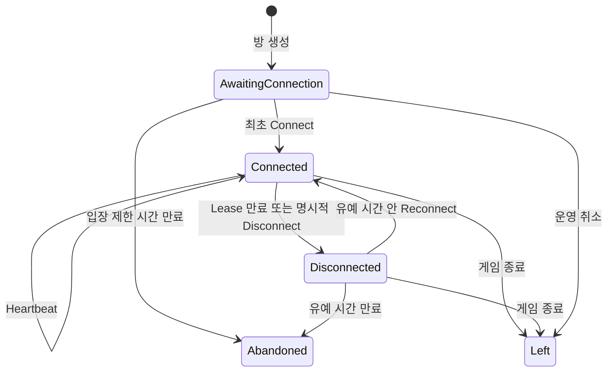

# 4주차 세부 설계 04 — 연결 이탈·유예 시간·재접속

- 문서 상태: 제안됨(Proposed)
- 최초 작성일: 2026-08-21
- 구현 상태: 1차 설계 검토 반영, 코드 미구현
- 상위 문서: [4주차 전체 설계 — 게임 룸·전투·재접속](week-04-game-room-reconnect-overview.md)
- 선행 문서: [서버 시간·전투 명령·쿨다운 검증](week-04-03-server-time-and-command-validation.md)

## 1. 문서 목적

현재 프로젝트는 HTTP(Hypertext Transfer Protocol, 웹 요청·응답 통신 규약) API를 사용한다. HTTP 요청이 끝난 뒤 서버와 클라이언트 사이에 지속 연결이 남아 있지 않으므로 서버는 “게임 앱이 종료됐다”는 사건을 항상 즉시 알 수 없다.

따라서 4주차 재접속은 다음 방식으로 정의한다.

- 클라이언트가 주기적으로 Heartbeat(하트비트, 생존 신호)를 보낸다.
- 서버는 마지막 Heartbeat 시각과 Lease(리스, 일정 기간 유효한 접속 권한)를 저장한다.
- Lease가 만료되면 연결 이탈로 판정한다.
- Grace Period(유예 시간) 안에 동일 Player가 다시 인증하면 재접속을 허용한다.
- 재접속 성공 시 최신 GameRoom Snapshot을 반환한다.

## 2. 목표

1. 일시적 네트워크 단절과 영구 이탈을 구분한다.
2. 연결이 끊겨도 방과 전투 상태를 즉시 삭제하지 않는다.
3. JWT의 동일 Player만 자신의 자리로 재접속한다.
4. 오래된 클라이언트 연결이 새 연결 뒤 명령을 보내는 것을 차단한다.
5. 재접속 뒤 현재 웨이브·체력·쿨다운·명령 순번을 복원한다.
6. Silo 재시작 뒤에도 마지막 접속 시각과 유예 시간을 복원한다.

## 3. 비목표

- WebSocket 또는 TCP의 실제 연결 이벤트 감지
- 여러 기기에서 동일 계정 동시 플레이
- 네트워크 패킷 재전송 프로토콜 구현
- 클라이언트 로컬 전투 시뮬레이션 복원
- 장시간 오프라인 플레이 유지
- 매칭 완료 뒤 다른 Player로 자리 교체

## 4. HTTP 환경의 연결 의미

이 프로젝트에서 `Connected`는 물리적인 소켓 연결이 계속 열려 있다는 뜻이 아니다.

> 최근 Heartbeat를 받아 서버 Lease가 유효한 논리적 접속 상태

클라이언트가 앱을 강제 종료하면 명시적 로그아웃 요청이 오지 않을 수 있다. 서버는 Heartbeat가 끊긴 뒤 시간 만료로 상태를 바꿔야 한다.

## 5. 연결 상태

```csharp
public enum PlayerConnectionStatus
{
    AwaitingConnection = 0,
    Connected = 1,
    Disconnected = 2,
    Abandoned = 3,
    Left = 4,
}
```

| 상태 | 의미 |
|---|---|
| AwaitingConnection | 매칭됐지만 아직 방 접속 확인을 하지 않음 |
| Connected | 최근 Heartbeat가 있고 Lease가 유효함 |
| Disconnected | Lease가 만료됐지만 재접속 유예 시간 안에 있음 |
| Abandoned | 유예 시간이 지나 이번 게임 복귀가 불가능함 |
| Left | 게임이 정상 종료되어 활성 접속이 필요하지 않음 |

## 6. 상태 전이



`Abandoned`에서 `Connected`로 돌아가는 전이는 허용하지 않는다.

연결 상태와 방 생명주기는 서로 다른 축이다. 방이 `Completed`가 되면 당시 `Connected` 또는
`Disconnected` Player는 `Left`가 되고, 이미 유예 시간이 만료된 Player는 최종 감사 정보를 위해
`Abandoned`를 유지할 수 있다. 어느 경우에도 완료된 방의 활성 연결은 남기지 않는다.

### 6.1 명령별 완전 허용표

| 명령 | AwaitingConnection | Connected | Disconnected | Abandoned | Left |
|---|---|---|---|---|---|
| Connect | 최초 연결 허용 | 다른 requestId는 `AlreadyConnected` | `Reconnect` 사용 | 거부 | 거부 |
| Heartbeat | 거부 | 현재 connectionId·generation만 허용 | 거부 | 거부 | 거부 |
| Reconnect | 거부 | 예상 generation 일치 시 연결 교체 허용 | 예상 generation 일치·유예 시간 안 허용 | 거부 | 거부 |
| Disconnect | 거부 | 현재 connectionId·generation이면 허용 | 같은 requestId 재생만 허용 | 거부 | 거부 |
| 전투 명령 | 거부 | InGame이고 전투 가능할 때 허용 | 거부 | 거부 | 거부 |
| GetSnapshot | 참가자에게 허용 | 참가자에게 허용 | 참가자에게 허용 | 참가자에게 허용 | 참가자에게 허용 |

추가 생명주기 규칙:

- Connect와 Reconnect는 `Ready` 또는 `InGame` 방에서만 활성 연결을 만든다.
- `Completed` 방의 Reconnect는 `RoomCompleted`로 거부한다. 최종 상태는 기존 인증된
  `GET /api/game-rooms/{roomId}`로만 조회한다.
- `Ready` 방의 Start는 호출 순간 네 Player 모두 Lease가 유효한 `Connected`여야 한다.
- 같은 requestId 재생은 최초 결과를 확인하는 동작이며 상태를 다시 변경하지 않는다.

## 7. 시간 정책

권장 초기값:

| 항목 | 값 | 의미 |
|---|---:|---|
| Heartbeat 주기 | 5초 | 클라이언트가 서버에 생존 신호를 보내는 간격 |
| Connection Lease | 15초 | 마지막 Heartbeat 뒤 Connected로 인정하는 시간 |
| Reconnect Grace Period | 30초 | Lease 만료 또는 명시적 Disconnect 시각부터 복귀를 기다리는 시간 |
| Initial Connect Timeout | 30초 | Ready 방 생성 시 저장한 마감 시각까지 최초 접속을 기다리는 시간 |

모든 판정은 `TimeProvider.GetUtcNow()`로 읽은 서버 UTC 시각을 사용한다.

```text
LastSeenAt = 12:00:00
Lease 만료 = 12:00:15
ReconnectDeadline = 12:00:45
```

경계는 반개구간(Half-open interval, 시작은 포함하고 끝은 제외하는 시간 구간)으로 고정한다.

```text
Connected    : serverNow < LeaseExpiresAt
Disconnected : LeaseExpiresAt <= serverNow < ReconnectDeadline
Abandoned    : ReconnectDeadline <= serverNow
Reconnect 허용: serverNow < ReconnectDeadline
```

- 자동 Lease 만료에서는 `DisconnectedAt = LeaseExpiresAt`으로 기록한다.
- `ReconnectDeadline = LeaseExpiresAt + 30초`로 계산한다. Timer가 늦게 실행된 시각을 기준으로
  유예 시간을 연장하지 않는다.
- 명시적 Disconnect에서는 `LeaseExpiresAt = DisconnectedAt = serverNow`로 바꾸고
  `ReconnectDeadline = serverNow + 30초`로 계산한다.
- `InitialConnectDeadline = room.CreatedAt + 30초`를 방 생성 시 한 번 계산해 PostgreSQL에 저장한다.
- `serverNow == ReconnectDeadline`이면 이미 만료된 것으로 판정한다.

## 8. 연결 식별자와 세대

JWT는 “누구인가”를 증명하지만 어떤 연결이 가장 최신인지는 구분하지 못한다.
따라서 Connect 또는 Reconnect 성공 시 서버가 새 `connectionId`와 `connectionGeneration`을 발급한다.

```csharp
public sealed record GameRoomConnection(
    Guid ConnectionId,
    long ConnectionGeneration,
    DateTimeOffset LeaseExpiresAt);
```

- `connectionId`: 암호학적으로 추측하기 어려운 새 UUID이며 현재 연결을 가리키는 임시 식별자다.
- `connectionGeneration`: 최초 Connect에서 1로 시작하고 연결 교체가 성공할 때마다 1씩 증가한다.
- Heartbeat·Disconnect·전투 명령은 현재 `connectionId`와 `connectionGeneration`을 모두 포함한다.
- 새 연결이 생기면 이전 connectionId는 즉시 무효다.

이 값은 인증 토큰을 대신하지 않는다. JWT 검증 후에 추가로 확인하는 게임 세션 식별자다.
`connectionId`는 현재 연결을 직접 차단하는 Fencing Token(펜싱 토큰, 이전 작업자를 거부하는 토큰)이고,
`connectionGeneration`은 경쟁 Reconnect의 예상 버전을 비교하고 클라이언트가 응답의 신구를 판단하는
단조 증가 버전이다. 두 값 중 하나라도 현재 저장 값과 다르면 `StaleConnection`으로 거부한다.

## 9. 계약 초안

### 9.1 최초 접속

```csharp
Task<GameRoomConnectionResult> ConnectAsync(
    ConnectGameRoomCommand command);
```

```csharp
public sealed record ConnectGameRoomCommand(
    Guid RequestId,
    Guid PlayerId);
```

### 9.2 Heartbeat

```csharp
Task<GameRoomConnectionResult> HeartbeatAsync(
    HeartbeatGameRoomCommand command);
```

```csharp
public sealed record HeartbeatGameRoomCommand(
    Guid PlayerId,
    Guid ConnectionId,
    long ConnectionGeneration);
```

Heartbeat는 멱등성 requestId 이력을 생성하지 않는다. 생존 신호는 같은 내용을 재전송해도
“서버가 지금 다시 생존을 확인했다”는 새 사건이므로, Room 생성 때 이미 만든 현재 연결 행의 `LastSeenAt`과
`LeaseExpiresAt`만 Update(갱신)한다. 영향받은 행이 0개면 새 참가자를 삽입하지 않고 Room 불변 조건 위반으로 처리한다.

### 9.3 재접속

```csharp
Task<GameRoomReconnectResult> ReconnectAsync(
    ReconnectGameRoomCommand command);
```

```csharp
public sealed record ReconnectGameRoomCommand(
    Guid RequestId,
    Guid PlayerId,
    long ExpectedConnectionGeneration);
```

재접속 결과에는 새 연결 정보와 현재 전투 스냅샷을 함께 반환한다.
`ExpectedConnectionGeneration`은 클라이언트가 마지막으로 확인한 generation이다. 로컬 값을 잃었다면
먼저 인증된 방 Snapshot을 조회해 본인의 현재 generation을 얻는다. Grain은 저장된 generation과
예상 값이 같을 때만 CAS(Compare-And-Swap, 예상 값이 맞을 때만 변경) 방식으로 새 연결을 발급한다.

### 9.4 명시적 연결 종료

```csharp
Task<GameRoomConnectionResult> DisconnectAsync(
    DisconnectGameRoomCommand command);
```

```csharp
public sealed record DisconnectGameRoomCommand(
    Guid RequestId,
    Guid PlayerId,
    Guid ConnectionId,
    long ConnectionGeneration);
```

명시적 종료는 정상 앱 종료를 빠르게 반영하기 위한 최적화다. 클라이언트가 항상 이 요청을 보낸다고 가정하지 않는다.

### 9.5 게임 시작

```csharp
public sealed record StartGameRoomCommand(
    Guid RequestId,
    Guid PlayerId,
    Guid ConnectionId,
    long ConnectionGeneration);
```

Player용 Start도 연결 종속 명령이다. 현재 connectionId·generation이 모두 일치하는 인증된 참가자만 요청할 수 있다. 저장할 때는 기존 3주차 `Start` 행과 구분되는 `StartCombat` command kind와 payload를 사용한다.

## 10. API 경로 초안

```text
POST /api/game-rooms/{roomId}/connections
POST /api/game-rooms/{roomId}/connections/heartbeat
POST /api/game-rooms/{roomId}/connections/reconnect
POST /api/game-rooms/{roomId}/connections/disconnect
```

- Player ID는 요청 본문이 아니라 JWT에서 읽는다.
- `connectionId`와 `connectionGeneration`은 Heartbeat·Disconnect·전투 명령 본문에 포함한다.
- Reconnect에는 이전 connectionId를 요구하지 않는다. 분실된 연결을 복구하는 요청이기 때문이다.
- 외부 요청 DTO에는 Player ID를 두지 않는다. API가 JWT에서 읽은 Player ID를 내부 Grain 명령에 넣는다.
- Disconnect는 요청 본문을 안정적으로 전달하기 위해 DELETE 대신 POST 동작 경로를 사용한다.

## 11. 최초 접속과 게임 시작

권장 정책은 네 명 모두 `Connected`가 된 뒤에만 Ready 방을 시작하는 것이다.

```text
방 생성
    ↓
Player 4명 AwaitingConnection
    ↓
각 Player Connect
    ↓
4명 모두 Connected
    ↓
Start 허용
```

초기 접속 제한 시간 안에 네 명이 모이지 않으면 방을 `Completed + Cancelled`로 종료하고 Party·Ticket을 복구한다.

Start 주체는 다음과 같이 확정한다.

- 자동 Start는 하지 않는다. 마지막 Connect 응답 안에서 파티·방 시작까지 묶으면 실패 경계가 커지기 때문이다.
- 인증된 방 참가자라면 누구나 Start를 요청할 수 있다. 네 솔로로 구성된 방에는 공통 파티 리더가 없기 때문이다.
- GameRoomGrain은 Start 처리 직전에 네 Player의 Lease를 지연 평가하고 모두 `Connected`인지 다시 확인한다.
- 현재 관리자 전용 Start API는 진단용으로 유지하고, Player용 Start는 참가자 검증을 통과하는 별도 경계로 노출한다.
- 여러 참가자가 동시에 Start해도 Grain 직렬 처리와 requestId 기록으로 최초 한 건만 성공한다.

### 11.1 최초 접속 만료와 후처리

`Lifecycle = Ready`인 동안 `InitialConnectDeadline`이 지나면 하나의 후보 상태에서 다음을 먼저 PostgreSQL Transaction으로 저장한다. Start에 성공해 `InGame`이 된 뒤에는 이 기한을 다시 평가하지 않는다.

1. 방을 `Lifecycle = Completed`, `Outcome = Cancelled`, `CancellationReason = InitialConnectionTimeout`으로 변경한다.
2. `CompletedAt`을 저장하되 게임이 시작되지 않았으므로 `StartedAt`은 null을 허용한다.
3. 접속하지 못한 Player는 `Abandoned`, 연결됐던 Player는 `Left`로 바꾸고 활성 connectionId를 제거한다.
4. 네 Player의 `game_results = Pending`을 만들고 저장된 보상 정책 버전과 결정적 requestId를 기록한다.
5. 방 ID와 InitialConnectDeadline에서 결정적인 내부 작업 ID를 생성해 후처리 상태를 기록한다.

DB Commit 뒤에는 결정적인 하위 requestId로 다음을 반복 보장한다.

1. `MatchQueued` 사전 구성 Party를 `Active`로 되돌린다.
2. 이 방의 `Matched` Ticket을 `Completed`로 바꿔 Player를 다시 매칭할 수 있게 한다.
3. 일부 외부 Grain 호출이 실패하면 방 완료를 되돌리지 않고 같은 내부 작업 ID로 재시도한다.
4. `FinalizeCompletedRoomAsync`가 PlayerGrain 정책 평가를 거쳐 실제 RewardWriter를 호출하지 않는 `NoReward`로 확정한다.
5. Timer, Recovery Worker, 이후 Snapshot 조회는 미완료 후처리를 다시 조정한다.

이에 맞춰 `CK_game_rooms_lifecycle_times`를 변경한다.

```text
(lifecycle = Ready AND outcome = None
  AND started_at IS NULL AND completed_at IS NULL)
OR
(lifecycle = InGame AND outcome = None
  AND started_at IS NOT NULL AND completed_at IS NULL)
OR
(lifecycle = Completed AND outcome IN (Victory, Defeat)
  AND cancellation_reason = None
  AND started_at IS NOT NULL AND completed_at IS NOT NULL)
OR
(lifecycle = Completed AND outcome = Cancelled
  AND cancellation_reason != None
  AND completed_at IS NOT NULL)
```

3주차 관리자 Start API는 테스트·진단용으로 유지할 수 있지만, 실제 Player 흐름에서는 연결 확인을 통과해야 한다.

## 12. Heartbeat 처리

Heartbeat 검증 순서:

API는 Grain 호출 전에 JWT·Room별 Heartbeat Rate Limit을 검사한다. 허용된 요청에 대한 Grain 검증 순서는
다음과 같다.

1. Room과 JWT Player 참가 여부 확인
2. 현재 서버 시각으로 Initial Connect·Lease·유예 시간을 지연 평가
3. 현재 상태가 Connected인지 확인
4. 현재 connectionId와 connectionGeneration이 모두 일치하는지 확인
5. `LastSeenAt = serverNow` 갱신
6. `LeaseExpiresAt = serverNow + 15초` 갱신
7. `game_room_players` 현재 행을 DB에 갱신하고 결과 반환

Heartbeat는 Player의 전투 `commandSequence`를 소비하지 않는다. 연결 생존 신호와 전투 명령 순서는 별도다.
단순히 `LastSeenAt`과 `LeaseExpiresAt`만 연장하는 Heartbeat는 전투 `StateVersion`도 증가시키지 않는다.
`Connected → Disconnected`, `Disconnected → Connected`, connection generation 교체처럼 클라이언트가 관찰할 수 있는 연결 상태 변화가 Commit될 때만 `StateVersion`을 1 증가시킨다.
Heartbeat는 `game_room_requests`에 행을 누적하지 않는다. 네 Player가 5초마다 보낸 이력을 모두 복원하면
장시간 방의 DB와 Grain 메모리가 계속 증가하기 때문이다. Rate Limit 초기값은 Player·Room별 초당 2회로
두고, 이를 넘는 요청은 API에서 `429 Too Many Requests`로 거부한다.

## 13. 연결 이탈 판정

GameRoomGrain은 활성 방의 빠른 판정을 위한 Grain Timer, 모든 명령 진입 시점의 지연 평가,
Silo 재시작·Grain 비활성화를 보완하는 Recovery Worker를 함께 사용한다.

### 13.1 Grain Timer

- Ready에서는 Initial Connect deadline·Player Lease·Reconnect deadline을 검사한다.
- InGame에서는 Player Lease·Reconnect deadline만 검사하고 Initial Connect deadline은 무시한다.
- `serverNow >= LeaseExpiresAt`이면 Disconnected로 전환한다.
- `serverNow >= ReconnectDeadline`이면 Abandoned로 전환한다.
- 상태 변경이 있을 때만 PostgreSQL에 저장한다.
- Orleans 8.2 이후 API인 `RegisterGrainTimer`를 사용한다.
- `KeepAlive = true`로 활성 방이 유휴 수집되지 않게 하고 `Interleave = false`로 일반 Grain 명령과
  같은 단일 실행 순서를 유지한다.
- 방이 Completed가 되거나 Grain이 비활성화될 때 Timer handle을 Dispose한다.

### 13.2 지연 평가

Timer는 Silo 재시작 동안 실행되지 않는다. 따라서 다음 시점에도 만료를 다시 계산한다.

- Grain 활성화 직후
- GetSnapshot
- Connect
- Start
- Heartbeat
- Reconnect
- Disconnect
- 전투 명령

Timer 자체를 영속 상태로 보지 않고 DB에 저장된 절대 시각을 기준으로 다시 판정한다.
모든 경로는 같은 순수 함수 `EvaluateDeadlines(candidateState, serverNow)`를 호출한다. Timer 주기가
늦어져도 시간 구간 판정 결과는 달라지지 않는다.

## 14. Orleans Timer 선택

첫 구현은 Orleans Grain Timer와 PostgreSQL 기반 Recovery Worker를 함께 사용한다.

- Timer는 해당 Grain 활성화 안에서만 주기 작업을 실행한다.
- Timer는 Grain 비활성화 또는 Silo 중단 시 사라지므로 영속 스케줄러로 간주하지 않는다.
- Silo 시작 후 공통 `GameRoomRecoveryService`는 5초 주기로 PostgreSQL에서 다음 두 부류를 각각 조회한다.
  1. `Ready AND initial_connect_deadline <= now`이거나, `Ready/InGame`에서 Player Lease·Reconnect deadline이 도래한 Room → `ReconcileDeadlinesAsync`
  2. Completed이면서 Party·Ticket 후처리가 Pending이거나 `game_results`의 Pending/PendingRetry 재시도 시각이 도래한 Room → `FinalizeCompletedRoomAsync`
- `ReconcileDeadlinesAsync`는 HTTP에 노출하지 않으며 여러 번 호출해도 같은 후보 상태와 결정적인
  후처리 ID로 수렴해야 한다.
- `FinalizeCompletedRoomAsync`도 HTTP에 노출하지 않으며 Party 복귀·Ticket 완료·Player 결과 전달 중 끝나지 않은 단계만 다시 실행한다.
- Grain이 활성화될 때 Timer를 다시 등록한다.
- 영속된 `LeaseExpiresAt`과 `ReconnectDeadline`이 최종 판정 기준이다.
- 단일 Silo 학습 범위에서는 Worker 중복 실행 문제가 없고, 다중 Silo에서는 DB lease 또는 한 개의
  전용 Worker 배치 정책을 추가한다.

Reminder(리마인더)는 Grain이 비활성 상태이거나 클러스터가 재시작된 뒤에도 다시 Grain을 활성화할 수
있지만, 일반적으로 분·시간 단위의 비교적 낮은 빈도 작업에 사용한다. 이 설계의 1초 Timer와 15·30초
deadline에는 PostgreSQL 절대 시각 + Recovery Worker가 더 직접적이므로 Reminder를 사용하지 않는다.

## 15. 재접속 검증 순서

```text
1. JWT에서 Player ID 확인
2. Room 존재 확인
3. 실제 Room 참가자인지 확인
4. 현재 서버 시간으로 Lease·유예 시간 재평가
5. 상태가 Connected 또는 Disconnected인지 확인
6. Disconnected라면 `serverNow < ReconnectDeadline`인지 확인
7. `ExpectedConnectionGeneration == currentGeneration`인지 CAS 검사
8. 새 connectionId 발급
9. connectionGeneration을 1 증가
10. Connected·LastSeenAt·LeaseExpiresAt 저장
11. DisconnectedAt·ReconnectDeadline을 null로 초기화
12. 최신 전투 Snapshot 반환
```

이미 Connected인 Player의 Reconnect는 다음 연결 교체 정책으로 확정한다.

- 동일 계정의 새 기기 또는 앱 재실행을 복구하기 위해 연결 교체를 허용한다.
- 단, 요청의 ExpectedConnectionGeneration이 현재 값과 같을 때만 교체한다.
- 새 generation을 발급하고 이전 connectionId를 즉시 무효화한다.
- 기존 연결이 이후 명령을 보내면 `StaleConnection`으로 거부한다.
- 클라이언트는 자신이 수신한 가장 큰 generation만 채택하고 더 작은 generation의 늦은 응답은 버린다.
- generation이 `long.MaxValue`면 새 연결을 발급하지 않고 서버 상태 오류로 기록한다.

## 16. 재접속 스냅샷

재접속 응답에는 다음 정보를 포함한다.

- Room ID와 생명주기
- 게임 결과
- 현재 웨이브와 전체 웨이브 수
- 적 현재·최대 체력
- Player 네 명의 전투·접속 상태
- 현재 Player의 마지막 승인 명령 순번
- 현재 Player의 공격·스킬 ReadyAt
- 방 StateVersion
- 새 connectionId·generation·LeaseExpiresAt

클라이언트는 로컬 상태를 이 스냅샷으로 교체한다. 과거 로컬 명령을 자동 재적용하지 않는다.
다른 Player의 Snapshot에는 접속 상태만 포함하고 connectionId·generation·LeaseExpiresAt은 노출하지 않는다.
연결 자격 정보는 인증된 현재 Player 자신의 Connect·Reconnect·Heartbeat 응답에만 들어간다.
일반 인증 조회 Snapshot은 현재 Player 자신의 generation만 `ExpectedConnectionGeneration` 준비용으로
반환할 수 있지만 connectionId는 반환하지 않는다.

## 17. 연결 이탈 중 전투 정책

연결 이탈을 게임상 무적 상태로 사용하면 악용할 수 있다.

따라서 다음 정책을 사용한다.

- Disconnected Player는 새 공격·스킬을 사용할 수 없다.
- 적 반격 대상 선택에는 Disconnected이지만 전투 가능한 Player도 포함한다.
- 쿨다운 시간은 계속 흐른다.
- 다른 Player의 전투는 계속 진행된다.
- Disconnected Player가 공격받아 체력 0이 되면 전투 불능이 된다.
- 재접속하면 남아 있는 현재 체력과 쿨다운을 그대로 사용한다.

## 18. Abandoned 처리

유예 시간이 만료되면 Player를 `Abandoned`로 바꾸고 전투 상태를 `Incapacitated`로 확정한다.

- 해당 Player는 이번 게임에 다시 접속할 수 없다.
- 나머지 Player는 전투를 계속할 수 있다.
- 네 명 모두 전투 불능이면 게임은 Defeat로 종료한다.
- Abandoned 여부의 감사 정본은 `game_room_players.connection_status`와 `abandoned_at`이다. `game_results`에 같은 정보를 중복 저장하지 않는다.
- Party에서 영구 탈퇴시키지는 않는다. 게임 종료 뒤 사전 구성 Party는 기존 멤버 그대로 유지한다.

연결 종료와 파티 탈퇴는 서로 다른 개념이다.

만료 평가는 현재 `_state`를 직접 바꾸지 않고 전투 명령과 같은 후보 상태 방식을 사용한다.

1. 현재 방·Player 상태를 복제한다.
2. 후보에서 도래한 deadline을 모두 평가해 Disconnected 또는 Abandoned로 전환한다.
3. 네 Player가 모두 Incapacitated이면 같은 후보 안에서 `Completed + Defeat`와 Player별
   `game_results = Pending`을 만든다.
4. 방·Player·결과·내부 만료 작업 결과를 한 PostgreSQL Transaction으로 저장한다.
5. Commit 성공 후에만 Grain 메모리 상태를 후보로 교체한다.
6. Commit 뒤 Party 복귀·Ticket 해제·Player 보상 후처리를 결정적 하위 requestId로 조정한다.

DB Commit이 실패하면 기존 메모리 상태를 유지한다. Timer 또는 Recovery Worker의 다음 호출이 같은
절대 시각에서 다시 평가하므로 부분적으로 Abandoned만 적용된 상태가 남지 않는다.

## 19. 게임 종료 후 재접속

- Completed 방에는 새로운 활성 연결을 만들지 않는다.
- 이전 참가자가 조회하면 최종 Snapshot을 반환할 수 있다.
- Heartbeat·공격·스킬은 `RoomCompleted`로 거부한다.
- 결과 조회 허용 기간과 데이터 정리 정책은 운영·보관 주차에서 정한다.

## 20. 멱등성과 경쟁 요청

### 20.1 Heartbeat와 Disconnect 동시 도착

같은 GameRoomGrain에서 순서대로 처리한다.

- Heartbeat가 먼저면 Lease 갱신 뒤 Disconnect
- Disconnect가 먼저면 이후 같은 connectionId Heartbeat는 거부

### 20.2 Reconnect 두 건 동시 도착

- Grain이 순서대로 처리한다.
- 같은 current generation을 예상한 첫 요청만 새 connectionId·generation을 만든다.
- 다른 requestId의 두 번째 요청은 ExpectedConnectionGeneration 불일치로 거부한다.
- 두 번째 호출자가 다시 교체하려면 최신 Snapshot을 읽고 새 requestId와 최신 예상 generation으로
  명시적으로 시도해야 한다.
- HTTP 응답 순서가 바뀌어도 클라이언트는 자신이 본 가장 큰 generation보다 작은 응답을 버린다.

### 20.3 같은 requestId 재시도

- 같은 본문은 최초 결과를 재생한다.
- 같은 requestId에 다른 Player·명령을 사용하면 충돌로 거부한다.
- 최초 자격을 다시 반환하려면 현재 상태가 Connected이고, 현재 connectionId·generation이 저장 결과와 모두 같으며, `serverNow < LeaseExpiresAt`이어야 한다.
- 위 조건을 하나라도 만족하지 않거나 다른 Reconnect가 현재 generation을 높였다면 과거 connectionId를 다시 전달하지 않고
  `SupersededReconnectRequest`와 현재 Snapshot을 반환한다. 이 응답은 최초 연결 발급이 실제로 한 번만
  일어났다는 기록을 유지하면서 만료된 자격을 활성 자격처럼 오인하지 않게 한다.

## 21. 영속 데이터

`game_rooms`에는 최초 접속 만료 처리를 위해 다음 열을 추가한다.

```text
initial_connect_deadline
```

`game_room_players`에 다음 열을 둔다.

```text
connection_status
connection_id
connection_generation
last_seen_at
lease_expires_at
disconnected_at
reconnect_deadline
abandoned_at
```

Check Constraint 후보:

```text
AwaitingConnection:
  connection_generation = 0
  connection_id IS NULL
  last_seen_at IS NULL
  lease_expires_at IS NULL
  disconnected_at IS NULL
  reconnect_deadline IS NULL

Connected:
  connection_generation >= 1
  connection_id IS NOT NULL
  last_seen_at IS NOT NULL
  lease_expires_at IS NOT NULL
  disconnected_at IS NULL
  reconnect_deadline IS NULL

Disconnected:
  connection_generation >= 1
  connection_id IS NULL
  last_seen_at IS NOT NULL
  lease_expires_at IS NOT NULL
  disconnected_at IS NOT NULL
  reconnect_deadline IS NOT NULL
  lease_expires_at = disconnected_at
  disconnected_at < reconnect_deadline

Abandoned:
  connection_id IS NULL
  abandoned_at IS NOT NULL
  다음 두 형태 중 하나:
    (connection_generation = 0
      AND last_seen_at IS NULL
      AND lease_expires_at IS NULL
      AND disconnected_at IS NULL
      AND reconnect_deadline IS NULL)
    OR
    (connection_generation >= 1
      AND last_seen_at IS NOT NULL
      AND lease_expires_at IS NOT NULL
      AND disconnected_at IS NOT NULL
      AND reconnect_deadline IS NOT NULL
      AND reconnect_deadline <= abandoned_at)

Left:
  connection_id IS NULL
```

connectionId와 generation은 재시작 뒤에도 최신 연결을 구분해야 하므로 PostgreSQL에 저장한다.
Disconnected 전환 시 활성 connectionId는 null로 제거하되 generation은 유지한다. 따라서 Reconnect CAS는
마지막 generation을 기준으로 하고, 이전 연결 명령은 상태와 generation 검사에서 모두 거부된다.

`connection_status`는 정의한 다섯 값만 허용하고 `connection_generation`은 0 이상이어야 한다.
`initial_connect_deadline`, `lease_expires_at`, `reconnect_deadline`에는 인덱스를 두어 Recovery Worker가
도래한 방만 조회할 수 있게 한다.

Heartbeat는 이 현재 행만 갱신하고 `game_room_requests`에 추가하지 않는다. Connect·Reconnect·Disconnect는
상태 전이와 자격 발급이 있으므로 `(room_id, request_id)` 멱등성 기록을 남긴다.

## 22. 오류 코드

```csharp
public enum GameRoomConnectionError
{
    None = 0,
    InvalidRequestId,
    InvalidConnectionId,
    InvalidConnectionGeneration,
    RequestIdConflict,
    RoomNotCreated,
    PlayerNotInRoom,
    AlreadyConnected,
    NotConnected,
    StaleConnection,
    ConnectionGenerationConflict,
    SupersededReconnectRequest,
    StartConditionsNotMet,
    ReconnectWindowExpired,
    InitialConnectExpired,
    RoomCompleted,
}
```

HTTP 권장 매핑:

| 오류 | HTTP |
|---|---:|
| InvalidRequestId / InvalidConnectionId / InvalidConnectionGeneration | 400 |
| PlayerNotInRoom | 403 |
| RoomNotCreated | 404 |
| RequestIdConflict / StaleConnection | 409 |
| ConnectionGenerationConflict / SupersededReconnectRequest / StartConditionsNotMet | 409 |
| ReconnectWindowExpired / InitialConnectExpired | 409 |
| RoomCompleted | 409 |

API Rate Limiter가 거부한 Heartbeat·Reconnect 남용은 Grain 오류가 아니라 `429 Too Many Requests`로
반환하고 `Retry-After` 헤더를 제공한다.

## 23. 보안과 호출 제한

- 운영 연결은 HTTPS로만 제공한다. connectionId가 평문 네트워크에서 노출되면 안 된다.
- 모든 Connect·Heartbeat·Reconnect·Disconnect는 JWT Player와 Room 참가자를 먼저 확인한다.
- connectionId는 비밀번호나 JWT를 대신하지 않지만 세션 자격 정보이므로 구조화 로그, APM,
  ProblemDetails, 다른 Player Snapshot에 원문을 남기지 않는다.
- 로그에는 roomId, playerId, connectionGeneration, 결과 오류만 기록하고 connectionId는 필요하면
  단방향 해시의 짧은 접두사만 사용한다.
- Heartbeat는 Player·Room별 초당 2회, Reconnect는 Player·Room별 분당 5회를 초기 제한으로 둔다.
- Rate Limit은 API의 빠른 남용 방어이고, Grain의 현재 connectionId·generation·상태 검증은 우회할 수
  없는 최종 방어다.
- 현재 단일 API 인스턴스에서는 메모리 Rate Limiter로 시작한다. 다중 API 배포 시 분산 제한은 운영
  확장 범위에서 Redis 등 공유 저장소를 검토한다.
- connectionId는 `Guid.NewGuid()`처럼 운영체제의 암호학적 난수를 사용하는 방식으로 생성한다.

## 24. TimeProvider와 테스트 주입

Silo 운영 환경에는 다음처럼 시스템 시간을 등록한다.

```csharp
services.AddSingleton(TimeProvider.System);
```

GameRoomGrain은 생성자에서 `TimeProvider`를 받아 모든 deadline 계산과 지연 평가에 사용한다.
`DateTimeOffset.UtcNow`를 직접 호출하지 않는다.

TestCluster에는 테스트 전용 ManualTimeProvider(수동 시간 공급자)를 Singleton으로 등록하고 각 테스트가
기준 UTC 시각과 시간을 명시적으로 초기화한다. xUnit Collection은 시간 공유 테스트를 병렬 실행하지
않는다. 순수 상태 테스트는 가짜 시간을 전진시켜 14.999초·15초·29.999초·30초 경계를 검증한다.

Orleans Timer 자체의 스케줄러는 TimeProvider를 따르지 않을 수 있으므로 실제 1초를 기다리는 테스트에
의존하지 않는다. Timer와 Recovery Worker가 공통으로 호출하는 `EvaluateDeadlines(candidate, now)`를
가짜 시간으로 검증하고, 통합 테스트에서는 서버 내부 `ReconcileDeadlinesAsync`를 호출해 영속 결과를
확인한다.

## 25. 테스트 계획

### 25.1 최초 접속

- 방 참가자 Connect 성공
- 비참가자 Connect 거부
- 네 명 모두 Connected 전 Start 거부
- 네 명 Connect 뒤 Start 성공
- 최초 접속 제한 시간 만료 시 Cancelled
- Cancelled 방은 StartedAt null·CompletedAt non-null로 저장
- Cancelled 뒤 Party Active·Ticket Completed로 수렴
- Start 호출 직전 Lease가 만료된 Player가 있으면 Start 거부

### 25.2 Heartbeat와 Lease

- Heartbeat가 LastSeenAt·LeaseExpiresAt 갱신
- 다른 connectionId Heartbeat 거부
- 가짜 시간 14.999초 뒤 Connected 유지
- 15초 뒤 Disconnected 전환
- 중복 Heartbeat가 요청 이력 행을 늘리지 않고 현재 Lease 행만 갱신
- 초당 허용량을 넘는 Heartbeat는 API 429

### 25.3 재접속

- Disconnected 뒤 `serverNow < ReconnectDeadline`인 동안 Reconnect 성공
- 새 connectionId와 generation 발급
- 이전 connectionId 전투 명령 거부
- 이전 connectionGeneration 전투 명령 거부
- 29.999초 Reconnect 성공, 정확히 30초 Reconnect 거부
- 같은 expected generation의 경쟁 Reconnect 한 건만 성공
- superseded requestId 재생이 과거 connectionId를 활성 자격처럼 반환하지 않음
- 유예 시간 초과 뒤 Abandoned
- Abandoned 뒤 Reconnect 거부

### 25.4 전투 연계

- Disconnected Player 공격 거부
- Disconnected Player도 적 공격 대상에 포함
- 재접속 뒤 마지막 순번 다음 명령 성공
- 재접속해도 체력·쿨다운 유지
- Abandoned Player 전투 불능 처리
- 사전 구성 Party는 게임 종료 뒤 유지

### 25.5 장애 복구

- Silo 재시작 뒤 Connected Lease 재평가
- 재시작 시간이 유예 시간을 넘으면 Abandoned
- DB Commit 실패 시 connectionGeneration 증가 미반영
- Reconnect Commit 성공 후 응답 유실 시 같은 requestId로 같은 연결 결과 재생
- Silo 재시작 뒤 Recovery Worker가 도래한 방을 재조정
- Grain Timer와 Recovery Worker가 같은 만료를 처리해도 한 번만 상태 전이
- InitialConnectDeadline 직전 Start한 뒤 기한을 지나 Timer·Recovery를 실행해도 InGame 유지
- 네 명 모두 Abandoned면 방·Player·Pending 결과가 한 Transaction에서 Defeat로 저장

## 26. 검토한 대안

### 26.1 명시적 Disconnect 요청만 사용

- 장점: 구현이 단순하다.
- 단점: 앱 강제 종료·네트워크 단절에서는 요청이 오지 않는다.
- 결정: Heartbeat와 Lease를 사용하고 명시적 Disconnect는 보조 기능으로 둔다.

### 26.2 JWT만으로 최신 연결 판단

- 장점: 별도 connectionId가 필요 없다.
- 단점: 이전 앱과 새 앱이 같은 JWT로 동시에 명령을 보낼 수 있다.
- 결정: connectionId와 generation을 함께 사용한다.

### 26.3 Disconnected Player를 적 공격에서 제외

- 장점: 네트워크 문제로 피해받지 않는다.
- 단점: 연결을 끊어 공격을 피하는 악용이 가능하다.
- 결정: 전투 가능한 동안 적 공격 대상에 포함한다.

### 26.4 Orleans Reminder만 사용

- 장점: Grain 비활성·클러스터 재시작 뒤에도 Grain을 다시 활성화할 수 있다.
- 단점: 15·30초 세션 deadline에 비해 주기가 짧고 영속 Reminder 저장소 설정이 추가된다.
- 결정: 활성 방은 Grain Timer, 장애 복구는 DB deadline을 조회하는 Recovery Worker를 사용한다.

### 26.5 Timer와 지연 평가만 사용

- 장점: 별도 Worker가 없어 구현이 단순하다.
- 단점: Silo 재시작 뒤 아무 요청도 없는 방은 Grain이 다시 활성화되지 않아 만료 처리가 무기한 늦어진다.
- 결정: 현재 단일 Silo 범위에서도 Recovery Worker를 두어 도래한 방을 재활성화한다.

### 26.6 Heartbeat도 requestId 영구 이력으로 저장

- 장점: 같은 HTTP 요청의 최초 결과를 정확히 재생할 수 있다.
- 단점: 4명이 5초마다 보내면 분당 48개 행이 쌓이고 현재 Grain 활성화 방식은 모든 요청 기록을 읽는다.
- 결정: Heartbeat는 현재 Lease 행만 갱신하고 Connect·Reconnect·Disconnect만 요청 이력을 저장한다.

## 27. 구현 순서

1. 연결 상태·계약·오류 코드와 TimeProvider DI 작성
2. game_rooms InitialConnectDeadline·game_room_players 영속 모델·DB 제약과 Migration 작성
3. 순수 `EvaluateDeadlines`와 반개구간 경계 단위 테스트
4. Connect와 네 명의 현재 Lease 확인 전 Start 차단
5. Heartbeat Lease 행 갱신·API Rate Limit·비누적 테스트
6. Reconnect CAS와 connectionId·generation 교체
7. Disconnect와 전투 명령 connectionId·generation 검증
8. Grain Timer 등록·해제와 Recovery Worker 조정
9. Ready Cancelled 후 Party·Ticket 후처리 수렴
10. Abandoned → Incapacitated → Defeat 후보 상태·Transaction 처리
11. 재시작·경계 시각·경쟁 요청·응답 유실 통합 테스트

## 28. 확정한 설계 결정

1. Heartbeat 5초·Lease 15초를 초기 학습 값으로 사용한다.
2. Reconnect 유예 시간과 최초 Connect 제한 시간은 각각 30초다.
3. 시간 구간은 끝 시각을 제외하며 deadline과 같은 시각은 만료다.
4. Start 시점에 네 명 모두 현재 Connected여야 하고, 인증된 참가자 누구나 Start를 요청할 수 있다.
5. Connected Reconnect 교체는 허용하되 ExpectedConnectionGeneration CAS를 통과해야 한다.
6. Abandoned Player는 Incapacitated로 확정하고 Disconnected Active Player는 적 공격 대상에 포함한다.
7. active room의 빠른 평가는 Grain Timer, 재시작 복구는 Recovery Worker가 맡는다.
8. Heartbeat는 멱등성 이력을 누적하지 않고 현재 Lease 행만 갱신한다.
9. Ready 접속 만료는 Completed + Cancelled로 저장한 뒤 Party Active·Ticket Completed로 수렴시킨다.
10. connectionId와 generation은 모든 연결 종속 명령에서 함께 검사한다.

## 29. 완료 기준

- HTTP 환경에서 Connected의 의미가 정확히 정의되어 있다.
- 명시적 Disconnect 없이도 Heartbeat 만료로 이탈을 판정한다.
- 동일 JWT의 오래된 연결을 connection generation으로 차단한다.
- 경계 시각에서 Reconnect와 Abandoned 결과가 실행 순서에 따라 달라지지 않는다.
- Silo 재시작 뒤 아무 클라이언트 요청이 없어도 Recovery Worker가 도래한 방을 다시 조정한다.
- Heartbeat를 반복해도 requestId 이력과 Grain 복원 메모리가 무제한 증가하지 않는다.
- 재접속 Snapshot에 전투를 이어가는 데 필요한 상태가 포함된다.
- 연결 이탈을 무적 상태로 악용할 수 없다.
- Silo 재시작 뒤에도 절대 시각으로 Lease와 유예 시간을 재평가한다.
- 파티 유지와 게임 연결 상태가 서로 다른 책임임을 설명할 수 있다.
