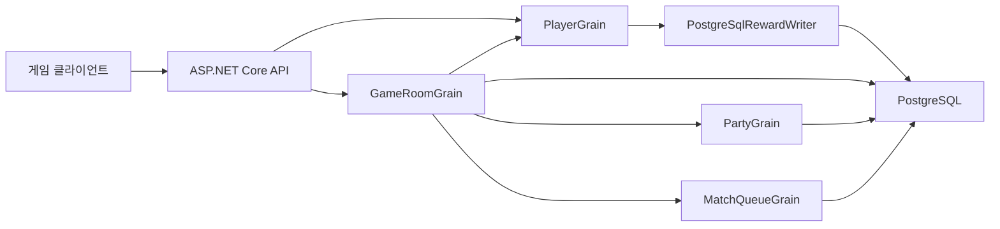
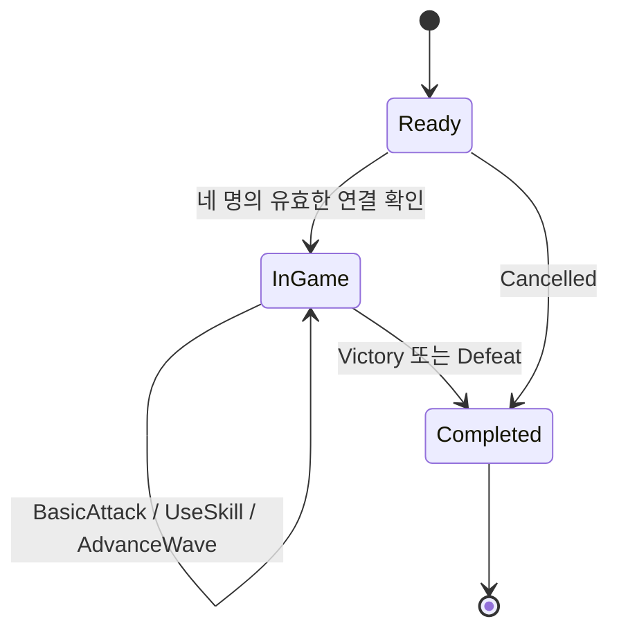
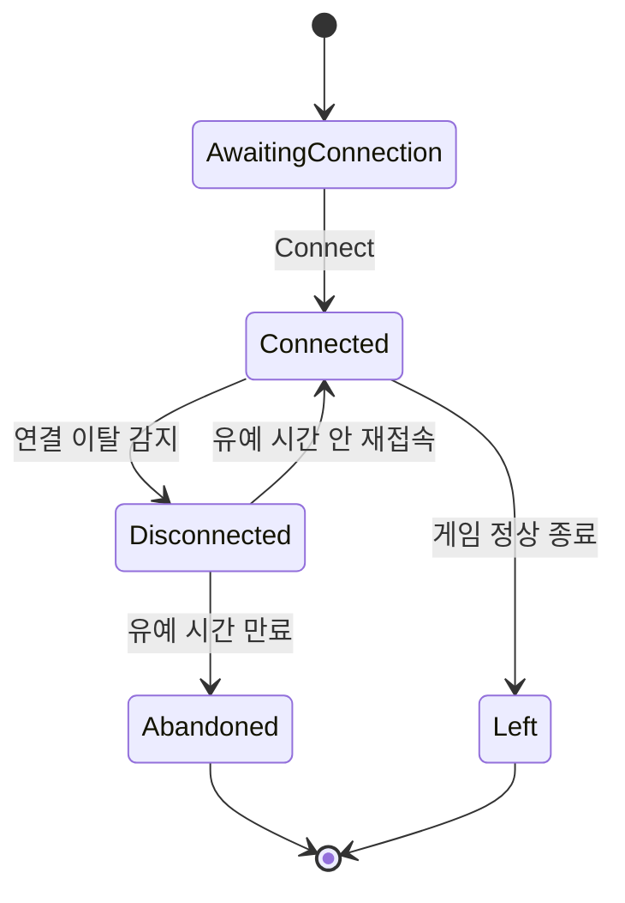
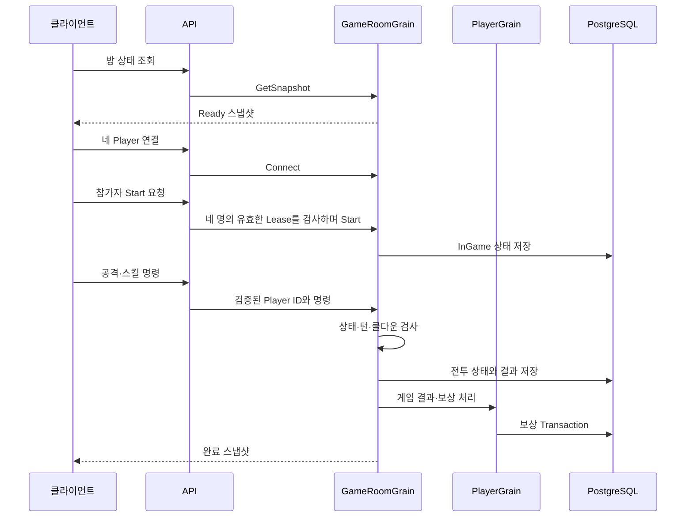

# 4주차 전체 설계 — 게임 룸·전투·재접속

- 문서 상태: 제안됨(Proposed)
- 최초 작성일: 2026-08-21
- 최근 검토일: 2026-08-24
- 구현 상태: 설계 작성 중, 코드 미구현
- 상위 계획: 4주차 — 게임 룸과 재접속

## 1. 문서 목적

3주차에서 구현한 `GameRoomGrain`은 정확히 4명을 배정하고 `Ready → InGame → Completed` 상태를 저장한다.
그러나 아직 전투 명령·웨이브·쿨다운·연결 이탈·재접속·게임 결과 보상은 없다.

4주차의 목적은 `GameRoomGrain`을 단순한 방 생명주기 관리 객체에서 **서버가 게임 진행을 판정하는 권위 있는 상태 머신**으로 확장하는 것이다.

이 문서는 4주차 전체 범위와 세부 설계문서 사이의 관계를 정의한다. 세부 규칙은 연결된 문서에서 확정한다.

## 2. 3주차 완료 기준선

4주차는 다음 구현이 정상 동작한다는 전제에서 시작한다.

- PartyGrain 생성·가입·탈퇴·해산·리더 승계
- Party의 `Active → MatchQueued → InGame → Active` 상태 전이
- 사전 구성 파티와 솔로를 정확히 4명으로 매칭
- MatchQueue Ticket의 `Queued → Matched → Completed` 상태 전이
- GameRoom의 `Ready → InGame → Completed` 최소 생명주기
- 게임 완료 뒤 사전 구성 파티 유지와 매칭 티켓 해제
- JWT(JSON Web Token, JSON 웹 토큰) 인증·인가
- PostgreSQL 영속화와 Silo 재시작 복원
- 멱등성 requestId와 실제 PostgreSQL 통합 테스트

4주차 작업은 위 동작을 깨지 않고 확장해야 한다.

## 3. 4주차 목표

1. 게임 방 상태를 서버가 최종 판정한다.
2. 허용된 상태에서만 공격·스킬 명령을 처리한다.
3. 서버 시간을 기준으로 쿨다운과 웨이브 진행을 판단한다.
4. 중복·지연·순서가 바뀐 명령을 안전하게 거부하거나 재생한다.
5. 일시적으로 연결이 끊긴 플레이어가 같은 방에 재접속할 수 있다.
6. 게임 결과를 한 번만 확정하고 플레이어별 보상을 안전하게 전달한다.
7. Silo 재시작 뒤에도 방·전투·재접속·보상 전달 상태를 복원한다.

## 4. 비목표

4주차에서는 다음을 구현하지 않는다.

- FPS(First-Person Shooter, 1인칭 슈팅) 수준의 실시간 위치·물리 동기화
- 클라이언트 예측과 서버 보정
- TCP(Transmission Control Protocol, 전송 제어 프로토콜) 게이트웨이
- 복잡한 캐릭터 성장·장비·스킬 트리
- 무작위 대규모 아이템 드롭 테이블
- PvP(Player versus Player, 사용자 간 대전) 판정
- Redis 캐시와 분산 락
- 다중 Silo 운영 배포 최적화

이번 전투는 HTTP 명령으로 검증 가능한 소규모 협동 웨이브 전투로 제한한다.

## 5. 세부 설계문서

| 순서 | 문서 | 핵심 질문 |
|---:|---|---|
| 01 | [PlayerGrain과 보상 영속 경계](week-04-01-player-grain-reward-boundary.md) | 플레이어 명령과 DB 보상을 누가 소유하는가? |
| 02 | [GameRoom 전투·웨이브 상태 머신](week-04-02-game-room-combat-state-machine.md) | 어떤 상태와 전이만 허용할 것인가? |
| 03 | [서버 시간·명령·쿨다운 검증](week-04-03-server-time-and-command-validation.md) | 클라이언트 명령을 어떻게 신뢰하지 않고 판정할 것인가? |
| 04 | [연결 이탈·유예 시간·재접속](week-04-04-disconnect-and-reconnect.md) | 연결이 끊겨도 같은 방 상태로 어떻게 복귀하는가? |

세부 문서는 각각 검토 후 `승인됨`으로 변경한다. 모든 문서가 승인되기 전에는 4주차 기능 코드를 시작하지 않는다.

## 6. 전체 구성 요소와 책임

| 구성 요소 | 4주차 책임 |
|---|---|
| HTTP API | JWT 신원 확인, 입력 형식 검사, Grain 호출, HTTP 상태 코드 변환 |
| PlayerGrain | Player별 성장 상태·보상 변경 직렬화와 보상 전달 조정 |
| GameRoomGrain | 전투 상태·웨이브·명령 순서·쿨다운·접속 상태·결과 확정 |
| PartyGrain | 사전 구성 파티의 로비·매칭·게임 상태 |
| MatchQueueGrain | 티켓과 방 배정, 게임 종료 뒤 티켓 해제 |
| RewardPolicy | 서버 게임 결과를 보상 내용으로 변환 |
| PostgreSqlRewardWriter | PostgreSQL 보상 Transaction 실행 |
| PostgreSQL | 영속 상태와 멱등성 결과의 최종 원본 |

PlayerGrain과 GameRoomGrain의 명령 순서는 서로 다른 범위다.

- PlayerGrain은 한 Player의 성장 상태와 보상 변경을 직렬화한다.
- GameRoomGrain은 한 Room 안에서 발생하는 전투 명령의 `commandSequence`를 검사한다.
- 전투 명령이 반드시 PlayerGrain을 먼저 통과하는 것은 아니다. API는 전투 명령을 GameRoomGrain에 직접 전달한다.

## 7. 서버 권위 원칙

Server Authority(서버 권위)는 클라이언트가 결과를 선언하지 않고 서버가 규칙을 검사해 결과를 확정한다는 뜻이다.

4주차에서는 다음 값을 클라이언트가 직접 결정하지 못하게 한다.

- 공격의 최종 피해량
- 스킬 쿨다운 완료 여부
- 현재 웨이브 번호
- 적 처치 여부
- 게임 승리·실패 결과
- 지급할 골드·아이템 수량
- 재접속 가능한 방과 Player ID

클라이언트는 “이 명령을 시도한다”는 의도만 보낸다. GameRoomGrain은 현재 상태·서버 시간·Player 소속을 검사한 뒤 결과를 계산한다.

## 8. 전체 상태 개요

세부 상태 이름은 상태 머신 문서에서 확정하지만 전체 흐름은 다음과 같다.

생명주기는 기존과 같이 `Ready`, `InGame`, `Completed` 세 상태를 유지한다. 종료 이유는 별도 `GameOutcome` 값인 `Victory`, `Defeat`, `Cancelled`로 기록한다.

- `Victory`와 `Defeat`는 `started_at`, `completed_at`이 모두 필요하다.
- 시작 전에 취소된 `Cancelled`는 `completed_at`만 필요하고 `started_at`은 `null`일 수 있다.
- 기존 관리자용 일반 `Complete`는 폐기하고 명시적인 `Cancel` 또는 서버 상태 머신의 승패 확정으로 대체한다.
- 기존 `Completed` 데이터는 Migration에서 `Completed + Cancelled + LegacyMigration`으로 변환한 뒤 새 제약조건을 적용한다.

## 9. 플레이어 접속 상태 개요

게임 방 생명주기와 플레이어 연결 상태는 분리한다.

한 Player가 `Disconnected`가 되어도 GameRoom 전체가 바로 종료되지는 않는다. 서버는 유예 시간 동안 방 상태를 유지하고 재접속을 허용한다. 네 Player가 모두 **현재 시각에도 유효한 Connected Lease(연결 임대)**를 가져야 Start가 허용된다.

- 자동 Start는 하지 않는다. 마지막 Connect 응답과 게임 시작의 실패 경계를 분리하기 위해서다.
- 인증된 방 참가자라면 누구나 Player용 Start를 요청할 수 있다. 네 솔로 Player로 구성된 방에는 공통 파티 리더가 없을 수 있기 때문이다.
- GameRoomGrain이 Start 직전에 네 Lease를 다시 평가하므로 Player가 조건을 우회해 게임을 강제로 시작할 수 없다.
- 기존 관리자 Start API는 개발 진단용으로만 유지하거나 제거하며, 유지하더라도 같은 연결 검사를 우회할 수 없다.

## 10. 대표 요청 흐름

### 10.1 정상 게임 흐름

### 10.2 재접속 흐름

1. 서버는 Player의 연결 이탈 시각을 기록한다.
2. 클라이언트가 다시 인증하고 방 재접속 API를 호출한다.
3. API는 JWT의 Player ID를 사용한다.
4. GameRoomGrain은 해당 Player가 실제 방 참가자인지 검사한다.
5. `ExpectedConnectionGeneration`이 현재 세대와 같고 유예 시간이 지나지 않았다면 연결 상태를 복구한다.
6. 서버는 현재 웨이브·체력·쿨다운·다음 명령 번호가 담긴 스냅샷을 반환한다.

## 11. 공통 멱등성·명령 순서 원칙

유효한 non-empty `requestId`를 가진 외부 업무 명령에는 멱등성 기록을 사용한다.

- 같은 대상 + 같은 `requestId` + 같은 본문: 최초 결과 재생
- 같은 대상 + 같은 `requestId` + 다른 본문: 충돌
- 다른 정상 명령: Grain에서 순서대로 처리

전투 명령에는 Player별 단조 증가 `commandSequence`도 사용한다.

- 단조 증가는 값이 이전보다 작아지지 않고 증가한다는 뜻이다.
- `requestId`는 네트워크 재시도를 구분한다.
- `commandSequence`는 늦게 도착하거나 순서가 바뀐 플레이어 명령을 구분한다.
- 두 값은 목적이 다르므로 하나로 합치지 않는다.
- 성공해 상태를 변경한 전투 명령만 `commandSequence`를 소비한다.
- 형식 오류·쿨다운·낡은 연결로 거부된 요청은 결과를 재생할 수 있도록 저장하되, 성공 순번용 열은 `null`로 둔다.
- 성공 순번에만 Partial UNIQUE Index(조건부 고유 인덱스)를 적용한다.
- 연결 종속 명령은 `connectionId`와 `connectionGeneration`을 함께 보내며, 현재 값과 일치하지 않으면 상태·순번 검사 전에 거부한다.
- 빈 requestId처럼 기본 형식조차 통과하지 못한 요청은 저장하지 않는다.
- Heartbeat는 requestId 이력을 만들지 않고 현재 Lease만 갱신한다.
- Timer·Recovery Worker의 만료 평가에는 클라이언트 requestId 대신 Room ID·deadline·작업 종류로 만든 결정적 내부 작업 ID를 사용한다.

## 12. 서버 시간 원칙

- 클라이언트가 보낸 현재 시각을 쿨다운 판정에 사용하지 않는다.
- 서버의 `TimeProvider`를 통해 현재 시각을 읽는다.
- 테스트에서는 가짜 시간을 주입해 실제 대기 없이 쿨다운과 유예 시간을 검증한다.
- 저장할 시각은 UTC(Coordinated Universal Time, 협정 세계시)로 통일한다.
- 단일 Silo 학습 단계에서는 서버 시간 하나를 사용하고, 다중 노드 시계 오차는 운영 확장 항목으로 남긴다.
- Silo 운영 DI(Dependency Injection, 의존성 주입)에는 `TimeProvider.System`을 등록하고, 테스트에는 조절 가능한 공유 가짜 TimeProvider를 등록한다.
- 한 명령을 처리할 때 현재 시각은 한 번만 읽고 상태·요청 결과·쿨다운 계산에 같은 값을 전달한다.
- Grain Timer는 활성화된 Grain의 빠른 만료 감지에만 사용한다. Timer는 Grain 비활성화나 Silo 재시작을 넘어 만료 처리를 보장하지 않는다.
- 단일 Silo의 `GameRoomRecoveryService`라는 Recovery Worker(복구 작업자)가 DB의 만료 예정 Room을 주기적으로 조회해 해당 Grain의 만료 평가를 호출한다. Grain 활성화와 모든 명령 시작 시에도 지연 만료 평가를 수행한다.

## 13. 영속성 원칙

정확성과 장애 복구를 우선해 상태를 바꾸는 명령은 DB Commit(커밋) 뒤에 성공으로 응답한다.

- 방 시작·공격·스킬·웨이브 전환·게임 종료를 즉시 영속화한다.
- 접속 이탈·재접속을 즉시 영속화한다.
- 상태 행은 필요한 행만 갱신하고 새 요청 결과 한 건만 추가한다.
- 현재 구현처럼 한 Room의 요청 이력을 모두 삭제하고 다시 삽입하는 방식은 전투 기능 도입 전에 증분 저장으로 교체한다.
- Heartbeat는 매번 영구 요청 이력을 추가하지 않고 Room 생성 때 만들어진 Player의 현재 Lease 행만 Update(갱신)한다. 영향받은 행이 0개면 새 참가자를 삽입하지 않고 불변 조건 위반으로 처리한다.
- 완료된 Room의 전투 요청 이력에는 보관 기간과 정리 정책을 둔다. 구체적인 운영 기간은 부하 측정 뒤 정한다.
- 결과 보상 전달 상태는 Player별 `Pending`, `PendingRetry`, `Applied`, `NoReward`, `TerminalFailure`로 저장한다.

성능 개선은 8주차 부하 테스트에서 측정한 뒤 수행한다. 지금은 근거 없이 저장을 생략하지 않는다.

## 14. 예상 데이터 확장

세부 설계 승인 뒤 실제 Migration을 확정한다.

| 테이블 또는 필드 | 목적 |
|---|---|
| `game_rooms` 전투 상태 필드 | 현재 웨이브·적 체력·상태 버전 저장 |
| `game_room_players` | Player별 체력·접속 상태·연결 세대·마지막 성공 명령 번호 |
| `game_room_requests` | 전투 명령 멱등성 결과를 증분 저장 |
| `game_results` | Player별 최종 결과·보상 정책 버전·결정적 requestId·전달 상태 저장 |

큰 JSON 하나로 모든 상태를 저장하는 방법과 정규화된 테이블을 나누는 방법은 상태 머신 세부 설계에서 비교한다.

`game_room_players`를 Room 참가자와 전투·접속 상태의 최종 원본으로 삼는다. 기존 `game_rooms.player_ids`는 Migration 호환 기간에 같은 Transaction으로 동기화하고, 후속 Migration에서 제거한다.

## 15. 보안 경계

- 모든 Player용 API는 JWT에서 Player ID를 읽는다.
- 요청 본문의 Player ID는 권한 근거로 사용하지 않는다.
- 방 참가자만 해당 방 스냅샷과 전투 명령을 호출할 수 있다.
- 시작·완료 관리자 API는 테스트용 경계이며 실제 전투 흐름에서는 서버 상태 머신으로 대체한다.
- 게임 보상 수량은 서버 RewardPolicy가 결정한다.
- 재접속은 새 Player ID를 받지 않고 JWT의 동일 Player ID로만 허용한다.
- `connectionId`는 JWT를 대신하는 신원 인증 수단이 아니라 이전 연결을 차단하는 Fencing Token(펜싱 토큰, 낡은 작업을 차단하는 값)이다.
- `connectionId` 원문과 다른 Player의 연결 정보는 로그·APM(Application Performance Monitoring, 애플리케이션 성능 모니터링)·공용 Snapshot에 노출하지 않는다.
- Heartbeat와 Reconnect에는 Player별 Rate Limit(호출 빈도 제한)을 적용한다.

## 16. 오류 표현 원칙

Grain은 HTTP 상태 코드를 직접 반환하지 않고 도메인 오류 코드를 반환한다.

예상 오류 범주:

- 방 없음
- 참가자가 아님
- 잘못된 방 생명주기
- 잘못된 명령 순서
- 오래되었거나 대체된 연결
- 쿨다운 중
- 이미 처리한 다른 본문의 requestId
- 재접속 유예 시간 만료
- 게임 결과 이미 확정됨
- 보상 전달 대기 또는 실패

API가 이 오류를 `400`, `403`, `404`, `409` 등 HTTP 상태 코드로 변환한다.

## 17. 테스트 전략

### 17.1 단위 테스트

- 상태 전이
- 피해량과 쿨다운 규칙
- 명령 번호 검사
- 유예 시간 계산
- 보상 정책
- 결정적 requestId 생성

### 17.2 Orleans TestCluster 통합 테스트

- 같은 Room Grain의 동시 명령 처리
- 웨이브 진행과 종료
- 접속 이탈·재접속
- 중복 명령 재생
- Silo 재시작 뒤 상태 복원
- GameRoom → PlayerGrain → PostgreSqlRewardWriter 연결

### 17.3 PostgreSQL 통합 테스트

- 전투 상태 Transaction
- 성공한 명령 순번의 Partial UNIQUE 제약
- 게임 결과와 보상 전달 상태
- 부분 실패 뒤 재시도

### 17.4 HTTP 통합 테스트

- JWT Player 본인 확인
- 비참가자 접근 거부
- 정상·오류 HTTP 상태 코드
- 재접속 스냅샷
- 같은 완료 요청에서 중복 보상 없음

## 18. 구현 단계

4주차는 다음 순서로 구현한다.

1. PlayerGrain·PostgreSqlRewardWriter 경계 승인 및 구현
2. GameRoom 전투 상태·데이터 모델 승인
3. 공격·스킬·웨이브 최소 규칙 구현
4. 서버 시간·쿨다운·명령 번호 검증
5. 연결 이탈·유예 시간·재접속 구현
6. 게임 결과·Player별 보상 전달 연결
7. 전체 흐름·재시작·실패 테스트
8. README·Notion·설계문서 실제 결과 갱신

각 단계는 별도 커밋으로 나누고 관련 테스트를 먼저 통과시킨다.

## 19. 4주차 완료 기준

- Ready 방이 서버 명령으로 InGame에 진입한다.
- 잘못된 상태의 공격·스킬 요청은 명확한 오류로 거부된다.
- 서버 시간 기준으로 쿨다운이 적용된다.
- 최소 한 개 웨이브가 서버 상태로 진행된다.
- 연결 이탈 뒤 유예 시간 안에 같은 Player로 재접속할 수 있다.
- 재접속 스냅샷으로 현재 게임 상태를 복원한다.
- 게임 결과가 정확히 한 번 확정된다.
- 네 참가자의 결과가 각각 `Applied` 또는 `NoReward`로 정확히 한 번 확정된다.
- Room 생성 또는 시작 시 선택한 보상 정책 버전이 DB에 고정된다.
- 일부 후처리 실패와 Silo 재시작 뒤에도 `GameRoomRecoveryService`와 멱등 재시도로 수렴한다.
- 기존 파티 유지·티켓 해제·재매칭 테스트가 계속 통과한다.
- 설계문서와 실제 코드의 차이를 최종 문서에 기록한다.

## 20. 공통 용어

| 용어 | 뜻 |
|---|---|
| Server Authority | 서버 권위, 클라이언트 요청을 서버 규칙으로 판정하는 원칙 |
| State Machine | 상태 머신, 허용 상태와 전이 규칙의 집합 |
| Cooldown | 쿨다운, 명령을 다시 사용할 수 있기까지의 대기 시간 |
| Snapshot | 스냅샷, 특정 시점의 전체 상태 사본 |
| Grace Period | 유예 시간, 연결 이탈 뒤 복귀를 기다리는 기간 |
| Command Sequence | 명령 순번, Player별 명령 도착 순서를 확인하는 증가 번호 |
| Idempotency | 멱등성, 같은 요청을 반복해도 결과가 한 번 처리한 것과 같은 성질 |
| Recovery | 복구, 장애 뒤 저장 상태에서 정상 처리를 이어가는 과정 |
| Lease | 임대, 일정 시간 동안 연결이 살아 있다고 인정하는 권리 |
| Fencing Token | 펜싱 토큰, 이전 연결이나 낡은 작업을 구분해 차단하는 값 |
| CAS | Compare-And-Swap, 예상 버전이 현재 값과 같을 때만 변경하는 방식 |

## 21. 전체 설계에서 확정한 결정

1. 전투 모델은 HTTP로 검증 가능한 웨이브 기반 전투로 제한한다.
2. 최소 공격 하나와 스킬 하나를 구현한다.
3. 생명주기는 `Completed` 하나를 사용하고 `GameOutcome`으로 `Victory`, `Defeat`, `Cancelled`를 구분한다.
4. Heartbeat·Lease·유예 시간의 숫자는 설정 객체로 분리한다. 세부 문서의 초기값은 학습·테스트 기본값이지 운영 환경의 고정값이 아니다.
5. 상태를 바꾼 전투 명령은 요청 결과와 상태를 같은 PostgreSQL Transaction에 즉시 저장한다.
6. 승리 보상만 실제 지급한다. 패배·취소는 RewardWriter를 호출하지 않고 `NoReward`로 확정한다.
7. 인증된 방 참가자가 Start를 요청할 수 있지만, GameRoomGrain이 네 명의 유효한 Lease를 다시 검사하므로 조건을 우회할 수 없다.
8. 활성 Grain의 Timer와 단일 Silo `GameRoomRecoveryService`를 함께 사용해 만료 처리를 보완한다.
