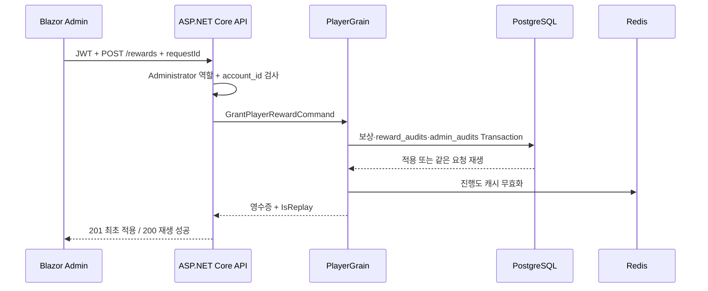

# 6주차: 관리자 도구와 감사 가능한 보상 지급

관리자는 로그인한 뒤 Player를 식별자 또는 정확한 닉네임으로 찾고, 현재 골드·인벤토리와 최근 보상 이력을 확인한 다음 수동 보상을 지급할 수 있습니다. 보상 효과, 보상 감사 기록, 관리자 감사 기록은 PostgreSQL의 같은 Transaction(트랜잭션, 전부 성공하거나 전부 취소되는 작업 단위)에서 확정됩니다.

## 이번 주에 배우는 핵심

1. **인증과 인가를 분리한다.** JWT(JSON Web Token, 서명된 로그인 토큰)가 누구인지 증명하고, `AdministratorOnly` 정책이 관리자 역할과 유효한 `account_id`를 함께 검사합니다.
2. **화면을 신뢰 경계 밖에 둔다.** Blazor 관리자 화면은 PostgreSQL이나 Grain을 직접 호출하지 않고 HTTP API만 호출합니다.
3. **감사 주체를 데이터와 함께 확정한다.** 누가 어떤 Player에게 무엇을 왜 지급했는지를 보상 효과와 같은 트랜잭션으로 저장합니다.
4. **응답 손실과 중복 지급을 구분한다.** 화면은 실패 후 같은 `requestId`로 재시도하고, PostgreSQL의 고유 제약 조건이 한 번만 적용되게 합니다.



## 실제 코드 흐름

### 1. API는 서명 검증된 관리자 식별자를 읽는다

[`CurrentPlayerClaims.cs`](../../src/CoopGameServer.Api/Authentication/CurrentPlayerClaims.cs)는 JWT의 `account_id`를 `Guid`로 해석합니다. [`Program.cs`](../../src/CoopGameServer.Api/Program.cs)의 관리자 정책은 역할 문자열만 확인하지 않고 이 변환까지 성공해야 통과시킵니다.

```csharp
options.AddPolicy(
    AuthorizationPolicies.AdministratorOnly,
    policy => policy
        .RequireRole(AccountRole.Administrator.ToString())
        .RequireAssertion(context => context.User.TryGetAccountId(out _)));
```

[`RewardsController.cs`](../../src/CoopGameServer.Api/Controllers/RewardsController.cs)는 검증된 값을 `RewardService`에 전달합니다. 요청 본문에 관리자 ID를 받지 않으므로 다른 계정 ID를 임의로 지정할 수 없습니다.

```csharp
if (!User.TryGetAccountId(out var administratorAccountId))
{
    return Forbid();
}

var result = await _rewardService.GrantAsync(
    playerId,
    request,
    administratorAccountId,
    cancellationToken);
```

### 2. Orleans 계약은 기존 필드 번호를 보존한다

[`GrantPlayerRewardCommand.cs`](../../src/CoopGameServer.GrainContracts/Players/GrantPlayerRewardCommand.cs)는 새 `AdministratorAccountId`에 `[Id(5)]`를 붙였습니다. Orleans 직렬화 계약에서 기존 0~4 번호를 바꾸지 않고 새 번호만 뒤에 추가해야 서로 다른 시점에 배포된 프로세스가 필드를 혼동하지 않습니다.

```csharp
[GenerateSerializer]
public sealed record GrantPlayerRewardCommand(
    [property: Id(0)] Guid RequestId,
    [property: Id(1)] long GoldAmount,
    [property: Id(2)] int? ItemId,
    [property: Id(3)] int? ItemQuantity,
    [property: Id(4)] string Reason,
    [property: Id(5)] Guid? AdministratorAccountId = null);
```

### 3. PostgreSQL이 최종 관리자 권한을 다시 확인한다

JWT 발급 뒤 계정 역할이 바뀔 수 있습니다. [`PostgreSqlRewardWriter.cs`](../../src/CoopGameServer.Persistence/Rewards/PostgreSqlRewardWriter.cs)는 쓰기 직전에 `accounts` 테이블에서 해당 ID가 현재도 `Administrator`인지 다시 확인합니다.

```csharp
if (requestedAdminAudit is not null &&
    !await IsCurrentAdministratorAsync(
        gameDbContext,
        requestedAdminAudit.AdministratorAccountId))
{
    await transaction.RollbackAsync(CancellationToken.None);
    return ToErrorResult(RewardWriteError.InvalidAdministrator);
}
```

그 뒤 `RewardAudit`과 `AdminAudit`을 같은 `GameDbContext`와 같은 트랜잭션에 추가합니다. 지갑이나 인벤토리 저장까지 모두 성공해야 `Commit`합니다.

```csharp
gameDbContext.RewardAudits.Add(requestedRewardAudit);
if (requestedAdminAudit is not null)
{
    gameDbContext.AdminAudits.Add(requestedAdminAudit);
}

await gameDbContext.SaveChangesAsync(CancellationToken.None);
// 지갑·인벤토리 변경
await gameDbContext.SaveChangesAsync(CancellationToken.None);
await transaction.CommitAsync(CancellationToken.None);
```

[`GameDbContext.cs`](../../src/CoopGameServer.Persistence/GameDbContext.cs)는 `admin_audits.request_id`를 고유하게 만들고 같은 `reward_audits.request_id`를 가리키게 합니다. 애플리케이션 실수로 관리자 감사만 따로 저장되는 상태도 데이터베이스가 거부합니다.

### 4. 재시도는 관리자 신원까지 같아야 한다

같은 `requestId`라도 보상 값이나 관리자 계정이 다르면 동일 요청이 아닙니다. Writer는 기존 `RewardAudit`과 `AdminAudit`을 함께 비교하고 다르면 `IdempotencyConflict`를 반환합니다. 따라서 한 관리자의 요청 ID를 다른 관리자가 가져와 기존 결과처럼 재생할 수 없습니다.

### 5. 관리자 조회 API는 읽기 전용이다

[`AdminOperationsController.cs`](../../src/CoopGameServer.Api/Controllers/AdminOperationsController.cs)는 다음 두 경로를 제공합니다.

- `GET /api/admin/players/lookup?query=...`: Player Guid 또는 정확한 닉네임 조회
- `GET /api/admin/players/{playerId}/reward-history?limit=20`: 최근 보상과 선택적 관리자 실행 주체 조회

게임 완료 보상에는 관리자 행이 없으므로 보상 이력과 관리자 이력을 `LEFT JOIN`합니다. 관리자 실행 주체가 없으면 관리 화면은 이를 게임 시스템 보상으로 표시합니다.

### 6. 화면은 성공 전까지 요청 ID를 바꾸지 않는다

[`AdminRewardSubmissionState.cs`](../../src/CoopGameServer.Admin/Services/AdminRewardSubmissionState.cs)는 폼 데이터와 `RequestId`를 보관합니다.

```csharp
public GrantRewardRequest CreateRequest() =>
    new(RequestId, GoldAmount, ItemId, ItemQuantity, Reason);

public void ConfirmSuccess()
{
    RequestId = Guid.NewGuid();
    GoldAmount = 0;
    ItemId = null;
    ItemQuantity = null;
    Reason = string.Empty;
}
```

네트워크 응답을 받지 못하면 `ConfirmSuccess`가 호출되지 않으므로 같은 ID로 다시 전송합니다. 서버가 201 Created 또는 200 OK 재생 결과를 반환한 뒤에만 다음 작업용 ID가 생성됩니다.

## 오류 순서와 결과

| 상황 | HTTP/업무 결과 | 영구 데이터 변화 |
|---|---|---|
| 로그인 토큰 없음 | 401 Unauthorized | 없음 |
| 일반 Player 역할 | 403 Forbidden | 없음 |
| `account_id` 누락·잘못된 Guid | 403 Forbidden | 없음 |
| DB에서 관리자 역할이 아님 | `InvalidAdministrator` → 403 | 없음 |
| 대상 Player 없음 | 404 Not Found | 두 감사·보상 모두 없음 |
| 같은 ID와 같은 관리자·내용 | 200 OK, `IsReplay=true` | 최초 결과 한 건 유지 |
| 같은 ID와 다른 관리자·내용 | 409 Conflict | 최초 결과 유지 |
| Redis 무효화 실패 | 보상 성공 유지 | PostgreSQL Commit 유지 |

## 로컬 실행

먼저 API 프로젝트 User Secrets에 개발 관리자 값을 넣습니다. 실제 비밀번호는 문서나 Git에 기록하지 않습니다.

```powershell
dotnet user-secrets set "DevelopmentAdministrator:LoginId" "local_admin" --project .\src\CoopGameServer.Api\CoopGameServer.Api.csproj
dotnet user-secrets set "DevelopmentAdministrator:Password" "<8자 이상의 개발 비밀번호>" --project .\src\CoopGameServer.Api\CoopGameServer.Api.csproj
dotnet user-secrets set "DevelopmentAdministrator:Nickname" "LocalAdmin" --project .\src\CoopGameServer.Api\CoopGameServer.Api.csproj
```

일반 계정과 같은 로그인 ID가 이미 있으면 자동으로 관리자 승격하지 않고 API 시작을 중단합니다. 기존 Player 닉네임도 재사용하지 않습니다.

```powershell
dotnet ef database update --project .\src\CoopGameServer.Persistence\CoopGameServer.Persistence.csproj --startup-project .\src\CoopGameServer.Api\CoopGameServer.Api.csproj
dotnet run --project .\src\CoopGameServer.Silo\CoopGameServer.Silo.csproj
dotnet run --project .\src\CoopGameServer.Api\CoopGameServer.Api.csproj --launch-profile https
dotnet run --project .\src\CoopGameServer.Admin\CoopGameServer.Admin.csproj --launch-profile https
```

관리 도구 기본 주소는 `https://localhost:7248`, API 기본 주소는 `https://localhost:7238`입니다.

## 테스트가 증명하는 범위

- [`AdminAuditTests.cs`](../../tests/CoopGameServer.UnitTests/Domain/Administration/AdminAuditTests.cs): 필수 ID, 작업 종류, 결과, 보상 모양과 사유 정규화
- [`AdminRewardSubmissionStateTests.cs`](../../tests/CoopGameServer.UnitTests/Admin/AdminRewardSubmissionStateTests.cs): 실패 후 같은 ID 유지와 성공 뒤 새 ID 생성
- [`PostgreSqlAdminRewardAuditIntegrationTests.cs`](../../tests/CoopGameServer.IntegrationTests/Persistence/Rewards/PostgreSqlAdminRewardAuditIntegrationTests.cs): 실제 PostgreSQL의 원자적 적용, 재생, 관리자 충돌, 권한 거부, 대상 없음 Rollback
- [`AdminOperationsHttpTests.cs`](../../tests/CoopGameServer.IntegrationTests/Controllers/AdminOperationsHttpTests.cs): 실제 HTTP/JWT/정책/Orleans/PostgreSQL 경로의 401, 403, 조회, 지급, 재생, 이력 조회

Controller를 직접 호출하는 단위 테스트만으로는 JWT 서명 검증이나 `[Authorize]` 정책 실행을 증명할 수 없습니다. 그래서 `WebApplicationFactory`가 실제 ASP.NET Core 파이프라인을 실행하는 통합 테스트를 별도로 둡니다.
